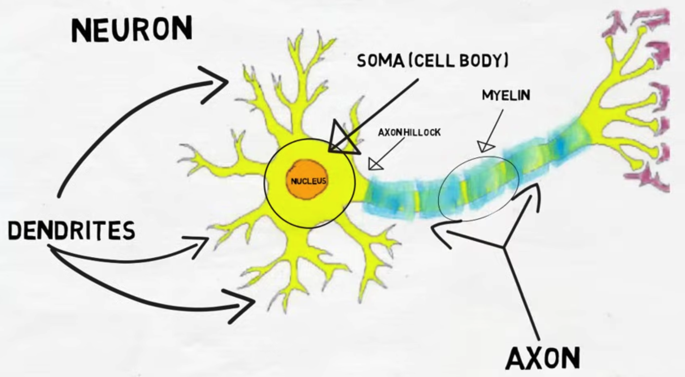

## 6. Neurons: Biology’s Signal Units (1891 Golgi & Cajal)

### Overview of Brain

- This guide zooms in from the largest scale (the brain) to the smallest functional unit (the neuron), then connects biology to the mathematics and technology of artificial intelligence.

## The Brain: The Command Center

- The brain is the main organ in your head that controls thoughts, senses, actions, and emotions.

  - **Example:** When you decide to speak, your brain plans the words, sends the signal to your mouth, and you start talking.

- It is made up of billions of cells, mainly **neurons** (for signaling) and **glia** (for support/protection).

  - **Example:** When you learn something new, your neurons form new connections, and glia cells keep those connections healthy.

## The brain's parts include

Steve is hiking around Mountainkid Valley. Suddenly, he sees a friendly robot walking across the road. Here's how Steve's brain works in **functional execution order** to handle this moment:

# Brain Parts and Functions: Aligned to First Principles Execution Order

The brain processes information hierarchically in a flow from raw sensory input to motor output, with regulatory feedback loops modulating activity.

| Brain Part                         | Location                                          | Main Functions & Steve's Example                                                                                                                     | Neural Network (NN) Analogy                          | Language Model (LM) Tip                                      |
| ---------------------------------- | ------------------------------------------------- | ---------------------------------------------------------------------------------------------------------------------------------------------------- | ---------------------------------------------------- | ------------------------------------------------------------ |
| Brainstem                          | Base of brain connecting to spinal cord           | Base signal propagation. Controls heartbeat, breathing, and supports all neural signaling. Steve’s heartbeat and breathing stabilize the hike.       | Underlying system operations                         | Gradient updates, loss monitoring                            |
| Thalamus                           | Deep brain relay hub                              | Filters and routes raw sensory inputs to the cortex. Steve’s brain filters visual and auditory data.                                                 | Input preprocessing layer                            | Token filtering/attention preprocessing for noise reduction  |
| Cerebral Cortex                    | Outer layer of the cerebrum                       | Initial feature extraction from sensory data. Steve recognizes shapes and movement patterns of the robot.                                            | Embedding/convolutional layers                       | Word embeddings                                              |
| Limbic System                      | Deep brain structures (amygdala, hippocampus)     | Emotional tagging and memory context. Steve feels curiosity and recalls past encounters.                                                             | Memory modules                                       | Context window in transformers                               |
| Cerebrum (Prefrontal Cortex)       | Largest brain part, frontal lobe (decision areas) | Reasoning, decision making, and planning. Steve decides whether to approach or wave at the robot.                                                    | Deep layers with attention mechanisms                | Self-attention for next-token prediction                     |
| Premotor Cortex                    | Just in front of primary motor cortex             | Action planning and movement preparation. Steve prepares to raise hand to wave.                                                                      | Policy network layers                                | Beam search for token candidates                             |
| Basal Ganglia                      | Deep inside cerebrum                              | Selects and regulates appropriate movements, suppressing unwanted ones. Steve walks smoothly on rocky terrain.                                       | Action selection/filtering mechanism                 | Beam pruning or filtering in decoding                        |
| Primary Motor Cortex               | Located in frontal lobe                           | Executes final motor commands sending signals to muscles. Steve moves arm to wave and walks forward.                                                 | Output layer                                         | Softmax probabilities for output tokens                      |
| Cerebellum                         | Back and bottom of brain                          | Fine-tunes movements via error correction and timing adjustment. Steve balances on uneven ground and waves smoothly.                                 | Residual connections and correction layers           | Post-processing for coherence and correctness                |
| Hypothalamus                       | Below thalamus, near brainstem                    | Regulates autonomic functions, stress, hormones, and body temperature to maintain system stability.                                                  | Optimization and system regulation                   | Gradient clipping, learning rate scheduling                  |
| Reticular Formation                | Throughout brainstem and midbrain                 | Modulates arousal and attention, enabling selective focus. Steve stays alert to the robot.                                                           | Gating mechanisms (like LSTM gates)                  | Attention weighting to prioritize context                    |
| Corpus Callosum                    | Connects left and right brain hemispheres         | Integrates information across hemispheres for unified processing. Allows coordination of bilateral functions in Steve’s body.                        | Cross-layer connections                              | Skip connections enabling long-range dependencies            |
| Neurotransmitters (e.g., Dopamine) | Distributed chemical signals                      | Modulate learning, reward processing, and motivation in brain function. Steve learns from positive experiences during hiking and social interaction. | Adaptive learning rate control                       | Dynamic learning rate adjustments based on training feedback |
| Plasticity Mechanisms              | Throughout brain (synaptic connections)           | Synaptic pruning and long-term potentiation enable learning and memory by altering connection strength.                                              | Regularization techniques like dropout, weight decay | Regularize to prevent overfitting, enhance generalization    |

---

This table aligns brain regions and functions with the first principles of signal flow and regulation, connecting each to comparable concepts in neural networks and language models.  
Steve’s examples ground abstract functions into real-world experiences during his Mountainkid Valley hike.

This table follows the **brain’s functional workflow**, from sensing and planning to movement execution and vital function regulation during Steve's encounter with the robot on the hiking trail.

# Neural Networks Overview: From First Principles

## The Brain as a Network of Neurons

- The brain is composed of **billions of neurons**, the specialized cells that transmit information.
- These neurons are **massively interconnected** through complex networks.
- Each neuron can connect to thousands of others via junctions called **synapses**.

## Parallel Working of Neurons

- Neurons operate **in parallel**, meaning many signals are processed simultaneously.
- This parallelism enables the brain to:
  - Process sensory inputs from multiple sources at once.
  - Perform complex computations rapidly.
  - Coordinate numerous body functions simultaneously.

## How Neurons Connect and Communicate

- A neuron receives input signals from its connected neurons.
- It integrates these inputs and decides whether to pass on the signal.
- Signals are sent electrically within the neuron and chemically across synapses.

  - The synapse is the small junction or gap where one neuron's axon terminal is very close to another neuron's dendrite or cell body.

  - It is not a direct physical connection, but a narrow space (about 20-40 nanometers wide) where chemical signals (neurotransmitters) travel across.

  - When an electrical signal (action potential) arrives at the axon terminal of the sending neuron, it triggers the release of neurotransmitters into the synaptic gap.

  - These neurotransmitters diffuse across the synapse and bind to receptors on the receiving neuron, transmitting the signal chemically.

  - This process converts the electrical signal in the first neuron into a chemical signal crossing the synapse, then back to an electrical signal in the next neuron.

  - So the synapse acts as a controlled communication bridge, managing how neurons pass messages at the microscopic scale.

- The network formed by these connections is the foundation of all brain functions: perception, movement, thought, and learning.

## Why Network Structure Matters

- The brain’s ability to learn and adapt comes from **plasticity**—the ability to strengthen or weaken synaptic connections.
- This plasticity allows networks to change structure based on experience, enabling learning and memory.
- Complex behaviors emerge from simple network interactions.

---

This understanding of the brain as a highly interconnected, parallel-processing neural network sets the stage for diving deeper into individual neuron function and how they generate electrical signals.

# Signal Types in the Brain: Electrical and Chemical Communication

## Electrical Signals Within Neurons

- Neurons communicate internally using **electrical signals** called **action potentials**.
- An action potential is a rapid change in the electrical charge inside the neuron, traveling along its length (axon).
- This electrical impulse enables fast transmission of information within the neuron itself.
- Think of it like a spark traveling down a wire, carrying a message quickly from one end of the neuron to the other.

## Chemical Signals Between Neurons

- Neurons communicate with each other at **synapses**, where the axon terminal of one neuron meets the dendrite or cell body of another.
- At the synapse, the electrical signal triggers the release of **chemical messengers** called **neurotransmitters**.
- These neurotransmitters cross the small gap (synaptic cleft) and bind to receptors on the next neuron.
- This binding can either excite or inhibit the next neuron, influencing whether it fires its own action potential.
- This chemical communication allows neurons to pass complex information and regulate brain functions dynamically.

## Combined Electrical-Chemical Signaling

- The brain’s communication system is a dynamic combination of rapid electrical signals inside neurons and slower, modulatory chemical signals between neurons.
- This dual signaling mechanism enables precise, flexible, and adaptable information processing.

---

Understanding these signal types is fundamental to grasping how neurons transmit information and interact, laying the groundwork for exploring neuron anatomy, physiology, and computational models.

### Summary: How Information Travels Across Neurons

- Information travels inside a neuron as **electrical signals** called **action potentials**.
- When the electrical signal reaches the axon terminal, it triggers the release of **chemical messengers** called **neurotransmitters**.
- Neurotransmitters cross the **synaptic gap (synapse)** between neurons.
- These chemicals bind to receptors on the receiving neuron, converting the chemical message back into an electrical signal.
- This process repeats across neuron networks, enabling complex brain functions like perception, movement, and learning.
- The brain’s network structure is flexible due to **plasticity**, which strengthens or weakens connections based on experience.
- Overall, neuron communication combines **fast electrical signaling inside neurons** and **chemical signaling between neurons** for precise, adaptable information processing.

# Cell Types in the Brain: Neurons vs. Glia

## Neurons: The Brain's Information Messengers

- Neurons are specialized cells responsible for **receiving, processing, and transmitting information**.
- They communicate via **electrical impulses** (action potentials) and **chemical signals** (neurotransmitters).
- Neurons have unique structures:
  - **Dendrites:** Receive signals from other neurons.
  - **Soma (cell body):** Integrates incoming signals.
  - **Axon:** Sends electrical signals to other neurons or muscles.
- Neurons form the core of brain function: sensation, movement, cognition, and emotions.

## Glia: The Brain's Supporting Staff

- Glial cells, or **glia**, are supporting cells that **maintain and protect neurons**.
- Types of glia include:
  - **Astrocytes:** Provide nutrients, maintain the chemical environment, and support the blood-brain barrier.
  - **Oligodendrocytes:** Form myelin sheaths around axons, speeding up electrical signals in the brain.
  - **Microglia:** Act as immune cells, removing waste and protecting against infection.
- Glia do not transmit electrical signals but are essential for healthy brain functioning.

## Why Differentiating Them Matters

- **Neurons** perform the brain’s information processing and communication.
- **Glia** provide critical support, ensuring neurons work efficiently and stay healthy.
- Understanding this division is fundamental before diving into neuron structure and signal mechanisms.

---

This foundational knowledge helps recognize the collaboration required for brain function, preparing for deeper study of neuron physiology.

# High-Level Brain Functions: Emergent from Neuronal Interaction

## Sensory Processing

- The brain receives information from the senses (sight, sound, touch, taste, smell).
- Specialized neurons process this sensory input, allowing perception of the world.
- This processing occurs primarily in sensory areas of the **cerebral cortex**.

## Motor Control

- Brain regions plan, initiate, and execute voluntary movements.
- Motor commands are refined and coordinated to perform smooth, purposeful actions.
- Control involves areas like the **primary motor cortex**, **premotor cortex**, **basal ganglia**, and **cerebellum**.

## Cognition

- Includes thinking, reasoning, problem-solving, and planning.
- Emerges from complex interactions in the **prefrontal cortex** and other cortical regions.
- Enables decision-making, attention, and working memory.

## Emotions

- Brain structures like the **limbic system** generate and regulate emotions.
- Neuronal networks integrate sensory input and internal states to produce feelings and responses.

# Major Neurotransmitters in the Brain: From First Principles with Deficiency Effects

Neurotransmitters are chemical messengers neurons use to communicate at synapses, crucial for brain function and behavior. Deficiencies often cause distinct problems.

## Dopamine

- **Function:** Modulates motivation, reward, pleasure, and movement.
- **Deficiency:** Can cause Parkinson’s disease (motor issues), depression, and lack of motivation.
- **Example:** Without enough dopamine, Steve might struggle with smooth movements and lose interest in hiking.

## Serotonin

- **Function:** Regulates mood, appetite, sleep, and emotions.
- **Deficiency:** Linked to depression, anxiety, sleep disorders, and mood instability.
- **Example:** Low serotonin could make Steve feel anxious or depressed during his hike.

## Norepinephrine (Noradrenaline)

- **Function:** Controls alertness, arousal, and the fight-or-flight response.
- **Deficiency:** Causes fatigue, poor focus, and low stress response.
- **Example:** Steve may feel drowsy or unable to focus on the trail.

## Acetylcholine

- **Function:** Crucial for muscle activation, attention, learning, and memory.
- **Deficiency:** Leads to memory problems (seen in Alzheimer’s), muscle weakness, and attention deficits.
- **Example:** Steve might forget the route or find walking difficult.

## GABA (Gamma-Aminobutyric Acid)

- **Function:** Primary inhibitory neurotransmitter, calming neural activity.
- **Deficiency:** Causes anxiety, seizures, and overstimulation.
- **Example:** Without enough GABA, Steve could experience nervousness or muscle spasms.

## Glutamate

- **Function:** Primary excitatory neurotransmitter, drives learning and memory.
- **Deficiency:** Can impair cognition, learning, and cause neurological issues.
- **Example:** Steve’s ability to learn or remember the trail could be impaired.

## Endorphins

- **Function:** Natural painkillers, induce pleasure and stress relief.
- **Deficiency:** Heightens pain sensitivity and lowers mood.
- **Example:** Steve would feel more pain from hiking discomfort and less enjoyment.

## Histamine

- **Function:** Modulates arousal, attention, inflammation.
- **Deficiency:** Leads to sleep disturbances, attention problems, and impaired immune responses.
- **Example:** Steve may feel tired or inattentive on the trail.

---

Neurotransmitters are stored in vesicles at the axon terminals (the far ends of the axon), not the axon hillock.

When the electrical signal travels down the axon and reaches the axon terminals, it triggers the release of neurotransmitters from vesicles into the synapse.

So, the sequence is: Signal starts at the axon hillock → travels down the axon → reaches axon terminals → causes neurotransmitter release.
Together, neurotransmitters form a chemical language critical for brain communication. Their balance underpins normal cognition, emotion, and motor function, and imbalances cause specific deficits.okay

### 6.1 Neuron Anatomy: Dendrites, Soma, Axon, Myelin

- Neurons are special cells that send messages in your body.
- They have parts like:

- **Dendrites:** Branch-like structures extending from the neuron, designed to receive most of the incoming information in the form of chemical signals called neurotransmitters from other neurons. They have receptors that pick up these signals and convert them into electrical changes.
- **Soma (Cell Body):** Contains the nucleus, which holds the DNA (genetic material). The soma integrates all the electrical signals received by the dendrites at a special region called the **axon hillock**. If the combined signal is strong enough, it triggers the next step in the neuron.
- **Axon:** A long fiber that transmits the electrical signal, now called an **action potential**, away from the soma towards other neurons or muscle cells.
- **Myelin:** A fatty, insulating material that wraps around the axon. It prevents the electrical signal from degrading and speeds up its transmission, allowing signals to travel quickly and efficiently along the axon.

This architecture allows neurons to process and pass on information rapidly throughout the nervous system, forming the basis for all neural communication.

---

### 6.2 The Neuron Membrane: Lipid Bilayer and Ion Channels — First Principles Explanation

Building on what we know about neurons sending electrical signals and chemical messages, it is essential to understand the **neuron’s membrane** because it is the foundation for electrical excitability.

#### Why Membrane Matters?

- The neuron must maintain a difference between the inside and outside environments to create an electrical signal.
- This separation is achieved by the **lipid bilayer membrane**, which acts like a waterproof wall blocking the free flow of ions and charged particles.
- Without this barrier, any electrical difference would quickly dissipate, and no signals could be generated.

#### What Controls Ion Flow?

- To communicate, the neuron needs ions to move in and out selectively.
- This is accomplished by **ion channels**, special proteins embedded in the membrane.
- Ion channels act like gates or doors that let only certain ions (like sodium, potassium, calcium, or chloride) pass through when open.
- Some channels open or close depending on the **electrical voltage** across the membrane (**voltage-gated**).
- Others open in response to **chemical signals** such as neurotransmitters binding (**ligand-gated**).

#### How Does This Create Electrical Signals?

- Due to the selective permeability of the membrane, neurons maintain different ion concentrations inside and outside the cell.
- This difference creates a voltage across the membrane—a kind of stored electrical energy known as the **membrane potential**.
- When ion channels open or close, they change ion flow, altering membrane voltage and creating electrical signals.
- These signals can propagate down the axon, allowing neurons to communicate rapidly and precisely.

---

In summary, the **lipid bilayer keeps ions separated**, and **ion channels control their flow**, enabling the neuron's electrical properties. Understanding this is key before we explore in detail how neurons maintain a resting membrane potential and generate action potentials.

### 6.3 Resting Membrane Potential (~-70 mV)

The **resting membrane potential** is the electrical voltage difference across the neuron membrane when the neuron is not actively sending a signal. This resting state is the foundation for neuron excitability and signaling.

#### Why Does Resting Membrane Potential Exist?

- Neurons maintain **unequal distributions of ions** inside and outside the cell.
- Potassium ions (\(K^+\)) are more concentrated inside the neuron, and sodium ions (\(Na^+\)) are more concentrated outside.
- There are also large **negatively charged proteins** inside the neuron that cannot cross the membrane.
- The membrane is more permeable to potassium, allowing it to move out of the cell, leaving behind negative charges.
- This creates a **negative charge inside relative to outside**, resulting in a voltage difference across the membrane, about **-70 millivolts (mV)**.

#### Concentration Gradients and Ion Movement

- **Concentration gradients** refer to the difference in ion concentrations across the membrane.
- Ions move naturally from high to low concentration; potassium tends to leave the neuron, sodium tends to enter.
- The precise amounts of sodium entering and potassium leaving neurons naturally (by diffusion) vary by neuron type and physiological state, but some typical figures can be given:

- Potassium ions (\(K^+\)) leaks out of the neuron at a higher rate than sodium enters because the membrane is more permeable to potassium at rest.

- Estimates suggest potassium leakage may be on the order of billions of ions per second per neuron, while sodium leakage is lower but still significant.

- The sodium-potassium pump balances this by pumping out roughly 3 sodium ions for every 2 potassium ions it brings in, keeping concentrations stable.

- To maintain these gradients, the neuron uses energy to actively pump ions.

#### Sodium-Potassium Pump and ATP

- The **sodium-potassium pump** is an enzyme embedded in the membrane that uses energy from ATP (adenosine triphosphate).
- It pumps **3 sodium ions (Na\(^+\)) out** of the neuron and **2 potassium ions (K\(^+\)) in**, against their concentration gradients.
- This active transport maintains the high sodium outside and high potassium inside.

#### Charge Separation and Energy Storage

- This unequal ion distribution leads to **charge separation**, where the inside of the neuron is negatively charged compared to the outside.
- The **membrane acts like an insulator**, keeping these charges separated.
- This creates a small electrical voltage, akin to a **battery that stores energy across the membrane**.
- The stored electrical energy is used when the neuron generates an action potential to send signals.

#### Why Resting Potential Is Critical

- It prepares the neuron to respond rapidly to stimuli.
- Without resting potential, neurons wouldn't be able to generate electrical signals.
- This state balances chemical and electrical forces, keeping neurons ready for communication.

---

### Summary Table

| Concept                         | Explanation                                                                    |
| ------------------------------- | ------------------------------------------------------------------------------ |
| Resting Membrane Potential      | Electrical voltage (~-70 mV) across membrane when neuron is at rest.           |
| Ion Concentrations and Movement | Potassium inside and sodium outside; potassium leaks out, sodium leaks in.     |
| Sodium-Potassium Pump           | Pumps 3 Na\(^+\) out and 2 K\(^+\) in using ATP energy, maintaining gradients. |
| ATP                             | Adenosine triphosphate, the energy molecule for ion pumping.                   |
| Charge Separation and Storage   | Unequal charges separated by lipid membrane store electrical energy.           |

- The resting membrane potential of around -70 millivolts (mV) means the inside of the neuron is approximately -70 mV relative to the outside.

- By convention, the outside of the neuron is set to 0 mV as the reference.

- So, typical voltages are:

  - Outside: ~0 mV

  - Inside: ~ -70 mV

- To generate and transfer information, a neuron must depolarize its membrane potential from the resting state (about -70 mV) to a critical threshold level.

- This threshold voltage typically is around -55 millivolts (mV).

- When the combined inputs cause the membrane potential at the axon hillock to reach this threshold, the neuron triggers an action potential.

- An action potential is a rapid, large change in voltage (from about -70 mV up to +40 mV) that propagates down the axon.

- This electrical signal serves as the fundamental unit of information transfer between neurons.

- Hence, the neuron needs to generate approximately a 15 mV depolarization (from -70 mV to -55 mV) to trigger the action potential needed to communicate information effectively.

**Additional facts:**

- **1 volt (V) = 1000 millivolts (mV)**
- A resting membrane potential of −70 mV means the inside is negative by about 0.07 volts.
- This small voltage difference is crucial because it allows the neuron to send electrical signals quickly when it needs to.

---

### Summary of Neuron Structure and Electrical Signaling: First Principles

- **Neurons** are specialized cells designed to send information rapidly through electrical and chemical signals.
- The **neuron membrane** is a **lipid bilayer** that acts as an insulating barrier, separating inside and outside environments.
- **Ion channels** embedded in the membrane control the selective flow of ions (sodium, potassium, calcium, chloride), enabling electrical currents.
- Neurons maintain **unequal ion concentrations** inside and outside, with potassium higher inside and sodium higher outside.
- **Negatively charged proteins** inside the neuron contribute to negative charge but cannot cross the membrane.
- The **resting membrane potential** (~-70 mV) arises from charge separation created by these ion distributions and membrane permeability, storing electrical energy like a battery.
- The **sodium-potassium pump**, an enzyme using **ATP** energy, actively transports 3 sodium ions out and 2 potassium ions in, maintaining ion gradients.
- A small number of ions leak across passively; the pump compensates to preserve gradients essential for signaling.
- To transmit information, the neuron’s membrane potential must depolarize by about 15 mV, reaching a **threshold of ~ -55 mV**, triggering an **action potential**.
- An **action potential** is a rapid, all-or-none voltage change that propagates down the axon, enabling fast, precise neural communication.

This foundational understanding connects biological structures, physics of ions, and energetic processes underlying neural excitability and signaling.

### 6.4 Threshold and Firing (\(-55\) mV Trigger)

- Neurons have a resting membrane potential of about **−70 mV**, meaning the inside of the cell is negative compared to the outside.

- When the sum of incoming signals causes the membrane voltage to rise towards **−55 mV**, this value is called the **threshold**.

- If the membrane voltage reaches this threshold, it triggers a sequence of events leading to an **action potential** (the neuron "fires"):

  1. **Voltage-gated sodium channels open** rapidly, allowing Na⁺ ions to flood inside.
  2. This sudden influx of positive ions causes rapid **depolarization**—the membrane voltage quickly rises to a positive value (up to +30 to +40 mV).
  3. After a brief peak, sodium channels close, and **voltage-gated potassium channels open**, allowing K⁺ ions to exit.
  4. The outflow of potassium ions causes **repolarization**, bringing the membrane potential back down toward the resting level.
  5. Sometimes the membrane voltage briefly dips below the resting potential, a phase called **hyperpolarization**.
  6. Finally, the neuron returns to its normal resting membrane state, ready to fire again if stimulated.

- This action potential travels along the axon as an electrical signal, enabling rapid communication between neurons or to muscle cells.

- If the membrane potential doesn’t reach the threshold, the neuron remains at rest—this all-or-none principle ensures that neurons only fire when sufficiently stimulated.

---

This mechanism, involving the critical threshold and rapid ion channel changes, forms the basis of how neurons transmit information electrically.

## Summary: Everything So Far We Discussed

Imagine Steve, a curious kid who wants to understand life:

- Everything around Steve is made of tiny building blocks called **atoms** — like LEGO pieces. When these atoms stick together, they form **molecules**, kind of like combining LEGO blocks to build something bigger.
- Molecules combine in special ways to create **cells** — the smallest living units. Think of cells like tiny factories doing many jobs to keep life going.
- Each cell has a **membrane** — its smart gatekeeper that decides what comes in and goes out. This helps the cell stay safe and balanced.
- Inside the cell, special parts called **organelles** work like machines:
  - The **nucleus** is the control center with the instructions (DNA).
  - The **mitochondria** are power plants giving energy.
  - Other organelles help build proteins, move packages, and clean up waste.
- Cells use **nutrients** like carbs and fats as fuel and building material. Fats also keep animals warm by acting as insulation.
- Groups of cells called **tissues** work together like a team — for example, muscle tissue lets Steve run and jump.
- Then there are **neurons** — special cells that send signals like tiny messengers.
  - They receive messages with **dendrites**, decide what to do in the **soma**, and send signals down a long wire called the **axon**, wrapped in insulation called **myelin** to speed things up.
  - Neurons communicate using electrical changes controlled by tiny gate-like structures called **ion channels**.
  - When the neuron gets excited enough (like reaching a threshold), it sends an electrical impulse — a signal — to other neurons or muscles.

In short: Life is complex, but it starts from a few simple, well-organized building blocks — just like Steve’s favorite addition problem.

---
