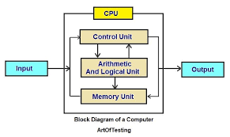
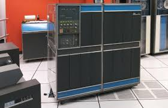
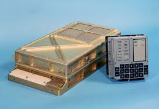

# 001 - Introduction to Computers

Computers are transformative tools that process data using hardware and software. They have changed the world, enabling innovations from smartphones to space travel. This article provides a beginner-friendly overview, diving into what computers are, their basic components, and their historical and modern significance.

## Definition and Purpose of a Computer

A computer is an electronic device that receives data (input), processes it according to a set of instructions (software), stores it, and produces output. Its main purpose is to perform complex calculations, automate repetitive tasks, store vast amounts of data, and connect systems globally.

## Basic Components: Hardware and Software

Basic Block Diagram of a Computer System

### Hardware

* **CPU (Central Processing Unit):** The brain of the computer, it executes instructions.
* **RAM (Random Access Memory):** Temporary storage for data and instructions being used.
* **Storage Devices:** Hard drives or SSDs for long-term data storage.
* **Input Devices:** Keyboard, mouse, microphone, etc.
* **Output Devices:** Monitor, printer, speakers, etc.

### Software

* **System Software:** Operating systems like Windows, macOS, Linux.
* **Application Software:** Programs like web browsers, games, photo editors.

## Historical Significance and Modern Applications

### Historical Roots

Early "computers" were human calculators. Over time, mechanical and then electronic computers replaced manual calculations.

IBM 1401 Data Processing System

### Modern Applications

Used in almost every field—healthcare, finance, education, communication, transportation, and entertainment.

A modern desktop computer setup

## Applications

Understanding the computer's core principles is foundational for any future learning in programming, hardware design, data science, or AI.

## Fascinating Facts

* The first "computer" was a human calculator in the 17th century!
* The Apollo 11 guidance computer had less processing power than a modern smartphone.

    

    Apollo Guidance Computer at the Smithsonian

* Modern chips can execute over **3 trillion** operations per second!
