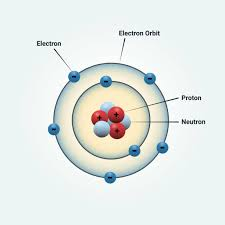
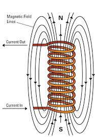
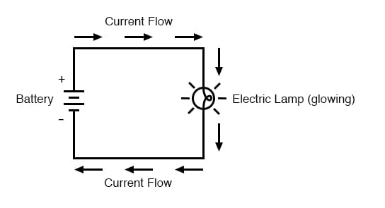
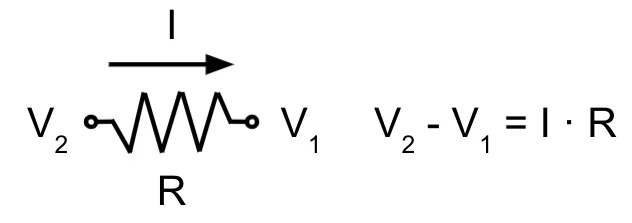
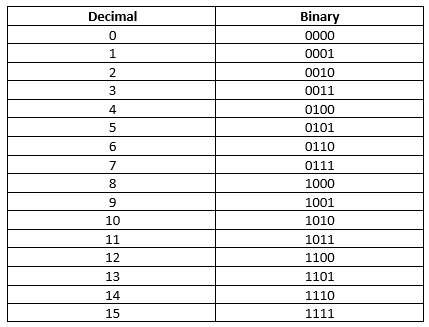
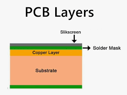

# Physics Foundations for Computing

Computers are built upon the fundamental laws of physics—electricity, magnetism, quantum behavior, and waves. Every signal in a computer, every byte processed, and every pixel lit on your screen is governed by these invisible forces. By understanding them, we can demystify how machines think and communicate.

---

## Atoms and Electrons

Atoms are the building blocks of matter. Each atom consists of a nucleus (containing **positively charged protons** and **neutral neutrons**) and **negatively charged electrons** orbiting around it.

In computers, the behavior of electrons is especially important. These tiny particles can move from one atom to another when pushed by an electric field. When this movement is controlled through wires or microcircuits, it creates **electricity**—the foundation of all computing processes.

Atom Structure

---

## Energy

Energy is the ability to do work, and in computers, it powers everything—from calculations to screen displays.

- **Kinetic energy** in computing refers to the motion of electrons moving through wires.
- **Potential energy** is stored in batteries or capacitors, waiting to be released when needed.

This stored energy allows devices to function even for brief moments without continuous input, like maintaining your phone’s clock when powered off.

---

## Electromagnetism

Electricity and magnetism are two sides of the same coin. When current flows through a conductor, it generates a **magnetic field**. This magnetic field can influence nearby circuits, or even transfer energy without wires (as seen in wireless charging).

This principle enables technologies such as:

- Transformers
- Inductors in power supply circuits
- Wireless technologies (radio, Wi-Fi, NFC)

---

## Voltage

Voltage is the “pressure” that pushes electrons through a conductor. It’s measured in volts (V) and represents the energy per charge.

Imagine water in a pipe: higher pressure moves water faster. Similarly, higher voltage moves electrons more forcefully.

Too little voltage and a circuit won’t operate. Too much, and components can overheat or get damaged.

---

## Current

Electric current is the flow of electrons through a conductor. It’s measured in **amperes (A)** and depends on how many electrons pass a point per second.

Stable current ensures reliable operation of electronic parts. In CPUs, for example, massive numbers of transistors switch on and off rapidly—all powered by controlled current.

---

## Resistance

Resistance is the opposition to the flow of current. Materials with high resistance limit electron flow and convert electrical energy into heat. In circuits, **resistors** are used to control this behavior.

Using Ohm’s Law:
**V = I × R**

Engineers design circuits so the correct voltage and current flow to each component—preventing overloads and controlling signal behavior.

---

## Conductors and Insulators

- **Conductors** (e.g., copper, aluminum): allow easy flow of electric current.
- **Insulators** (e.g., rubber, plastic): resist current flow.

Circuit boards use conductors for electrical paths and insulators to keep signals separated and prevent short circuits.

---

## Capacitance

A **capacitor** stores electrical energy in an electric field. It can charge and discharge rapidly, making it perfect for:

- Stabilizing voltage
- Smoothing power supply fluctuations
- Filtering noise from signals

Capacitors act like shock absorbers for electricity.

---

## Inductance

An **inductor** stores energy in a magnetic field when current passes through a coil of wire. It resists changes in current, helping to stabilize power flow.

Inductors are used in:

- Voltage regulators
- Audio equipment
- Power supply circuits

---

## Logic Gates

Logic gates are simple circuits that follow Boolean logic. They are the **fundamental building blocks** of all digital systems—from microprocessors to calculators.

Each gate takes binary inputs (0 or 1) and produces an output based on logical rules:

- AND: Output is 1 only if both inputs are 1
- OR: Output is 1 if at least one input is 1
- NOT: Inverts the input

Modern CPUs contain **billions of logic gates**, working together at light speed.

---

## Binary Language

All data in computers—text, images, sound—is ultimately stored as 0s and 1s. This is called **binary**.

Each **bit** (binary digit) represents one state: on or off. By combining multiple bits (like 8 bits = 1 byte), computers can encode complex data.

---

## Waves

Electromagnetic waves carry data wirelessly. Different frequencies correspond to different technologies:

- 2.4 GHz: Wi-Fi, Bluetooth
- ~850–1900 MHz: GSM mobile signals
- Infrared and optical: Fiber internet

These invisible waves are modulated to carry binary data across space—allowing the internet, phone calls, and GPS.

---

## Sound

Computers generate sound using **digital-to-analog conversion**. This turns binary audio files into voltage changes that vibrate a speaker membrane—producing sound waves.

Sound in devices like phones and alarms is crafted from tiny electric pulses transformed into physical motion.

---

## PCB Layers and Traces

A Printed Circuit Board (PCB) contains:

- **Copper traces**: like roads for electrons
- **Substrate**: structural base layer
- **Multiple layers**: allow compact and complex connections

Modern PCBs are engineered to minimize interference, maximize speed, and pack entire systems in a small form factor—like your smartwatch or phone.
