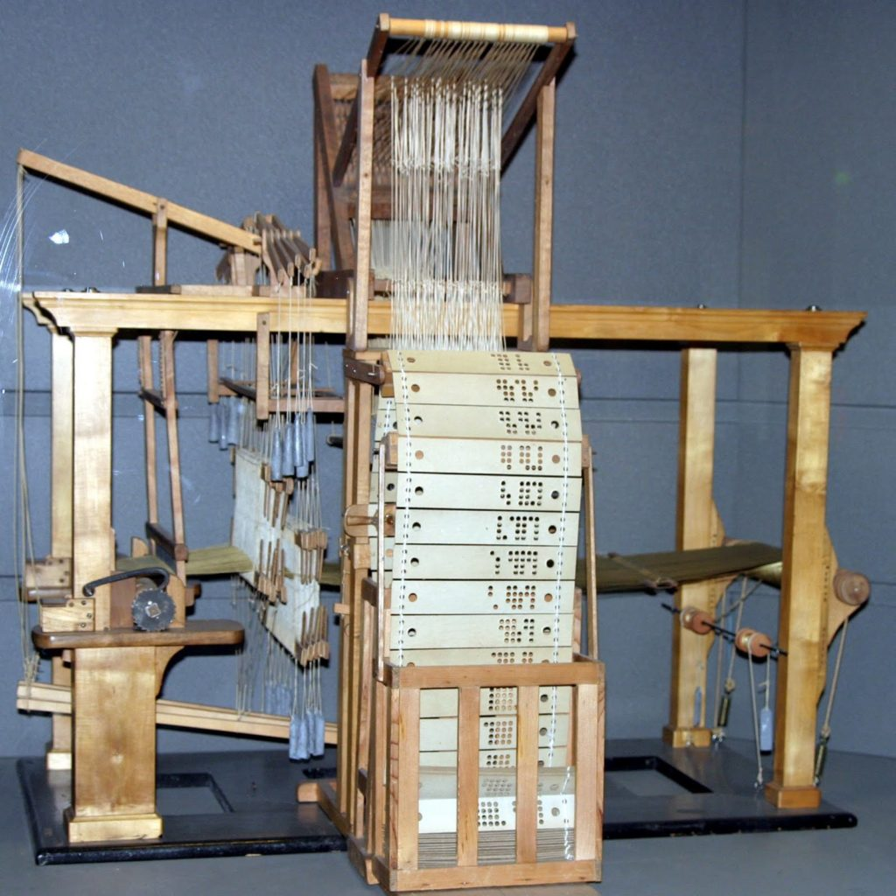
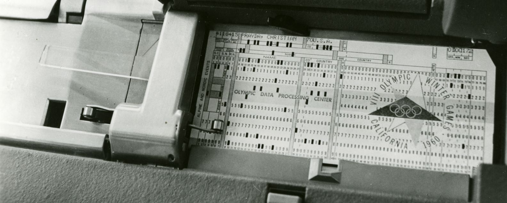

# Mechanization of Logic

The leap from mechanical calculation to programmable logic began in the 18th and 19th centuries. Innovators transformed ideas into instructions, and instructions into machines that could follow them. These early inventions laid the philosophical and technical foundation for programming.

## Jacquard Loom: The First Programmable Machine

Invented by **Joseph Marie Jacquard** in 1801, the Jacquard Loom revolutionized weaving by using **punch cards** to control patterns in textiles.

Each punch card represented a set of instructions: where holes existed, the loom would lift threads; where there were no holes, it wouldn’t. This enabled complex patterns to be woven automatically without manual intervention.

This concept of feeding instructions into a machine became the philosophical precursor to computer programs.

---

## Punch Cards: Early Data Storage and Control

Punch cards evolved beyond textile manufacturing to become a data processing method in early 20th-century computers. Used by IBM and the U.S. Census Bureau, these cards stored data and instructions.

* A **punched hole** represented a binary '1'; no hole meant '0'.
* Machines would read these patterns to perform calculations or control tasks.

Punch cards were used in:

* The **1890 U.S. Census**, allowing data from 63 million Americans to be processed efficiently
* **IBM tabulators**, forming the backbone of business and government computing through the mid-1900s

---

## Mechanical Logic and the Birth of Programming

These systems proved that machines could follow symbolic logic—paving the way for programmable computers. With punch cards acting as external memory, machines could be **reconfigured** without altering their internal mechanisms.

This idea—**separating logic (software) from hardware**—is central to modern computing.

> **Fun Fact:** Ada Lovelace, decades later, would see this same concept in Babbage’s Analytical Engine and become the first programmer.

---

## Why It Matters

The mechanization of logic was more than technical—it was philosophical. It represented a shift:

* From machines **doing tasks** to machines **following instructions**
* From pure mechanics to **algorithmic reasoning**

These humble beginnings eventually evolved into programming languages, software, and artificial intelligence.
