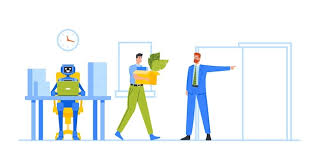

# Automation and Societal Response

As machines began replacing human labor, the world witnessed not only technical breakthroughs but also social unrest, ethical debates, and existential questions. Automation promised efficiency—but it also challenged livelihoods and identities. Understanding these responses is key to navigating today’s AI debates.

## The Luddite Movement: Resistance to Machines

In early 19th-century England, a group known as the **Luddites** emerged. These were skilled textile workers who destroyed weaving machinery that threatened their jobs.

They weren’t anti-technology—they were protesting how industrial owners used automation to cut costs while displacing skilled labor. The Luddite movement symbolized:

* Fear of job loss
* Economic inequality
* Technological disruption without ethical planning

---

## Echoes in Today’s Automation Fears

History echoes in today’s fears around automation:

* Will **AI replace jobs**?
* Can **robots outthink humans**?
* Who controls the **benefits of automation**?

Today’s debates around AI, surveillance, and algorithms trace their roots to early industrial fears. But history also shows us that society adapts:

* New **industries emerge** (e.g., software, robotics)
* New **skills are in demand** (e.g., data science, AI ethics)
* New **laws and norms evolve** (e.g., labor rights, digital privacy)

---

## The Opportunity Side

Automation, despite disruption, also brought massive improvements:

* Reduced human error
* Increased productivity
* Created entirely new types of jobs

From **assembly lines** to **autonomous vehicles**, the pattern is clear: every wave of automation reshapes society. The challenge is **how well we adapt**—not whether change will come.

---

## Why It Matters

Understanding society’s historical reactions to automation helps us:

* Predict how people might respond to new technologies
* Develop fair and inclusive innovation policies
* Learn how to balance efficiency with ethics

Technology changes fast—but human responses often repeat.
