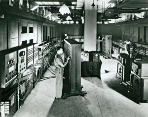
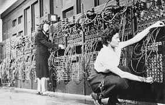
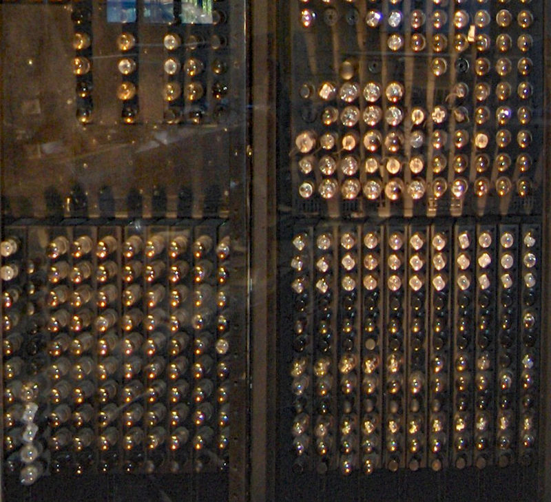

# ENIAC’s Breakthrough

The **Electronic Numerical Integrator and Computer (ENIAC)**, completed in 1945, was the first **general-purpose programmable electronic computer**. Unlike earlier machines designed for a single task, ENIAC could be reprogrammed to solve a wide range of problems.

Built by **John Mauchly** and **J. Presper Eckert** at the University of Pennsylvania, ENIAC was a monumental achievement in speed and flexibility.

---

## Design and Features

ENIAC was massive in every sense:

* Contained over **17,468 vacuum tubes**, 7,200 crystal diodes, and 70,000 resistors
* Covered **1,800 square feet** and weighed about **30 tons**
* Consumed **150 kilowatts** of electricity
* Could perform **5,000 additions or subtractions per second**

ENIAC used **decimal (not binary)** digits and **pulses** to represent data. It performed calculations by passing these pulses between various accumulators and units.

---

## Programming the ENIAC

Initially, programming ENIAC was a manual task. It required physically rewiring plugboards and setting dials—a process that could take **days** to set up.

Programming teams (including six pioneering women programmers) would:

* Set up connections between arithmetic units
* Route data and instructions through switches and cables
* Debug logic manually using paper schematics

This hardware-based approach to programming inspired efforts to make machines more flexible—which led to stored-program designs like EDVAC and EDSAC.

---

## Use Cases and Performance

ENIAC was used for:

* **Ballistics calculations** during World War II
* **Atomic energy** research
* **Weather prediction**, **cosmic ray studies**, and **wind tunnel design**

It could calculate artillery trajectories in 30 seconds that previously took 20 hours by hand.

---

## Legacy

ENIAC’s impact was transformative:

* Proved electronic speed could revolutionize problem solving
* Demonstrated the need for **programmable flexibility**
* Inspired computer architecture evolution toward stored-program machines

Despite its complexity, ENIAC’s success paved the way for every programmable computer that followed.
