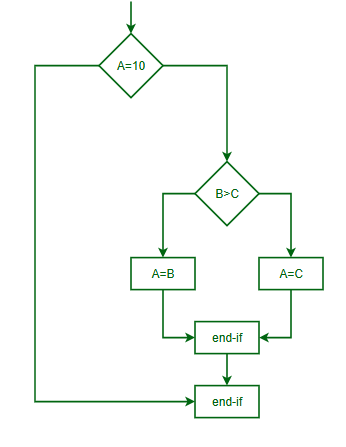

# CPU, ALU, and Control Flow

The **Central Processing Unit (CPU)** is the brain of a computer. It is the component responsible for interpreting and executing most of the commands from a computer's other hardware and software. Every application, from a basic calculator to a full 3D video game, ultimately relies on the CPU to run instructions. At its core are two major subsystems:

* The **Arithmetic Logic Unit (ALU)**: handles all the mathematical and logical operations.
* The **Control Unit (CU)**: directs how data moves and how instructions are processed.

Together, they execute every action you see—from typing this sentence to rendering a video.

---

## What is the CPU?

The CPU is a silicon chip mounted on the motherboard of a computer. It:

* **Fetches** instructions from memory: Each program you run contains instructions stored in memory. The CPU reads (fetches) them one at a time.
* **Decodes** them: The instruction is interpreted so the CPU knows what action to perform.
* **Executes** them: The actual operation is performed, such as a calculation or moving data.

This cycle repeats over and over in what's called the **fetch-decode-execute cycle**, and it happens extremely fast—millions to billions of times every second.

Modern CPUs are made of **billions of transistors** and include **multiple cores**, where each core can independently run processes. This enables multitasking and increases performance significantly.

---

## Arithmetic Logic Unit (ALU)

The **Arithmetic Logic Unit** is a digital circuit that performs:

* **Arithmetic operations**: such as addition, subtraction, multiplication, and division.
* **Logical operations**: such as comparisons, AND, OR, NOT, and XOR operations that are fundamental to decision-making in software.
* **Comparisons**: used to evaluate expressions like "Is X greater than Y?"

The ALU uses binary numbers (combinations of 0s and 1s) and applies Boolean logic. It works with **registers**, which are fast, temporary memory locations inside the CPU.

Despite being small, the ALU is powerful—enabling the CPU to solve complex problems by rapidly executing basic operations.

---

## Control Unit (CU)

The **Control Unit** is the supervisor inside the CPU. It does not execute instructions itself but manages the other parts of the CPU to do so. It:

* Sends control signals to coordinate the timing and operation of other CPU parts
* Decodes instruction codes from memory
* Controls data movement between the CPU, memory, and I/O devices

The CU ensures that instructions happen in the correct order, without conflicts or delays. It is essential for synchronizing the fetch-decode-execute cycle.

Think of it like the **conductor of an orchestra**, coordinating all the musicians (hardware units) to play in harmony.

---

## Registers and Data Flow

**Registers** are the fastest type of memory, built directly into the CPU. They store:

* Temporary results from the ALU
* Memory addresses
* Current instructions being processed

Key registers include:

* **Program Counter (PC)**: Holds the address of the next instruction to be fetched.
* **Instruction Register (IR)**: Stores the instruction currently being executed.
* **Accumulator**: Stores the result of ALU operations temporarily.

Registers enable **pipelined execution**, where multiple instruction stages (fetch, decode, execute) happen simultaneously, making CPUs much faster.

---

## Control Flow

**Control flow** is the logic that determines how a program moves through its instructions. It’s not just linear; decisions are made based on conditions.

The CPU uses:

* **Jumps**: To go to another instruction in the program.
* **Branches**: Conditional jumps, like “If A is greater than B, go here.”
* **Loops**: Repeat blocks of instructions (e.g., "while" or "for" loops in programming).
* **Function calls**: Temporarily jumps to a function and returns after it finishes.

Control flow is fundamental for implementing algorithms and making computers useful. Without it, programs would just be static sequences of instructions.
