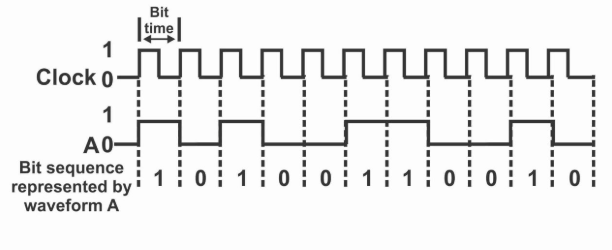
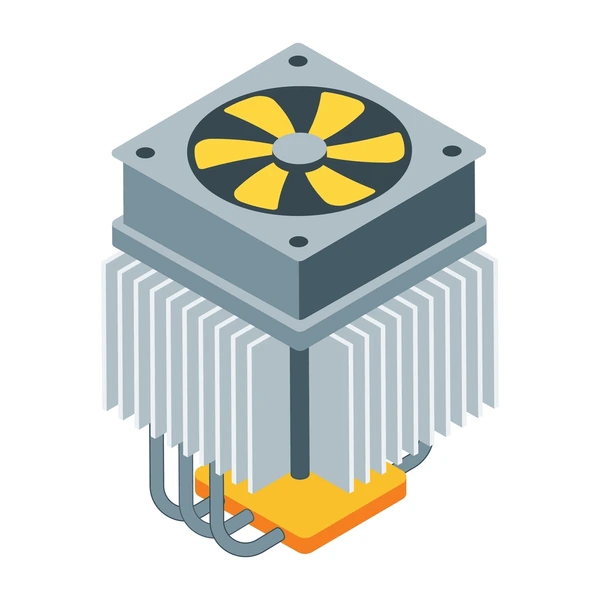

# Clock Speed and Frequency

Computers perform tasks by executing billions of instructions every second. But how fast a computer actually operates is largely determined by its **clock speed**—the frequency at which its CPU cycles through instructions. This speed controls how quickly a processor can respond to tasks, and is a key metric for evaluating a computer's performance.

---

## What is Clock Speed?

**Clock speed** refers to the rate at which a processor completes its basic operations. It is measured in **Hertz (Hz)**, meaning cycles per second. A higher clock speed means the processor can execute more instructions every second.

For example:

* **1 GHz (gigahertz)** = 1 billion cycles per second
* **3.5 GHz CPU** = performs 3.5 billion cycles per second

Each cycle in a CPU performs a fundamental part of instruction processing: it might fetch an instruction from memory, decode it to understand the operation, or execute it to perform calculations or logic. Therefore, higher clock speeds mean these steps happen faster.

The CPU has an internal quartz crystal oscillator that creates regular electronic pulses—this is the clock. Every tick of this clock synchronizes the activities inside the CPU, ensuring all parts work together.

---

## Why Clock Speed Matters

Clock speed sets the **heartbeat** of the processor. It's like the ticking of a metronome—every instruction the CPU executes is synchronized with this beat. If the beat ticks faster, more instructions can be processed per second.

However, there are **limits** to how high clock speeds can go:

* **Heat**: Faster switching means more heat generation. This can damage chips if not cooled properly.
* **Power consumption**: Higher frequencies require more voltage and current, which drains battery and increases electricity costs.
* **Diminishing returns**: At some point, increasing clock speed doesn’t lead to proportional performance gains due to bottlenecks in other parts of the system, like memory access or software limitations.

Modern CPUs often use **dynamic frequency scaling** (like Intel's Turbo Boost or AMD’s Precision Boost) to increase clock speed only when needed. This helps balance performance and energy efficiency.

---

## Clock Speed vs Performance

It’s a myth that **clock speed alone determines speed**. Performance depends on:

* **CPU architecture** (how efficiently instructions are processed)
* **Instructions per cycle (IPC)**: how much work is done per clock tick
* **Multithreading/multi-core** capabilities: Can it do multiple things at once?
* **Cache size and memory bandwidth**: How fast can it fetch the data it needs?

For example, a CPU with lower clock speed but higher IPC may outperform a higher-clocked processor in real-world applications. This is why newer CPUs sometimes beat older ones even at lower GHz.

---

## Overclocking

**Overclocking** is the practice of increasing a CPU’s clock speed beyond its factory rating to gain more performance. While this can boost speed:

* It may cause **overheating**
* It can lead to **instability** or hardware damage
* It typically voids the **warranty**

To support overclocking, users often upgrade:

* CPU **cooling systems** (e.g., liquid cooling)
* **Power supplies** for stable energy delivery
* **Motherboards** that support unlocked clock multipliers

Overclocking is popular among gamers and performance enthusiasts, but it requires knowledge and caution.

---

## Real-World Comparison

* A 2000s desktop CPU might run at 1 GHz and perform a few hundred million instructions per second.
* A modern smartphone CPU runs at 2–3 GHz, but with far more cores and greater IPC, outperforming old desktops.

**Analogy**: Think of clock speed like a car’s RPM. It tells you how fast the engine turns, but not necessarily how fast the car moves—it depends on gear efficiency, tire size, and weight too.

So, clock speed is one factor of many that determines how fast and efficient a computer is. It should always be evaluated alongside architecture, core count, and thermal design.
