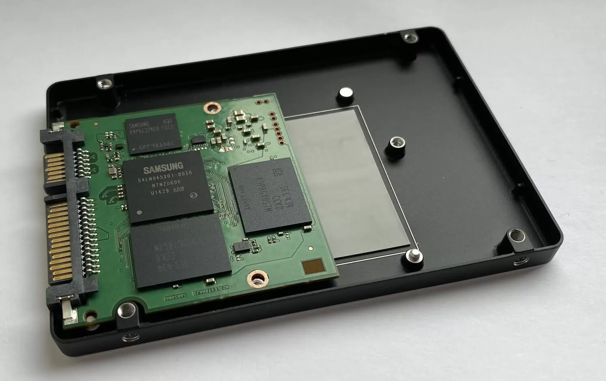

# Storage and I/O Systems

Storage and Input/Output (I/O) systems form the bridge between the CPU and the external world. While **storage** preserves data over the long term, **I/O systems** allow the computer to communicate with peripherals—devices that provide input and output functionality.

Let’s explore both of these vital subsystems.

---

## Storage Systems: Long-Term Memory

Unlike RAM, which is volatile and temporary, storage is **non-volatile**—it retains data even when power is off. There are two primary forms:

### 1. **HDD (Hard Disk Drive)**

* Uses spinning magnetic platters and a mechanical arm
* Slower, but offers large capacities at lower cost
* Good for archival and bulk storage

### 2. **SSD (Solid-State Drive)**

* No moving parts, stores data on flash memory chips
* Much faster than HDDs (especially in read/write speeds)
* More durable and energy-efficient

---

## Internal vs External Storage

* **Internal storage**: Located inside the device (e.g., SSD in a laptop)
* **External storage**: Plugged in via USB or other ports (e.g., USB drives, external HDDs)

Modern systems may also use **hybrid drives** that combine HDD capacity with SSD speed.

---

## Input Devices

Input devices **send data** to the computer. Examples:

* **Keyboard** (text input)
* **Mouse or trackpad** (navigation)
* **Scanner** (digitizing physical documents)
* **Microphone** (voice input)
* **Webcam** (video input)

---

## Output Devices

Output devices **receive data** from the computer and present it to users:

* **Monitor or display** (visual output)
* **Printer** (physical copies)
* **Speakers** (audio output)

---

## Ports and Interfaces

I/O systems rely on physical and wireless **interfaces**:

* **USB**: Universal Serial Bus, connects input/output devices
* **HDMI**: For video and audio output to monitors and TVs
* **Thunderbolt**: High-speed data and power transfer
* **Wi-Fi / Bluetooth**: Wireless I/O connectivity

---

## Data Transfer and Bus Systems

I/O and storage rely on data transfer mechanisms:

* **Buses** carry data to/from the CPU
* **DMA (Direct Memory Access)** allows devices to transfer data without CPU interruption
* **I/O Controllers** manage connected hardware

---

## Summary

* **Storage** is non-volatile and holds data long term (HDD/SSD)
* **I/O devices** allow data exchange with the user and peripherals
* **Ports and buses** connect everything into a single working system

Both storage and I/O systems are essential to making computers useful, interactive machines.
