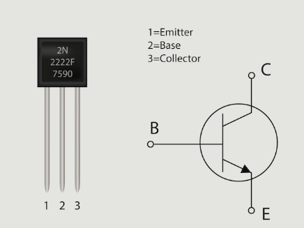
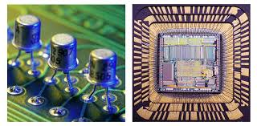
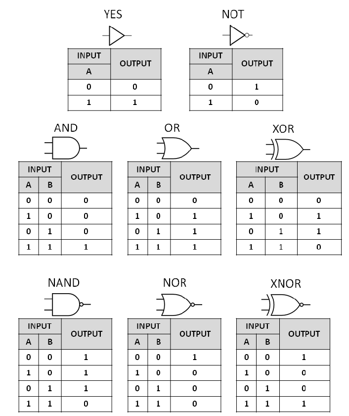

# Transistors and Logic Gates

Transistors and logic gates are the **foundation of all digital computing**. They’re the tiny components that enable your computer, phone, or even a smartwatch to make decisions, perform calculations, and run code.

---

## What is a Transistor?

A **transistor** is a tiny switch that can either allow or block the flow of electricity. It has three parts:

* **Base** (controls)
* **Collector** (input)
* **Emitter** (output)

When voltage is applied to the base, the transistor allows current to flow between the other two ends. This "on/off" behavior represents **1s and 0s**, or binary data.

### Why Transistors Matter

* They act as **tiny switches** or **amplifiers**.
* A modern CPU contains **billions of transistors**, enabling complex computations.
* Transistors are built into silicon chips using nanometer-scale fabrication (e.g. 3nm technology).

---

## Logic Gates: Building Blocks of Decision-Making

Logic gates are combinations of transistors arranged to perform basic logic operations. Each gate takes **binary inputs** (0 or 1) and produces a **binary output**.

### Common Logic Gates

* **AND Gate**: Output is 1 if both inputs are 1.
* **OR Gate**: Output is 1 if at least one input is 1.
* **NOT Gate**: Inverts the input (1 becomes 0, 0 becomes 1).
* **NAND, NOR, XOR, XNOR**: Variants used to build complex logic.

---

## From Logic to Circuits to CPUs

* Logic gates form **combinational circuits** (adders, comparators)
* These combine into **sequential circuits** (memory, registers)
* All together, they create a **CPU’s ALU** (Arithmetic Logic Unit), the part of the processor that performs logic and math

---

## Real-World Analogy: Plumbing System

* A transistor is like a valve controlling water flow
* Logic gates are arrangements of valves deciding which pipes (signals) open
* The whole system processes water (electricity) in a meaningful way

---

## Fun Facts

* Your smartphone has over **10 billion transistors** in its CPU!
* Intel’s 4004, the first commercial microprocessor (1971), had just **2,300 transistors**.
* Transistors switch **billions of times per second**—that’s how fast computers "think".

---

## Summary

* **Transistors** are electrical switches representing 0s and 1s.
* **Logic gates** are combinations of transistors that perform basic decisions.
* They’re the foundation of all digital devices—from calculators to AI.
