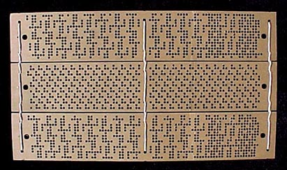
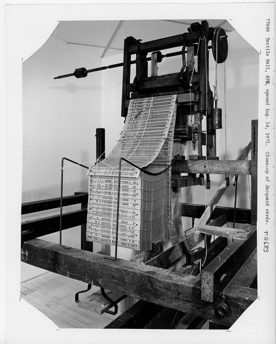
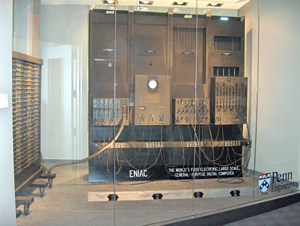
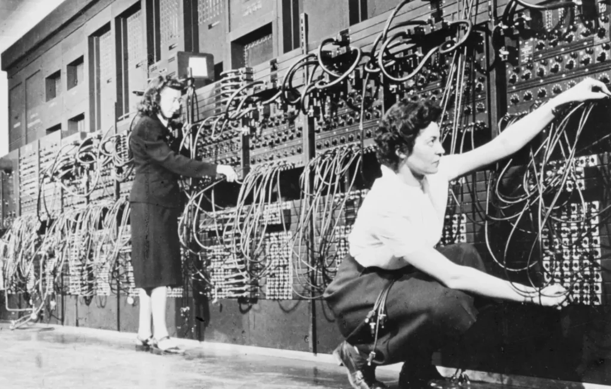
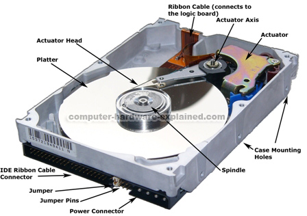

# Evolution of memory, data and instruction/program from jacquard loom to AI

* Jacquard built the loom and used punched cards purely to **control the weaving pattern**.
* The punched cards contained holes arranged in specific patterns that acted as **instructions** telling the loom when to lift certain warp threads.
* These cards were **input only**; they controlled the machine's behavior mechanically but did **not** store data or output information.
* The system was inspired early computing by demonstrating that a machine could be controlled by **programmable external instructions**.
* However, unlike later computers, **storage of data** and **manipulation of output** were not part of the Jacquard loom— it was solely an input-driven device producing fabric by following the punch card pattern instructions.

## The Analytical Engine (1837)

* Charles Babbage designed the Analytical Engine, the world's first mechanical general-purpose computer concept.
* Inspired by the Jacquard loom's punched card input, Babbage proposed using **two types of punched cards**: one for the **program/instructions** and one for **data (numbers)**.
* Unlike the loom, the Analytical Engine was designed with an internal **memory system called the Store**, using mechanical wheels and gears to hold numbers during computation.
* It had a **processing unit called the Mill** to perform arithmetic operations on the data stored in the Store.
* The engine included principles of **conditional branching** (decision-making based on data), **loops**, and **sequential instruction execution**, enabling it to run different algorithms dynamically.
* **Number cards (data cards)** contained numeric values and were fed into the machine to load numbers into the internal memory (the Store).
* The machine then **mechanically set the Store wheels** (gears) corresponding to those values, holding the data physically in memory.
* **Program cards** contained instructions telling the processing unit (Mill) what operations (addition, multiplication, etc.) to perform.

## Alan Turing's Universal Machine (1936)

* **Alan Turing's Universal Machine (1936):** Formalized the concept of a universal computing machine capable of simulating any algorithm, laying the theoretical foundation for modern computers.
  * The UTM uses an **infinite tape divided into squares**, each holding a symbol.
  * This tape acts as the machine's **memory**, holding both the program instructions and data.
  * A read-write head moves over the tape to **read symbols**, **write new symbols**, and **move left or right**.
  * By reading these symbols sequentially and changing them based on a finite set of rules, the machine **processes data and instructions simultaneously**.
  * The tape is an abstract representation of memory—not physical paper tape, but an endless sequence of memory cells.

## Why is it important?

* It showed that instructions (programs) could be encoded as data on the same memory tape that the machine reads from and writes to.
* This foundational idea is behind today's **stored-program computers**, which store both programs and data in the same memory.
* It proved any computable problem could be solved by designing a machine reading appropriate encoded instructions.

## ENIAC (1945)

* **ENIAC (1945):** The first general-purpose electronic digital computer, using vacuum tubes for computations. It was programmable but required manual rewiring for different programs.

## How ENIAC Stored Data and Instructions

* Data was stored in **accumulators**, which were electronic registers holding decimal numbers through electronic flip-flops and counters.
* There was **no centralized memory** holding programs (instructions) electronically.
* Instruction sequences (programs) were implemented by the wiring and switches; programs were hardcoded into the machine physically.
* Output and input were often through **punched cards**, similar to earlier machines.

**Problem:**

* ENIAC: electronic computation with manual rewiring for program; data in electronic registers, no stored instructions.

## Programming ENIAC: Manual Rewiring

* ENIAC was programmed by **physically rewiring cables (plugboards)** and setting switches.
* Programmers had to connect units and routes manually to define the sequence of operations.
* Setting up a new program was complex, sometimes taking **days or weeks**.
* After this hardware setup, software ran automatically, but changing the program meant **changing the wiring and switches again**.

## Stored-program computers (EDVAC, EDSAC)

### Stored-program computers (EDVAC, EDSAC): both program and data stored electronically in the same memory, dynamically read and executed by CPU

* Mercury delay lines were an early form of computer memory used in stored-program computers like EDVAC.
  * Picture a long, sealed tube filled with mercury.
  * At one end of the tube, a device changes electrical signals (1s and 0s) into sound waves.
  * These sound waves travel through the mercury to the other end of the tube.
    * Why mercury when we can directly send it?
      * Mercury is a **liquid metal** that allows sound waves (ultrasonic vibrations) to travel through it very **quickly and smoothly** compared to other liquids or air.
      * also for a calculated delay
  * At the far end, another device listens and changes the sound waves back into electrical signals.
  * This signal is then boosted and sent back to the beginning to keep traveling in a continuous loop.
  * The sound waves moving inside the mercury are like a "wave" of data moving around a loop, storing information.
  * Data is stored one after another in order, like cars moving on a single-lane circular road—so to get a specific "car" (bit), you have to wait for it to arrive at the listening point.
* They used tubes filled with liquid mercury through which **sound waves (ultrasonic pulses)** representing bits (1s and 0s) traveled.
* An electronic transducer at one end would convert electrical signals to sound waves; another transducer at the other end converted the sound waves back to electrical signals.
  * Imagine the data bits as **cars moving one behind another in a circular track** (loop).
  * Each car represents a bit (1 or 0) as a pulse in the mercury.
  * When the computer wants to **add a bit**, it places a car on the track at the right time.
  * To **remove or modify a bit**, it waits until that car arrives at the detector and either changes or discards it.
  * The cars keep circulating as long as the system is powered, preserving the data in sequence.
  * Once the operations or program execution is finished, the machine takes the current "traffic" (data bits) and produces output (reads the bits in order), and the memory can be cleared or reused for the next task.
* Vacuum tubes: electronic switches/amplifiers for CPU logic in early computers.
* EDVAC and EDSAC combined these with stored-program architecture, pioneering modern computers. Mercury delay lines were an early form of memory used in stored-program computers like EDVAC. They stored data as ultrasonic sound waves traveling through tubes of mercury, converting electrical signals to sound and back. The data pulses circulated in a loop, refreshed regularly, storing bits sequentially but not randomly accessible. Mercury was chosen for its acoustic properties, making data transmission faster than air.

## Summary Table: Evolution of Memory and Instructions

| **Phase** | **Memory Type** | **Instructions** | **Data** | **Key Features/Remarks** |
|-----------------------------------|--------------------------------------------------------|-----------------------------------|----------------------------------|--------------------------------------------------------|
| Jacquard Loom (1803) | None (mechanical control only) | Punched cards | None (mechanical) | Programs via cards; no data storage |
| Analytical Engine (1830s) | Mechanical wheels (Store) | Punched cards | Punched cards | Separate program/data cards; mechanical memory wheels |
| Turing Universal Machine (1936) | Abstract infinite tape as memory (theoretical) | Tape symbols as data/instructions | Tape symbols | Abstract model; unified program and data storage |
| ENIAC (1945) | Electronic accumulators (registers) | Hardwired plugs & switches | Electronic registers (temporary) | No stored program; manual rewiring required |
| EDVAC (1949) | Mercury delay line memory | Stored electronically in memory | Stored electronically in memory | Stored-program concept; sequential delay line memory |
| EDSAC (1949) | Mercury delay line memory | Stored electronically in memory | Stored electronically in memory | Early stored-program computer; first practical machine |
| Later generations (1950s onwards) | Williams tube, magnetic core memory, semiconductor RAM | Stored digitally in memory | Stored digitally in memory | Faster, random-access memory; flexible programming |

* **Magnetic Core Memory:** Emerged in the 1950s, became the dominant form through the 1970s. It stored bits as magnetized ferrite cores with very fast random access, non-volatile and reliable. This was true **RAM**.

## Magnetic Core Memory (1950s to mid-1970s)

* Invented and developed mainly by Jay Forrester's team at MIT for the **Whirlwind computer** (early 1950s).
* Used tiny magnetic ceramic rings called **cores**, each representing one bit.
* These cores could be magnetized clockwise or counterclockwise, representing 0 or 1.
* Cores were arranged in a grid with wires threaded through them:
  * Applying current to specific wires magnetized or read a particular core.
* Key innovations included the **coincident current method**, controlling many cores with fewer wires.
* Magnetic core memory was **non-volatile**: it retained data without power.
* Provided **fast random access** unlike earlier sequential memories (e.g., mercury delay lines).
* Became the standard memory for computers for about 20 years, used in early supercomputers, IBM machines, and UNIVAC.

## Advantages of Core Memory

* Reliable with minimal maintenance.
* Faster access (~5-10 microseconds) compared to earlier technologies.
* Could store thousands to hundreds of thousands of bits, scalable.
* Physically robust (no moving parts).

## Semiconductor RAM

* The invention of the **transistor enabled the development of electronic memory: semiconductor RAM**.
* Transistors act as switches storing and controlling bits electronically and more efficiently.
* Semiconductor RAM (DRAM and SRAM) replaced magnetic core, offering **faster, smaller, cheaper, and scalable memory**.

## Basic Concepts Table

| **Concept** | **Explanation** |
|-------------|-------------------------------------------------------------------|
| Transistor | Basic electronic switch, building block of logic gates |
| Logic Gates | Circuits built from multiple transistors implementing Boolean logic |
| Capacitor | Stores electrical charge temporarily |
| Magnetic Core | Early non-volatile memory using magnetism |
| Transistor RAM | Modern electronic memory using transistors and capacitors |

## Memory/Storage Types Comparison

| **Memory/Storage Type** | **Technology Used** | **Transistor Role** | **Volatility** | **Usage** |
|-------------------------|--------------------------------------|------------------------------------------------|----------------|-------------------------------|
| RAM (SRAM/DRAM) | Transistors + Capacitors | Transistor = switch, capacitor = charge holder | Volatile | Temporary active data storage |
| Magnetic Core | Magnetic cores | No transistors | Non-volatile | Early RAM before transistors |
| Hard Disk | Magnetic spinning disks | No direct transistor role | Non-volatile | Permanent storage |
| Flash Storage (SSD) | Transistor-based floating gate cells | Transistors trap electrons | Non-volatile | Permanent storage |

## Flashcards

**Flashcard 1**
Q: What is a transistor?
A: An electronic device acting as a switch or amplifier; fundamental building block to create logic gates.

---

**Flashcard 2**
Q: What are logic gates?
A: Circuits made from multiple transistors implementing Boolean logic (AND, OR, NOT, etc.) to process binary inputs.

---

**Flashcard 3**
Q: What is a capacitor?
A: An electronic component that temporarily stores electrical energy as charge between two plates separated by an insulator.

---

**Flashcard 4**
Q: What is magnetic core memory?
A: Early form of non-volatile random-access memory using magnetized ferrite cores to store bits as magnetic polarity.

---

**Flashcard 5**
Q: How does semiconductor RAM work?
A: Uses transistors and capacitors to store bits electronically; requires refreshing and is volatile.

---

**Flashcard 6**
Q: When was semiconductor RAM invented?
A: Static RAM around 1963; Dynamic RAM invented in 1966; first commercial DRAM chip in 1970.

---

**Flashcard 7**
Q: Is RAM volatile or non-volatile?
A: RAM is volatile; it loses data when power is off.

---

**Flashcard 8**
Q: Is magnetic core memory volatile or non-volatile?
A: Non-volatile; it retains data without power.

---

**Flashcard 9**
Q: How do hard disks store data?
A: Using magnetic polarity of tiny regions on spinning platters read/written by heads.

---

**Flashcard 10**
Q: How does flash storage work?
A: Stores data by trapping electrons in floating gate transistors within flash memory cells.

## Hard Disk Drive Operation

* The **read/write head floats just nanometers above the spinning platter surface**, riding on a thin cushion of air created by the spinning motion.
* This floating prevents any physical contact or scratching during normal operation.
* If a head **does crash into the platter**, it's called a **head crash** and causes physical scratching that can permanently damage data.
* Hard drives are designed carefully to keep heads from touching and to operate without wear during normal use.
* Physical shocks, drops, or wear can sometimes cause head crashes, but regular operation is contact-free.

## Evolution of the CPU

* **Early CPUs (1940s-1950s):**
  * Built from vacuum tubes; huge, slow, and prone to failure.
  * Performed basic arithmetic and logic operations.
* **Transistor-based CPUs (1950s-1960s):**
  * Transistors vastly improved speed, reliability, and size.
  * Enabled more complex instructions and faster execution.
* **Integrated Circuits (1960s-1970s):**
  * Multiple transistors placed on a single chip to form early microprocessors.
  * Intel 4004 (1971) was the first commercial microprocessor, integrating the CPU on one chip.
* **Microprocessor Evolution (1980s-present):**
  * Increasing number of transistors per chip (Moore's Law).
  * Introduction of multi-core processors to handle parallel tasks efficiently.
  * Specialized CPUs like Graphics Processing Units (GPUs) emerged for parallel computation, graphics, and later, AI workloads.

## Why GPU when CPU also does parallel processing?

* **CPUs are designed for general-purpose computing** with a few (4 to 64) powerful cores optimized for sequential and complex tasks.
* CPUs can handle **multiple threads but each core is powerful and designed for diverse tasks** like running OS, applications, and managing I/O.
* **GPUs have thousands of smaller, simpler cores** specialized for doing many similar calculations simultaneously.
* This makes GPUs perfect for **highly parallel tasks** like rendering graphics (thousands of pixels/colors at once), video processing, and AI computations.
* GPU cores have less cache and control logic, focused on throughput over versatility.
* Because GPUs can split tasks into thousands of tiny parallel pieces, they **complete repetitive and uniform computations faster and more efficiently** than CPUs.

## CPU vs GPU Comparison

| **Attribute** | **CPU** | **GPU** |
|---------------|------------------------------------|-----------------------------------------|
| Core Count | Few (4 to 64), powerful | Thousands, simpler cores |
| Task Type | Sequential, diverse, complex | Highly parallel, repetitive |
| Strength | Versatility, decision making | Massive parallel data processing |
| Use Cases | Running OS, apps, logic code | Graphics rendering, AI, deep learning |
| Memory | Smaller cache, optimized for tasks | Larger VRAM, optimized for throughput |
