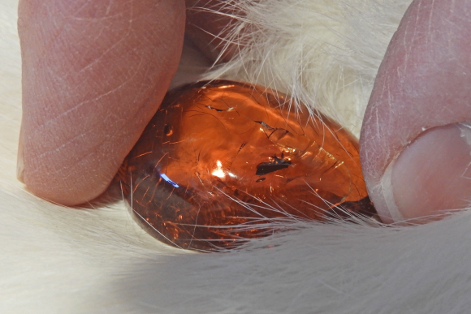
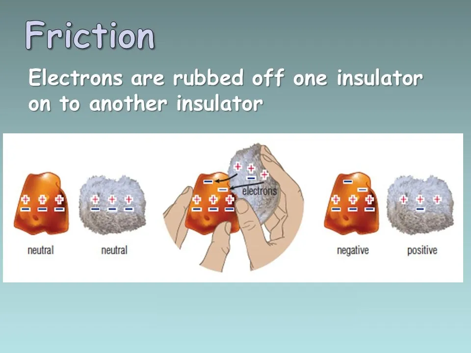
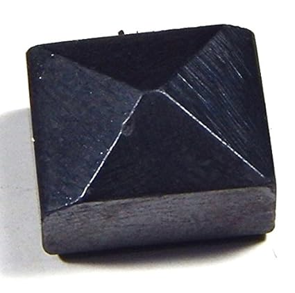

# Evolution of transistors

## Ancient Times: Living without electricity

* People lived by **firelight and candles** for light, and manual labor for tasks.
* Natural phenomena like **lightning** amazed and scared them—a powerful unknown force.

## Early Observations (~600 BC)

* Greek philosopher **Thales of Miletus** noticed rubbing amber with fur attracted light objects.

### What is Amber and Static Electricity?

* **Amber** is fossilized tree resin that becomes hard and yellowish, often found as shiny gems.
* The ancient Greeks noticed that **when amber is rubbed with cloth (like fur),** it can attract small objects like feathers or dust.
* This happens because rubbing transfers tiny electric charges, creating an imbalance called **static electricity**.
* Yet, electricity was a mystery, no understanding of currents or how it worked.

## What is imbalance in static electricity?

* Matter is made of atoms, which have a nucleus (protons + neutrons) and electrons orbiting it.
* Normally, atoms have an equal number of **protons (+ charge)** and **electrons (- charge)**, so they are electrically **neutral**.

### Electric Force in Atoms

* Atoms have positively charged protons in the nucleus and negatively charged electrons around.
* The **electric force between protons and electrons holds the electrons near the nucleus**.
* This force keeps the atom stable.
* **Static electricity occurs when some electrons get transferred** from one object to another by rubbing or contact.
* This causes one object to have too many electrons (negative charge), and the other to have fewer electrons (positive charge).
* This **charge imbalance** creates attraction/repulsion forces—like a balloon sticking to a wall after you rub it on your hair.

### What is Electric Force?

* **Electric force** is the push or pull between two objects that have electric charge.
* Charges can be **positive** or **negative**:
  * Opposite charges (**+ and -**) attract each other.
  * Like charges (**+ and +** or **- and -**) repel each other.

**SUMMARY:**

* Static electricity = imbalance of electrons and protons by electron transfer.
* Atoms are neutral when electrons balance protons.
* Rubbing causes electrons to jump between objects, creating charge differences.

## Thousands of years later: More curiosity and experiments

* People saw electric shocks from **electric fishes** in rivers, known in ancient Egypt and Greece.
* Early experiments involved rubbing objects and seeing sparks or attraction but **no clear science yet**.
* Electricity was considered a curiosity, magical or divine.

### **Electricity was considered a curiosity, magical or divine.**

## 1600s–1700s: Beginning scientific understanding

* English scientist **William Gilbert** distinguished between magnetism and static electricity.
* Named the phenomenon **"electricus"** from the Greek for amber, which gave us the word **electricity**.
* Static electricity was studied, and devices like the **Leyden jar** were invented that could store charge—like early capacitors.

* Lodestone magnet is a naturally magnetized piece of the mineral **magnetite**.
* It was the first known **natural magnet**, attracting iron and used in early compasses.
* Gilbert experimented with different materials like lodestone magnets and electrified amber.
* He noticed **magnets attract only metals like iron and steel, and their attraction is strong, permanent.**

## Let's recap important things that you must know to understand hardware and software

**Electricity** is like water flowing through a pipe.

* The **electric current** is the flow of water (electrons flowing in wires).
* The **voltage** is like water pressure pushing the flow through the pipe.
* An **electric field** is like the pressure field around the pipe that pushes water in a specific direction.
* When you turn on a tap (close a switch), you let electric current flow.
* In circuits, this current powers devices like lights or computers.

**Transistors and vacuum tubes:**

* Imagine a valve controlling water flow.
* A small twist of the valve handle (small voltage) can open or close the valve, controlling the big flow of water (electric current).
* This is how transistors use small signals to control large currents on/off, forming the basis of digital logic (bits: 1 and 0).

**Key Points:**

* Electricity = flow of electrons/current (like water flow).
* Voltage = pressure pushing current.
* Electric field = the pushing force direction and strength.
* Transistors/vacuum tubes = valves controlling current for binary switching.

## Hans Christian Ørsted's Discovery (1820)

* Ørsted was investigating the effects of electric current flowing through a wire.
* He placed a **compass needle** (a tiny magnet) near a wire carrying electric current during a lecture.
* When the current was switched **on**, the **compass needle moved**—it no longer pointed north but was deflected.
* This showed that an **electric current creates a magnetic field** around the wire.
* The magnetic field produced by the current in the wire formed **circular lines around the wire**.
* Reversing the current direction reversed the direction of the magnetic field and the needle's deflection.

**Significance:**

* Electricity and magnetism were not separate phenomena — they are connected.
* It was the first experimental proof that moving electric charge (current) produces magnetism.

## Mid to Late 1800s: From Discovery to Practical Electricity

### Faraday's Key Experiment

* Faraday wrapped two insulated wire coils around opposite sides of an iron ring (a magnetic core).
* He connected one coil to a battery, creating electric current and thus a magnetic field in the iron ring.
* The second coil was connected to a galvanometer (a device that detects electric current).
* When current was switched **on or off** in the first coil, Faraday observed a brief pulse of current in the second coil.
* After Faraday's discovery of electromagnetic induction, inventors worked to harness electricity for practical use.
* **Electric generators** were developed, using mechanical energy (like steam engines) to produce electricity on a large scale.
* **Electric motors** were invented, converting electric energy back into motion.
* Electrical power started being used in **industries, street lighting, and eventually homes**.

### Timeline of Key Discoveries

| **Year** | **Discovery/Contribution** | **Impact** |
|----------|------------------------------------------------|----------------------------------------------------------|
| 1820 | Ørsted: Current creates magnetic fields | Linked electricity and magnetism |
| 1831 | Faraday: Changing magnetic field induces current | Basis of electric generators and transformers |
| 1860s-70s | Maxwell: Unified electromagnetism | Predicted electromagnetic waves leading to wireless tech |

## Late 1800s – Early 1900s: The Electrification Era

* Thomas Edison developed the **incandescent light bulb** and built early electric lighting systems.
* George Westinghouse and Nikola Tesla championed **AC (Alternating Current)** for long-distance power transmission, which became dominant over Edison's DC systems.
* Development of power plants, transmission lines, and electrical grids began powering cities worldwide.

## Early 20th Century: Rise of Electronics

* The invention of the **vacuum tube** enabled amplification and switching of electrical signals.
* This led to **radios, telephones, and early computing machines**.
* Electricity changed from just light and motion to complex signal processing.

## Magnetic Fields and Moving Charges

* When electric charges (current) **move through a wire**, they create a magnetic field circulating around the wire.
* A **coil** is just a wire wound into loops, like a spiral or spring.
* When electricity flows through this coil, it intensifies the magnetic field around it (like stacking magnets together).
* The coil acts like a temporary magnet when current passes through.

## Maxwell's Contributions (1860s-1870s)

Maxwell formulated the **classical theory of electromagnetic radiation**, known as **Maxwell's Equations**.

* He showed that **electric and magnetic fields are interconnected and can propagate through space as waves**.
* These waves, called **electromagnetic waves**, travel at the speed of light.
* He proposed that **light itself is an electromagnetic wave**, uniting optics and electromagnetism.
* Maxwell's theory predicted the existence of other electromagnetic waves beyond visible light—like radio waves, microwaves, and X-rays.
* This explained how **electric and magnetic phenomena and light are different aspects of the same underlying electromagnetic force.**
