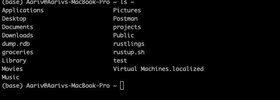
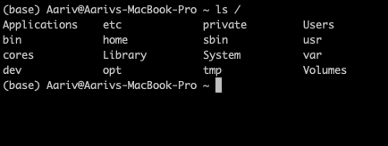
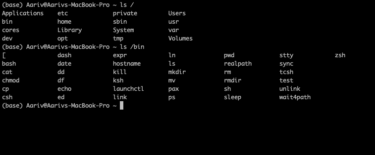

# Shell Explained

## What is a Shell?

### This article is a pre-requisite for rust language

To read rust script

```sh
curl --proto '=https' -sSf <https://sh.rustup.rs> -o rustup.sh
cat rustup.sh

```

To install rust:

```sh
curl --proto '=https' -sSf <https://sh.rustup.rs> | sh
```

The | (pipe) in the command curl --proto '=https' -sSf <https://sh.rustup.rs> | sh is a Unix pipe operator. It takes the output of the command on its left (curl ...) and feeds it as input to the command on its right (sh).

Explaining **sh**

A **shell** is a command-line interface that lets you interact with the operating system by running commands, scripts, and programs. It interprets user input (or scripts) and executes them, like running your command...

### Purpose of sh in Your Command

- The rustup script fetched by curl is a shell script (starts with #!/bin/sh).
- \#!/bin/sh - use bourne shell to execute the script
- sh is chosen for broad compatibility across Unix-like systems (e.g., macOS, Linux).

### **Folder Structure**

What is a File System?

A file system is how macOS organizes files and folders on your computer.

Why care?:

Programs (Rust, Chrome) and files (rustup.sh) are stored in specific folders.

```sh
ls
```

What it does: Lists files/folders in your current location.
Your output: Applications Desktop Documents ...

What is a Directory?

A directory is a folder that holds files or other folders (e.g., Desktop, /bin).
Directories have paths (addresses) like /Users/aariv or /bin.

```sh
pwd
```

What is ~ (Home Directory)?

**~** is your personal directory on macOS, located at

```sh
/Users/<your-username> (e.g., /Users/aariv).
```

It’s where your personal files and folders live, like Desktop, Documents, Downloads, rustup.sh, rustlings.

**Note**
When you open a terminal:

By default, it starts in your home directory (~, e.g., /Users/aariv).
Running ls lists the contents of your current directory, which is ~.

**/** (Root Directory)?

/ is the top-level directory of the entire file system, containing system folders like /bin, /usr, /Users (which includes your ~).
It’s the root of the file system tree, not your personal space.


1. Applications:

What it is: A folder for system-wide applications (e.g., Chrome in /Applications/Google Chrome.app).
Purpose: Stores apps accessible to all users, installed via the Mac App Store or manually.

2.bin:

What it is: Short for "binaries," contains core system commands like sh, ls, cp.
Purpose: Essential tools for the OS to function, used by scripts like rustup’s #!/bin/sh.


```sh
ls /bin
```

3.cores:

What it is: A folder for crash report data (e.g., core dumps from crashed programs).
Purpose: Used by the OS for debugging, not something you interact with directly.

4.dev:

What it is: Contains device files (e.g., tty, disk) representing hardware like keyboards or disks.
Purpose: Allows the OS to communicate with hardware.

5.etc:

What it is: Stores configuration files for the OS (e.g., hosts, passwd).
Purpose: Defines system settings, not user data.

6.Library:

What it is: Contains system and user libraries, caches, and preferences.
Purpose: Stores shared code and app data (e.g., /Library/Fonts, ~/Library for user-specific data).

7.opt:

What it is: For optional software installed by admins (e.g., third-party tools).
Purpose: Keeps additional software separate from core system files.

8.private:

What it is: Holds private system files (e.g., var, tmp) with restricted access.
Purpose: Secures OS internals.

9.sbin:

What it is: Contains system administration binaries (e.g., reboot, shutdown).
Purpose: Tools for managing the OS, requiring root access.

10.System:

What it is: Core macOS system files and folders.
Purpose: Houses OS components (e.g., kernel, frameworks).

11.tmp:

What it is: A folder for temporary files (e.g., during installs or crashes).
Purpose: Stores data deleted on reboot.

12.Users:

What it is: Contains all user home directories (e.g., /Users/aariv is your ~).
Purpose: Central hub for personal folders like Desktop, Documents.

13.usr:

What it is: Holds user-related binaries and libraries (e.g., /usr/bin for python3, gcc).
Purpose: Extends /bin with more tools.

```sh
ls /usr/bin
Output: gcc  python3  vim  ... (if installed).
```

14.Volumes:

What it is: Lists mounted storage devices (e.g., external drives, partitions).
Purpose: Manages additional storage.

```txt
/
├── Applications (apps for everyone, e.g., Chrome, Xcode)
├── bin (basic commands: ls, cp, sh)
├── cores (crash dumps)
├── dev (devices: disks, terminals)
├── etc (system configs: hosts, passwd)
├── Library (shared fonts, caches, preferences)
├── opt (optional software, e.g., Homebrew)
├── private (system internals: var, tmp)
├── sbin (admin commands: reboot, shutdown)
├── System (macOS itself: kernel, frameworks)
├── tmp (temporary files, cleared on reboot)
├── Users (home folders: /Users/aariv, /Users/guest)
├── usr (extra tools: python3, gcc, vim)
└── Volumes (mounted drives: USBs, external disks)
```

### **Types of Shells:**

Bourne Shell (sh):

- **Description**: The original Unix shell (1977), lightweight, POSIX-compliant, designed for scripting.
  - **Lightweight**: Minimalist design, low resource usage, built for efficiency on early Unix systems.
  - **POSIX-compliant**: Forms the core of the POSIX shell standard (IEEE 1003.1), ensuring portable scripting with consistent syntax (e.g., if, for, pipe) across Unix-like OSes.
  - **Designed for scripting**: Optimized for automation, with features like variables, control structures, and I/O redirection (>, |), ideal for system tasks.
- **Path**: /bin/sh (on macOS, often a symlink to /bin/bash).
- **Use**: Portable scripts, like rustup’s #!/bin/sh, for cross-system compatibility.

```sh
#!/bin/sh // hashbang - Guarantees the script uses a POSIX-compliant shell,
echo "Installing..."
```

Run: sh script.sh → Output: Installing...

Bash (Bourne Again Shell)

- **Description**: Extends sh with interactive features (history, tab completion) and scripting enhancements.
- **Path**: /bin/bash.
- **Use**: Default on many Linux systems, runs sh scripts

```shellscript
#!/bin/bash
for i in 1 2 3; do echo "Count: $i"; done
```

zsh Z Shell:

- **Description**: Extends bash with advanced interactivity (better completion, plugins like Oh My Zsh). Default on macOS since 2019, likely your shell.
- **Path**: /bin/zsh.
- **Use**: Ideal for coding sessions, runs sh scripts.

### Which is most used?

- **Globally**: Bash is the most used due to its default status on Linux (80%+ server market share) and legacy in scripting. Stack Overflow’s 2023 survey shows Bash as the top shell for developers (used by \~50% of respondents).

**Path building rule:**

A slash / means “go inside this folder”.

```bash
~/.cargo
~ = /Users/aariv (your home).
/.cargo after it = “the .cargo folder inside it.”
So:
~/.cargo → /Users/aariv/.cargo
```
