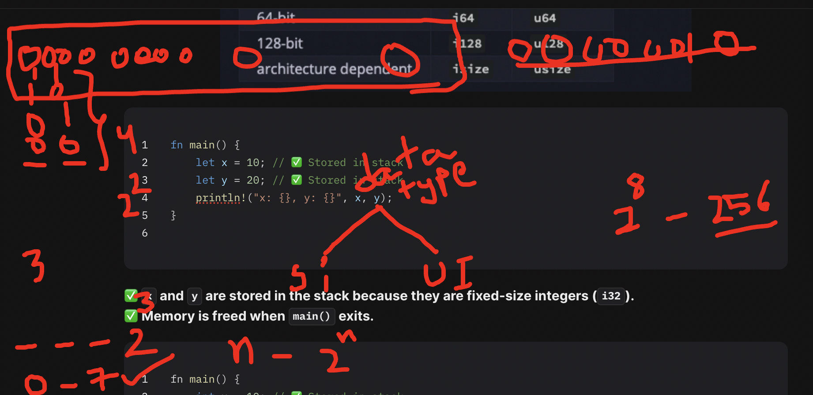
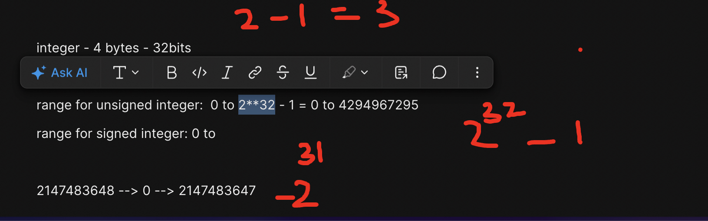
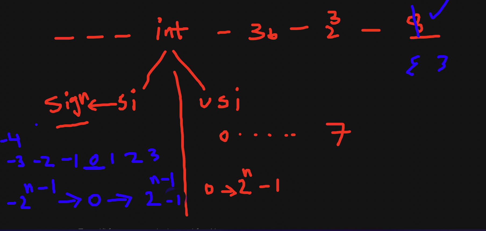
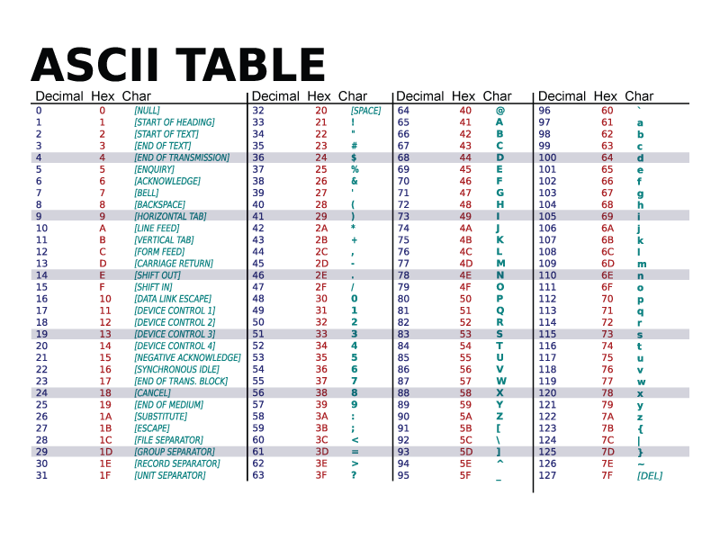

# Memory in Detail - Part 1

## **Understanding Memory in Rust (Stack vs Heap)**

To fully understand **stack and heap memory**, we need to explore:

1. **Where memory is located in the system (RAM, CPU, Registers)?**
2. **How Rust manages memory (Stack vs Heap Allocation)?**
3. **The journey of memory allocation, execution, and cleanup.**

## **Where Does Memory Reside?**

Your **computer's memory** is structured into different layers:

### **📌 Memory Hierarchy (From Fastest to Slowest)**

| **Memory Type**    | **Speed**   | **Size** | **Where It Resides?**    | **Example Use**                         |
| ------------------ | ----------- | -------- | ------------------------ | --------------------------------------- |
| **Registers**      | 🔥 Fastest  | 💾 Tiny  | Inside CPU               | Temporary calculations                  |
| **L1/L2/L3 Cache** | ⚡ Very Fast | 📦 Small | Inside CPU               | Frequently used data                    |
| RAM **Stack**      | ⚡ Fast      | 📦 Small | RAM (Fixed Memory Block) | Function calls, local variables         |
| RAM **Heap**       | 🐢 Slower   | 📦 Large | RAM (Dynamic Memory)     | Dynamic objects (e.g., `Vec`, `Box<T>`) |
| **Disk (SSD/HDD)** | 🐌 Slowest  | 🏢 Huge  | Storage Device           | Persistent data                         |

✅ **Registers & Cache**: Used for quick calculations.
✅ **Stack**: Stores temporary **function data, local variables****.**
✅ **Heap**: Stores dynamically allocated memory (large objects).

## **2️⃣ Stack vs Heap: How Rust Uses Them**

📌 **Stack (Fixed, Fast Memory Allocation)**

* **Stores function calls, local variables, small data.**
* **Faster than heap because memory is managed automatically (LIFO - Last In First Out).**
* **Memory is freed automatically when function exits.**

📌 **Heap (Dynamic, Flexible but Slower)**

* **Stores dynamically sized objects (e.g.,&#x20;****`String`****,&#x20;****`Vec<T>`****,&#x20;****`Box<T>`****).**
* **Requires explicit memory allocation (****`new()`****,&#x20;****`Box<T>`****,&#x20;****`Vec<T>`****, etc.).**
* **Slower than stack (Rust needs to track memory and free it manually).**

**Stack example:**


```rust
fn main() {
    let x::i8 = 10; // ✅ Stored in stack
    let y::i8 = 20; // ✅ Stored in stack
    println!("x: {}, y: {}", x, y);
}

```

✅ **`x`****&#x20;and&#x20;****`y`****&#x20;are stored in the stack because they are fixed-size integers (****`i32`****).**
✅ **Memory is freed when&#x20;****`main()`****&#x20;exits.**

```c
fn main() {
    unsigned int x = 10; // ✅ Stored in stack
    int y = 20; // ✅ Stored in stack
    println!("x: {}, y: {}", x, y);
}

```



###


integer - 4 bytes - 32bits

range for unsigned integer:  0 to 2\*\*32 - 1 = 0 to 4294967295

range for signed integer: 0 to

2147483648 --> 0 --> 2147483647




// note - explain sign qualifiers in c

two types

signed

unsigned



### **🔹 Heap Example (Dynamic Memory Allocation)**

```rust
fn main() {
    let name = String::from("Rustacean"); // ✅ Stored in heap
    println!("Hello, {}", name);
} //  `name` is dropped (heap memory freed)
```



✅ **The actual string&#x20;****`"Rustacean"`****&#x20;is stored in the heap.**
✅ **`name`****&#x20;(the pointer) is stored in the stack.**
✅ **When the function exits, Rust automatically frees heap memory.**

```rust
let name = "steve"
let name = "jobs"
let name = first_name + last_name
// name = "stevejobs"
```

## **3️⃣ Journey of Memory Allocation in Rust**

Let's **visualize the journey** of how memory is allocated **step by step**.

### **📌 Example: Stack & Heap Allocation in Rust**

```rust
fn main() {
    let a = 10;          // ✅ Stored in STACK (Fixed size)
    let b = 20;          // ✅ Stored in STACK
    let name = String::from("Rust"); // ✅ Allocated on HEAP

    println!("a: {}, b: {}, name: {}", a, b, name);
} // ✅ `name` is automatically dropped (Heap memory freed)

```

### **📌 Step-by-Step Memory Journey**

1️⃣ **Program Starts**

* OS allocates memory for execution.
* CPU registers/cache load frequently used data.

```txt
Stack:
┌────────┐
│  a: 10 │
│  b: 20 │
└────────┘

```

✅ Fast allocation, no need to track memory manually.

3️⃣ **String Stored in Heap (****`String::from("Rust")`****)**

```txt
Stack:                     Heap:
┌────────┐                 ┌───────────────┐
│  a: 10 │                 │ "Rust"        │
│  b: 20 │  ───────────►   │ (Allocated)   │
│ name:* ──Pointer──►      └───────────────┘
└────────┘

```

✅ Stack stores a **pointer&#x20;**&#x20;to the heap memory.
✅ Heap memory is managed separately for dynamic data.

4️⃣ **Function Ends, Memory Cleanup**

* **Stack memory is automatically cleared (****`a`****&#x20;&&#x20;****`b`****&#x20;removed).**
* **Heap memory (****`name`****) is freed by Rust’s ownership system.**

## **4️⃣ Rust Memory Management: Ownership, Borrowing, and Lifetimes**

Rust uses **ownership** to ensure safe memory usage **without garbage collection**.

### **🔹 Ownership Example (Preventing Memory Leaks)**

```rust
fn main() {
    let s1 = String::from("Hello");
    let s2 = s                                         // ✅ Ownership transferred (s1 is invalid now)

    println!("{}", s2); // ✅ Works
    // println!("{}", s1); // ❌ ERROR: s1 is no longer valid
}

```

✅ **No memory leaks (Rust frees&#x20;****`s1`****&#x20;automatically when ownership moves).**
✅ **Prevents accessing invalid memory.**

🔹 Borrowing Example (Avoiding Unnecessary Copies)

```rust
fn print_name(name: &String) { // ✅ Borrowing (No ownership transfer)
    println!("{}", name);
}

fn main() {
    let my_name = String::from("Rustacean");
    print_name(&my_name); // ✅ No ownership transfer, safe memory usage
    println!("{}", my_name); // ✅ Still valid
}

```

✅ **Using&#x20;****`&String`****&#x20;avoids moving ownership, allowing reuse.**

## **🚀 Final Summary: Stack vs Heap in Rust**

| **Feature**           | **Stack**                            | **Heap**                               |
| --------------------- | ------------------------------------ | -------------------------------------- |
| **Speed**             | ⚡ Very Fast                          | 🐌 Slower (Needs Allocation)           |
| **Size**              | 📦 Small (Fixed)                     | 📦 Large (Dynamic)                     |
| **Data Stored**       | Function calls, fixed-size variables | Dynamic data (Strings, Collections)    |
| **Ownership Needed?** | ❌ No (Auto-Managed)                  | ✅ Yes (Needs `Box<T>`, `Vec<T>`, etc.) |
| **Example**           | `let x = 10;`                        | `let name = String::from("Rust");`     |
