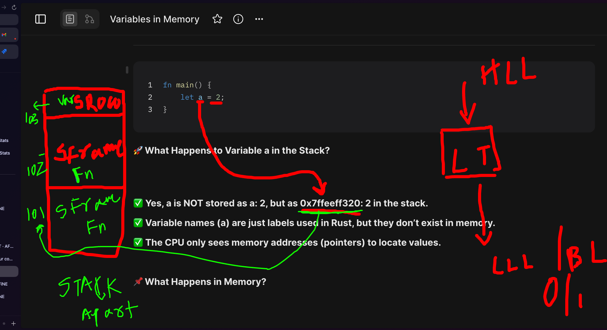

# Memory in Detail - Part 2- Variables, Array in Stack & Heap

```rust
fn main() {
    let a = 2;
}
```

**🚀 What Happens to Variable a in the Stack?**

- ✅ **Yes, a is NOT stored as a: 2, but as 0x7ffeeff320: 2 in the stack.**
- ✅ **Variable names (a) are just labels used in code, but they don’t exist in memory.**
- ✅ **The CPU only sees memory addresses (pointers) to locate values.**

**📌 What Happens in Memory?**

1️⃣ **Rust creates a stack memory slot for a.**

2️⃣ **The address (e.g., 0x7ffeeff320) is assigned to store the value 2.**

3️⃣ **a is just a name used in the code, but at runtime, only 0x7ffeeff320 is used.**

Stack memory represenation:

```txt
Stack Memory
---------------------
| 0x7ffeeff320 : 2 |
---------------------
```

```txt
Stack Memory
---------------------
| 00000000 00000000 00000000 00000010       -> address of this row -> 0x7ffeeff320
---------------------
```



✅ **The CPU doesn’t see a, it only accesses 0x7ffeeff320.**

**_✅ Rust’s compiler replaces variable names with actual memory addresses._**

| **Question**                           | **Answer**                                         |
| -------------------------------------- | -------------------------------------------------- |
| Is a stored in memory?                 | ❌ No, only its value (2) is stored at an address. |
| Does the CPU see a?                    | ❌ No, it only sees 0x7ffeeff320: 2.               |
| How does Rust access a?                | ✅ Rust uses the memory address \&a.               |
| What happens when a goes out of scope? | ✅ Stack memory is freed automatically.            |

## **Integer Array in Rust**

```rust
fn main() {
    let a = [10, 20, 30];  // ✅ Stored in Stack (i32 array)
    println!("Address of a: {:p}", &a);
}
```

📌 **Each i32 takes 4 bytes.**

📌 **Total memory usage = 4 bytes \* 3 elements = 12 bytes.**

📌 **a stores the memory address of the first element (10).**

stack clears when a variable goes out of scope:

```rust

fn main() {
    let a[3] = [12,32,345];  // ✅ Stored in Stack (i32 array)
    println!("Address of a: {:p}", add(a));
}
// program exit here -> a is flushed out
```

## How Is the Array Stored in Stack?\*\*

- ✅ **The array is stored in contiguous memory.**

- ✅ **a (variable name) is actually the address of a\[0] (first element).**

## **📌 Stack Memory Layout**

```txt
Stack Memory
-------------------------------------------------
| Address        | Value                         |
-------------------------------------------------
| 0x7ffeeff320  | 10  (a[0])  ⬅️ a points here |
| 0x7ffeeff324  | 20  (a[1])                    |
| 0x7ffeeff328  | 30  (a[2])                    |
-------------------------------------------------
access - a[1]
address arithmetic:
 starting address of the array + size of the datatype * index
0x7ffeeff320 + 4 * 1 = 0x7ffeeff324
```

- ✅ **Each element is stored 4 bytes apart (i32 = 4 bytes).**

- ✅ **a holds the address of a\[0] (0x7ffeeff320).**

## What If the Array Was in the Heap?

📌 **If we use Box<\[i32]>, the array moves to the heap, and a becomes a pointer stored in the stack.**

```rust
fn main() {
    let a = Box::new([10, 20, 30]);  // ✅ Stored in Heap
    println!("Stack Pointer Address: {:p}", &a);
    println!("Heap Memory Address: {:p}", a);
}
```

```txt
Stack Memory                     Heap Memory
----------------------        ----------------------
| a: PTR --------------->   | 10  (a[0])         |
|                          | 20  (a[1])         |
|                          | 30  (a[2])         |
----------------------        ----------------------


Stack Memory
-------------------------------------------------
| Address        | Value                         |
-------------------------------------------------
| 0x7ffeeff320  | ptr ──► 0x1000 (a: Box)       |
-------------------------------------------------

Heap Memory
-------------------------------------------------
| Address        | Value                         |
-------------------------------------------------
| 0x1000         | 10  (a[0])                    |
| 0x1004         | 20  (a[1])                    |
| 0x1008         | 30  (a[2])                    |
-------------------------------------------------

Access - a[1]
Address arithmetic:
 Starting address of the heap array + size of the datatype * index
 0x1000 + 4 * 1 = 0x1004
```

| **Scenario**                     | **Where is a Stored?** | **What is a?**            | **Where is the Array?** |
| -------------------------------- | ---------------------- | ------------------------- | ----------------------- |
| let a = 2;                       | ✅ Stack               | **Value (2) itself**      | ✅ Stack                |
| let a = \[10, 20, 30];           | ✅ Stack               | **Base address of a\[0]** | ✅ Stack (Contiguous)   |
| let a = Box::new(\[10, 20, 30]); | ✅ Stack               | **Pointer to Heap**       | 🐢 Heap                 |

**🚀 Why Does the Stack Store Heap Addresses?**

✅ **Even though heap memory has its own internal addresses, the stack must store the pointers to those addresses.**

✅ **This is because the CPU needs a way to track and access heap data efficiently.**

✅ **Heap allocations do not have fixed locations like the stack, so the stack acts as a “registry” for heap pointers.**

## **🔹 Example: Why Stack Pointers Are Needed**

```rust
fn main() {
    let x = Box::new(42);  // ✅ Allocated in Heap
    let y = Box::new(84);  // ✅ Allocated in Heap

    println!("Stack Pointer x: {:p}", &x);
    println!("Heap Address x: {:p}", x);
    println!("Stack Pointer y: {:p}", &y);
    println!("Heap Address y: {:p}", y);
}
```

## **📌 Stack & Heap Layout**

```txt
Stack Memory
-------------------------------------------------
| Address        | Value                         |
-------------------------------------------------
| 0x7ffeeff320  | ptr ──► 0x1000 (x: Box)       |
| 0x7ffeeff328  | ptr ──► 0x1008 (y: Box)       |
-------------------------------------------------

Heap Memory
-------------------------------------------------
| Address        | Value                         |
-------------------------------------------------
| 0x1000         | 42  (x's value)               |
| 0x1008         | 84  (y's value)               |
-------------------------------------------------

Stack Memory                    Heap Memory
┌─────────────────────┐         ┌─────────────────────┐
│ 0x7ffeeff320: x    │──ptr──►│ 0x1000: 42          │
│ (Box<i32>)         │         │                     │
├─────────────────────┤         ├─────────────────────┤
│ 0x7ffeeff328: y    │──ptr──►│ 0x1008: 84          │
│ (Box<i32>)         │         │                     │
└─────────────────────┘         └─────────────────────┘
```

✅ **The CPU accesses the stack quickly.**

✅ **If it needs heap data, it follows the pointer stored in the stack.**

**2️⃣ Why Does Rust Use Stack for Heap Pointers?**

📌 **Stack acts as a “Table of Contents”** for heap memory.

📌 **If we didn’t store heap addresses in the stack, the program would lose track of heap data.**

**📌 What Happens Without Stack Pointers?**

🚨 **If there were no stack pointers:**

1️⃣ **The CPU wouldn’t know where heap data is stored.**

2️⃣ **Memory leaks would occur because there’d be no way to track heap allocations.**

3️⃣ **The program would not be able to free heap memory safely.**

✅ **Stack pointers make heap memory manageable and accessible.**

---

**3️⃣ How Does the CPU Use Stack to Access Heap?**

📌 **The CPU does not directly scan heap memory because it’s unordered.**

📌 **Instead, it looks up heap addresses in the stack first, then accesses heap memory.**

## **🔹 CPU Access Flow**

```txt
1️⃣ CPU needs the value of `x`.
2️⃣ CPU checks stack → Finds pointer `0x555555758000`.
3️⃣ CPU follows the pointer to heap memory.
4️⃣ CPU retrieves value `42`.
```

## Heap and Stack Memory

Managing heap and stack memory efficiently makes your program faster and safer by avoiding unnecessary memory scanning and fragmentation.

| **Feature**         | **Stack (Fixed)**                                                                                  | **Heap (Dynamic)**                                                                              |
| ------------------- | -------------------------------------------------------------------------------------------------- | ----------------------------------------------------------------------------------------------- |
| **Speed**           | ✅ Very Fast due to Last-In-First-Out (LIFO) pattern. Simple push/pop operations happen instantly. | ❌ Slower because memory is allocated and freed in random order, requiring complex management.  |
| **Access Method**   | ✅ Direct access.                                                                                  | ❌ Indirect access via pointers stored on the stack, requiring an extra step to reach data.     |
| **Memory Order**    | ✅ Sequentially laid out in memory, reducing fragmentation and improving cache.                    | ❌ Scattered throughout memory, potentially causing fragmentation and cache misses.             |
| **Pointer Needed?** | ❌ No extra pointer needed; variables reside directly on stack frames.                             | ✅ Pointers are required to locate heap data from fixed stack variables (like `String` fields). |

---

### First Principles Summary

- The **stack** is simple and fast because it follows a strict order, making allocation/deallocation predictable.
- The **heap** offers flexibility for dynamically sized data but requires pointers and careful management to avoid fragmentation.
- Efficient use of stack and heap balances speed and flexibility in memory usage.
