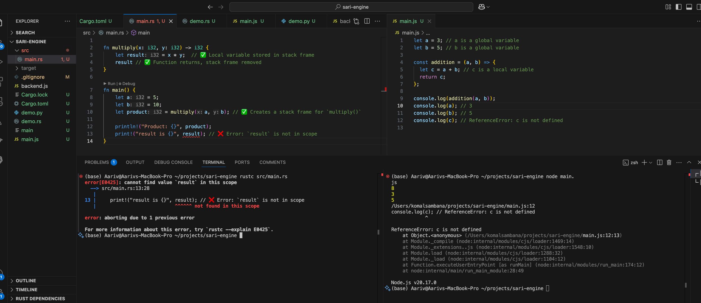

# Memory in Detail  - Part 4- Functions

**What is a Stack Frame?**

**&#x20;a stack frame is a single “block” or “row” in the stack, but it contains multiple values inside it.**

✅ **Each function call creates a new stack frame, which is a structured block of memory.**

✅ **When a function returns, its stack frame is removed (LIFO - Last In, First Out).**

**1️⃣ What is Inside a Stack Frame?**

Each stack frame contains:

1️⃣**Function parameters**(Arguments passed to the function)

2️⃣**Local variables**(Declared inside the function)

3️⃣**Return address**(Where to continue execution after the function ends)



***

## **2️⃣ Example: Stack Frames in Action**

```rust

fn multiply(x: i32, y: i32) -> i32 {
    let result = x * y;  // ✅ Local variable stored in stack frame
    result // ✅ Function returns, stack frame removed
}

fn main() {
    let a = 5;
    let b = 10;
    let product = multiply(a, b); // ✅ Creates a stack frame for `multiply()`

    println!("Product: {}", product);
}
```

```txt
Stack Memory Before Function Call
------------------------------------------------
| Address        | Value                        |
------------------------------------------------
| 0x7ffeeff328  | 5 (a)                         |
| 0x7ffeeff324  | 10 (b)                        |
------------------------------------------------

Stack Frame Memory During `multiply(x, y)`
------------------------------------------------
| Address        | Value                        |
------------------------------------------------
| 0x7ffeeff330  | 5 (x)                         |  <-- New Stack Frame
| 0x7ffeeff32C  | 10 (y)                        |
| 0x7ffeeff328  | 50 (result)                   |
| 0x7ffeeff324  | Return Address (to `main()`)  |
------------------------------------------------

Stack Memory After Function Call Ends
------------------------------------------------
| Address        | Value                        |
------------------------------------------------
| 0x7ffeeff328  | 5 (a)                         |
| 0x7ffeeff324  | 10 (b)                        |
| 0x7ffeeff320  | 50 (product)                  |
------------------------------------------------
```

✅ **Yes! RAM is divided into multiple memory sections, and two key parts are the** **Stack** and **Heap**.

✅ **The stack is a collection of stack rows (for variables) and stack frames (for function calls).**

✅ **The heap is an unordered memory pool for dynamically allocated data.**
