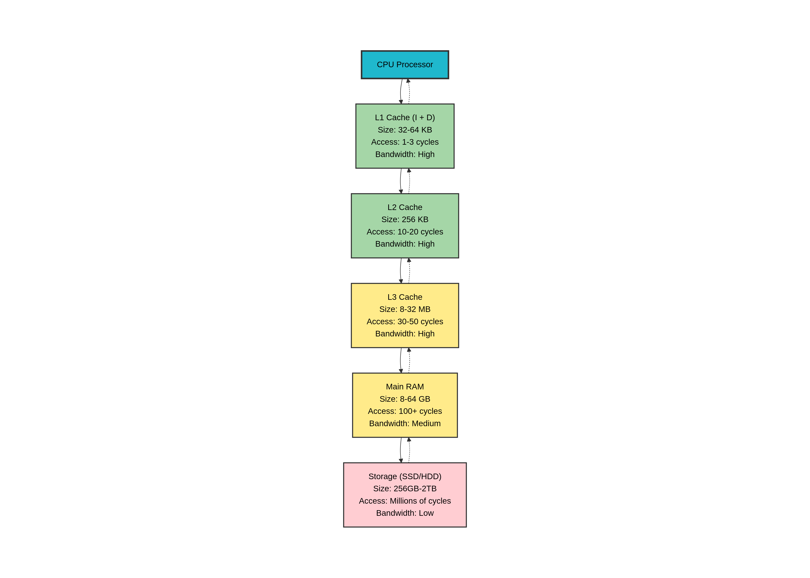

# How Computer Memory Works: The Big Picture

## Introduction

You've learned how the CPU executes instructions. But where does the CPU get those instructions? Where does it store data? How does it access a 64 GB RAM with registers that only hold 64 bits?

The answer is **memory**—one of the most critical and complex parts of your computer.

Memory isn't just one thing. Modern computers have a **memory hierarchy**: from tiny, ultra-fast registers inside the CPU to huge, slow storage on disk. Understanding this hierarchy is crucial for writing fast code, as a single cache miss can waste 100+ CPU cycles.

In this article, we'll explore the complete memory hierarchy, how caches work, and why memory access patterns matter so much.

## Prerequisites

Before reading this article, you should understand:

- CPU basics: registers, ALU, program counter (Article 004)
- Fetch-execute cycle and pipelining (Article 006)
- Basic concepts of storage and speed

## The Memory Hierarchy

Your computer has multiple types of memory, each with different speed and capacity trade-offs:



Let's explore each level in detail.

---

## Level 0: CPU Registers (Fastest, Smallest)

### What Are Registers?

**Registers** are the fastest memory in your computer—located inside the CPU itself.

```
Registers: 64-bit values, stored directly in CPU
Examples (x86-64): RAX, RBX, RCX, RDX, RSI, RDI, RBP, RSP, R8-R15
Examples (ARM64): X0-X31
```

### Characteristics

| Aspect          | Value                                       |
| --------------- | ------------------------------------------- |
| **Size**        | 16 registers × 8 bytes = 128 bytes (x86-64) |
| **Access Time** | 0 cycles (part of CPU, accessed directly)   |
| **Bandwidth**   | Unlimited (multiple reads per cycle)        |
| **Cost**        | Extremely expensive                         |

### Why So Expensive?

Registers are literally part of the CPU die. Each register requires transistors for storage and wiring to connect to ALU. Adding more registers means:

- Larger CPU die (more expensive to manufacture)
- More complex instruction encoding (limited registers per instruction)
- Slower clock speeds (more wiring = longer critical path)

### Register Usage

```rust
// Rust code
let a = 5;           // Register (fast!)
let b = 10;          // Register (fast!)
let sum = a + b;     // Register (fast!)

// CPU sees:
MOV RAX, 5      ; R0 = 5
MOV RBX, 10     ; R1 = 10
ADD RAX, RBX    ; R0 = R0 + R1
```

**Execution**: ~1 cycle for all three operations.

---

## Level 1: L1 Cache (Very Fast, Very Small)

### What Is L1 Cache?

**L1 Cache** is a small, fast memory between CPU and RAM, storing recently accessed data.

### Organization

Modern CPUs split L1 into two parts:

```
L1-I (Instruction Cache):
  - Stores recently executed instructions
  - 32-64 KB typical
  - Hit rate: ~95% (instructions executed sequentially)

L1-D (Data Cache):
  - Stores recently accessed data
  - 32-64 KB typical
  - Hit rate: ~80-90% (depends on code locality)
```

### Characteristics

| Aspect          | Value                         |
| --------------- | ----------------------------- |
| **Size**        | 32-64 KB per core             |
| **Access Time** | 1-3 cycles (hits)             |
| **Access Time** | 10+ cycles (misses, go to L2) |
| **Bandwidth**   | 100+ GB/s                     |
| **Cost**        | Expensive                     |

### How L1 Works: Cache Lines

Data isn't stored individually—it comes in **cache lines** (64 bytes typical).

```
Main Memory:
Address: 0x1000  0x1008  0x1010  0x1018  ...
Data:    [12]    [34]    [56]    [78]    ...

CPU requests: Load from address 0x1001
L1 Cache: "I'll fetch a whole cache line (0x1000-0x103F)"

Cache Line (64 bytes):
[0x1000-0x103F] = { 0x1000: 12, 0x1008: 34, 0x1010: 56, ... }

Now 0x1001, 0x1002, ... 0x103F are all cached!
```

### Cache Hit vs Miss

```
L1 Hit (Data is cached):
  Access time: 1-3 cycles
  CPU gets data immediately

L1 Miss (Data not cached):
  Access time: ~10 cycles + L2 lookup
  If L2 hit: 10-20 cycles
  If L2 miss: 100+ cycles (goes to RAM)
```

### Spatial and Temporal Locality

L1 caches rely on two principles:

**Temporal Locality**: "If you accessed data recently, you'll likely access it again soon."

```rust
// Loop accesses same memory
for i in 0..1000 {
    arr[i] += 1;  // Same array accessed repeatedly
}
// All arr[i] values likely stay in L1!
```

**Spatial Locality**: "If you accessed address X, you'll likely access X+1, X+2, etc. soon."

```rust
// Sequential access loads entire cache line
for i in 0..1000 {
    arr[i] += 1;  // Access 0x1000, 0x1001, ...
}
// Whole cache line fetched, next access already cached!
```

### Real-World L1 Cache Impact

```rust
// Good: Sequential access (L1 cache hits)
fn sum_sequential(arr: &[i32; 1000]) -> i32 {
    let mut sum = 0;
    for i in 0..1000 {
        sum += arr[i];  // Sequential → L1 hits
    }
    sum
}
// Speed: ~1 ns per element

// Bad: Random access (L1 cache misses)
fn sum_random(arr: &[i32; 1000]) -> i32 {
    let mut sum = 0;
    let mut idx = 0;
    for _ in 0..1000 {
        idx = (idx * 1103515245 + 12345) % 1000;  // Random
        sum += arr[idx];  // Random → L1 misses
    }
    sum
}
// Speed: ~100 ns per element (100x slower!)
```

---

## Level 2: L2 Cache (Fast, Small)

### What Is L2 Cache?

**L2 Cache** is larger than L1 but slower—a second-level cache for missed L1 lookups.

### Characteristics

| Aspect          | Value                         |
| --------------- | ----------------------------- |
| **Size**        | 256 KB per core               |
| **Access Time** | 10-20 cycles (hits)           |
| **Access Time** | 30+ cycles (misses, go to L3) |
| **Bandwidth**   | 100+ GB/s                     |
| **Cost**        | Less expensive than L1        |

### L1 Miss → L2 Hit

```
L1 Miss:
  "I need data from 0x10000, not in L1"
  ↓
L2 Check:
  "Found it in L2 cache!"
  ↓
Copy to L1:
  "Also copying to L1 for future hits"
  ↓
Return to CPU:
  10-20 cycles (still fast!)
```

### L2 Statistics (Typical)

```
100 memory accesses:
  90 hit in L1         → 1-3 cycles each = ~270 cycles
  8 hit in L2          → 10-20 cycles each = ~120 cycles
  2 hit in L3          → 30-50 cycles each = ~80 cycles

Total: ~470 cycles ≈ 4.7 cycles per access average
```

---

## Level 3: L3 Cache (Less Fast, Medium)

### What Is L3 Cache?

**L3 Cache** is large and shared between all cores on a CPU.

### Characteristics

| Aspect          | Value                                       |
| --------------- | ------------------------------------------- |
| **Size**        | 8-32 MB (shared across cores)               |
| **Access Time** | 30-50 cycles (hits)                         |
| **Access Time** | 100+ cycles (misses, go to RAM)             |
| **Bandwidth**   | 100+ GB/s                                   |
| **Shared**      | Yes, between all cores (8-16 cores typical) |

### When You Need L3

```
Large working set that doesn't fit in L1/L2:
- Processing image (16 MB) that's larger than L1+L2 (256KB+32KB)
- Multi-threaded program with multiple data sets
- Database operations with large result sets
```

### Cache Coherency (Multi-Core)

With multiple cores sharing L3, a problem arises:

```
Core 1 has value X = 42 in L1 cache
Core 2 modifies X = 100 in memory
Core 1 still sees X = 42 (stale!)

Solution: Cache Coherency Protocol (MESI/MOESI)
  - Cores keep track of what other cores have
  - Write invalidates copies in other cores
  - Cost: Memory barriers, cache line invalidation
```

---

## Level 4: Main Memory (RAM)

### What Is RAM?

**RAM (Random Access Memory)** is your computer's "main memory"—where programs and data live during execution.

### Characteristics

| Aspect          | Value                                      |
| --------------- | ------------------------------------------ |
| **Size**        | 8-64 GB typical (2026)                     |
| **Access Time** | 100+ cycles (latency: ~50-100 nanoseconds) |
| **Bandwidth**   | 20-100 GB/s (DDR4/DDR5)                    |
| **Cost**        | Cheap relative to cache                    |
| **Volatile**    | Data lost when powered off                 |

### Why RAM is So Slow

```
L1 Cache: Data is right next to ALU
          Electricity travels ~1mm = 1-3 cycles

RAM: Data is on separate DIMM module
     Electricity travels ~10cm + through bus
     Signal must:
       1. Travel to memory controller
       2. Be decoded
       3. Accessed from memory array
       4. Travel back
     Total: 100+ cycles
```

### RAM Organization

```
Memory Address Space (64-bit):
0x0000000000000000  ┌─────────────────┐
                    │  Kernel Space   │
                    │  (privileged)   │
                    ├─────────────────┤
                    │  Unused         │
                    ├─────────────────┤
                    │  Heap           │ (grows up)
                    │  (dynamic)      │
                    ├─────────────────┤
                    │  Uninitialized  │ (BSS)
                    │  data           │
                    ├─────────────────┤
                    │  Initialized    │
                    │  data           │
                    ├─────────────────┤
                    │  Code           │
                    │  (.text)        │
                    ├─────────────────┤
                    │  Stack          │ (grows down)
                    ├─────────────────┤
                    │  Unused         │
0xFFFFFFFFFFFFFFFF  └─────────────────┘
```

---

## Level 5: Storage (Disk)

### What Is Storage?

**Storage** (SSD or HDD) is permanent memory where programs and data are stored when not in use.

### Characteristics

| Aspect                    | Value                                         |
| ------------------------- | --------------------------------------------- |
| **Size**                  | 256 GB - 2+ TB typical                        |
| **Access Time**           | 100 microseconds (SSD), 10 milliseconds (HDD) |
| **Access Time in Cycles** | ~1 million cycles (SSD), ~100 million (HDD)   |
| **Bandwidth**             | 1-5 GB/s (SSD), 100 MB/s (HDD)                |
| **Cost**                  | Very cheap                                    |
| **Persistent**            | Data survives power off                       |

### Loading Program from Disk

When you run a program:

```
1. OS reads program file from disk
   Time: 10-50 milliseconds

2. OS creates process in memory
   Maps program code/data into virtual memory

3. CPU starts executing from 0x400000 (typical base)
   But data isn't all in RAM yet

4. First access to unmapped memory → Page Fault
   OS loads 4KB page from disk
   Cost: 10+ milliseconds (5000x slower than L3!)

5. Subsequent accesses to same page → Fast
   (now in RAM, possibly in cache)
```

### Page Faults Kill Performance

```rust
// This looks fast:
arr[0] = 1;
arr[1] = 2;

// But if arr[0] causes page fault:
arr[0] = 1;     // 10 milliseconds (disk load!)
arr[1] = 2;     // 1 nanosecond (already in memory)

10,000,000x difference!
```

---

## Complete Memory Access Latency Numbers

Here are **real numbers** for a modern (2026) CPU:

| Operation       | Cycles       | Nanoseconds | Relative Speed |
| --------------- | ------------ | ----------- | -------------- |
| Register access | 0            | 0 ns        | 1x             |
| L1 cache hit    | 1-3          | 0.3-1 ns    | 1x             |
| L2 cache hit    | 10-20        | 3-6 ns      | 3-10x          |
| L3 cache hit    | 30-50        | 10-15 ns    | 10-50x         |
| Main RAM access | 100-200      | 30-60 ns    | 100x           |
| SSD access      | ~1,000,000   | 300-500 µs  | 1,000,000x     |
| HDD access      | ~100,000,000 | 10 ms       | 100,000,000x   |

**Key insight**: One SSD access = **1 million CPU cycles** wasted!

---

## Virtual Memory and Memory Management

Your program doesn't directly access physical RAM. Instead, it uses **virtual addresses** that the OS translates to physical addresses.

### Why Virtual Memory?

```
Without Virtual Memory:
  Program 1 sees RAM: 0x0 - 0x8000000
  Program 2 sees RAM: 0x8000000 - 0x10000000
  Problem: Hard to manage, fragmented

With Virtual Memory:
  Program 1 sees: 0x0 - 0xFFFFFFFFFFFFFFFF (full address space)
  Program 2 sees: 0x0 - 0xFFFFFFFFFFFFFFFF (full address space)
  OS maps virtual addresses to physical RAM
  Isolation: Each program can't access other's memory
```

### Virtual Memory Address Translation

```
Virtual Address (from program): 0x12345678
                                ↓
TLB Check (Translation Lookaside Buffer):
  Quick lookup: "0x12345000 → 0x98765000"
  Hit: 1-3 cycles ✓

TLB Miss:
  Walk Page Table: 4-5 memory accesses
  Time: 100+ cycles

Physical Address: 0x98765678
                  ↓
L1 Cache Check: Hit/Miss
```

### TLB (Translation Lookaside Buffer)

The **TLB** is a tiny cache (64 entries typical) for virtual→physical address translation.

```
TLB = { (VA, PA) pairs }
Example: (0x12345000 → 0x98765000)

Program accesses 0x12345000: TLB hit → 1 cycle
Program accesses 0x12345100: TLB hit (same page) → 1 cycle
Program accesses 0x55555000: TLB miss → 100+ cycles

TLB flush (context switch): All entries invalidated
```

---

## The Memory Access Path: Real Example

Let's trace what actually happens when your code accesses memory:

```rust
fn access_array(arr: &[i32; 1000]) {
    let x = arr[500];  // Access middle of array
}
```

### Detailed Execution

```
1. REGISTER ACCESS: Get arr address
   Time: 0 cycles
   (Address is already in register from function parameter)

2. COMPUTE EFFECTIVE ADDRESS: arr + 500 * 4
   Time: 1 cycle
   (ALU computes: address + offset)
   Result: 0x12345A00 (virtual address)

3. TLB LOOKUP: Translate virtual → physical
   Time: 1-3 cycles
   (Fast: most addresses cached in TLB)
   Result: 0x98765A00 (physical address)

   (If TLB miss: +100 cycles for page table walk)

4. L1 CACHE LOOKUP: Check L1 data cache
   Time: 1-3 cycles
   Hit? Data found at 0x98765A00
   Not found? Continue to L2

5. L2 CACHE LOOKUP: Check L2 cache
   Time: 10-20 cycles if this is where we find it
   Not found? Continue to L3

6. L3 CACHE LOOKUP: Check L3 cache
   Time: 30-50 cycles if this is where we find it
   Not found? Continue to RAM

7. MAIN MEMORY ACCESS: Load from RAM
   Time: 100+ cycles
   Memory controller fetches from DIMM
   Returns 64-byte cache line

8. POPULATE CACHES: Fill L1, L2, L3
   Time: 0 cycles (happens in background)
   Data now available for future accesses

9. RETURN VALUE TO CPU
   Time: Already done
   Value is now in register/L1 for future use
```

**Total time depends on cache hits:**

- **Best case** (L1 hit): 3 cycles (~1 nanosecond)
- **Typical case** (L2 hit): 15 cycles (~5 nanoseconds)
- **Worst case** (RAM hit): 120 cycles (~40 nanoseconds)

---

## Cache Behavior and Optimization

### Cache Oblivious Algorithms

You can write code that's efficient on multiple cache sizes without knowing exact L1/L2/L3 sizes.

**Good**: Divide-and-conquer respecting memory hierarchy.

```rust
// Matrix multiplication (cache-friendly)
fn matmul_blocked(A: &Matrix, B: &Matrix, C: &mut Matrix) {
    // Process in 64×64 blocks that fit in L3
    for bi in 0..N/64 {
        for bj in 0..N/64 {
            for bk in 0..N/64 {
                multiply_blocks(&A[bi], &B[bk], &C[bi][bj]);
            }
        }
    }
}
// Only loads each cache line once per operation
```

**Bad**: Random access ignoring memory hierarchy.

```rust
// Matrix transpose (cache-hostile if large)
fn transpose_naive(A: &Matrix) -> Matrix {
    let mut B = Matrix::new();
    for i in 0..N {
        for j in 0..N {
            B[j][i] = A[i][j];  // Column-wise write
                                // Ignores cache lines
        }
    }
    B
}
// Misses cache every time, 100x slower
```

### Prefetching

Modern CPUs **prefetch** data they predict you'll need.

```
Sequential access pattern:
  Access: 0x1000, 0x1040, 0x1080, ...

CPU learns pattern:
  "Stride = 0x40 bytes"

Prefetches: 0x10C0 (before you ask!)

When you access 0x10C0: Already in L1!
```

---

## Multi-Core Memory Sharing

With multiple cores accessing memory, complications arise.

### False Sharing

```
Core 1: Modifies arr[0]
Core 2: Modifies arr[1]

But arr[0] and arr[1] are in same cache line!
Core 1 modifies cache line → Invalidates Core 2's copy
Core 2 must refetch → Cache miss

Solution: Pad arrays to separate cache lines
struct Item { data: u64, _pad: [u64; 7] } // 64-byte aligned
```

### Memory Barriers

For thread safety with weak memory ordering (ARM64, RISC-V):

```rust
// Thread 1
data.store(42, Ordering::Relaxed);
flag.store(true, Ordering::Release);  // ← Memory barrier

// Thread 2
if flag.load(Ordering::Acquire) {     // ← Memory barrier
    // Safe to read data
}
```

The `Release` and `Acquire` orderings ensure visibility across cores.

---

## Key Takeaways

1. **Memory hierarchy**: Registers → L1/L2/L3 caches → RAM → Disk
2. **Speed varies 1000x**: L1 cache (1 ns) vs RAM (100 ns)
3. **Cache lines matter**: Fetches 64 bytes at a time
4. **Spatial locality**: Sequential access is 100x faster
5. **Temporal locality**: Reusing data keeps it in cache
6. **Virtual memory**: Programs use virtual addresses, OS translates to physical
7. **TLB misses**: Page table walk costs 100+ cycles
8. **Page faults**: Disk access = 1,000,000+ cycles
9. **Multi-core**: Cache coherency and false sharing matter
10. **Optimization starts here**: Fix memory access patterns before anything else

## Implications for Programmers

1. **Structure of Arrays vs Array of Structures**: SOA is cache-friendly
2. **Sequential > Random**: Sequential access 100x faster
3. **Cache misses dominate**: Profile memory access, not just computation
4. **Prefetching helps**: Regular patterns enable hardware prefetch
5. **False sharing hurts**: Pad data structures to avoid cache line contention
6. **Minimize allocations**: Each allocation might come from disk (page fault)

## Further Reading & References

- [What Every Programmer Should Know About Memory](https://www.akkadia.org/drepper/cpumemory.pdf)
- [Cache Oblivious Algorithms](https://en.wikipedia.org/wiki/Cache-oblivious_algorithm)
- [NUMA Architecture](https://en.wikipedia.org/wiki/Non-uniform_memory_access)
- [Intel 64 Memory Architecture](https://www.intel.com/content/dam/www/public/us/en/documents/manuals/64-ia-32-architectures-system-management-manual-combined-vols-1-2-3.pdf)

## Questions to Test Your Understanding

1. Draw the memory hierarchy from fastest to slowest.
2. What is a cache line? Why do caches fetch them instead of individual bytes?
3. Explain the difference between L1 cache miss and L2 cache hit.
4. What are temporal and spatial locality? Give code examples.
5. Why is sequential memory access 100x faster than random?
6. How does virtual memory work? Why does the OS use it?
7. What is the TLB and why is a TLB miss expensive?
8. What is a page fault and when does it occur?
9. Explain false sharing and how to avoid it.
10. Why do memory barriers matter for multi-threaded code on weak-memory architectures?

Try answering these before reading the next article!

---

## What's Next

Now that you understand the memory hierarchy, the next article will dive into **The Stack**—the fast, structured memory where local variables live.
