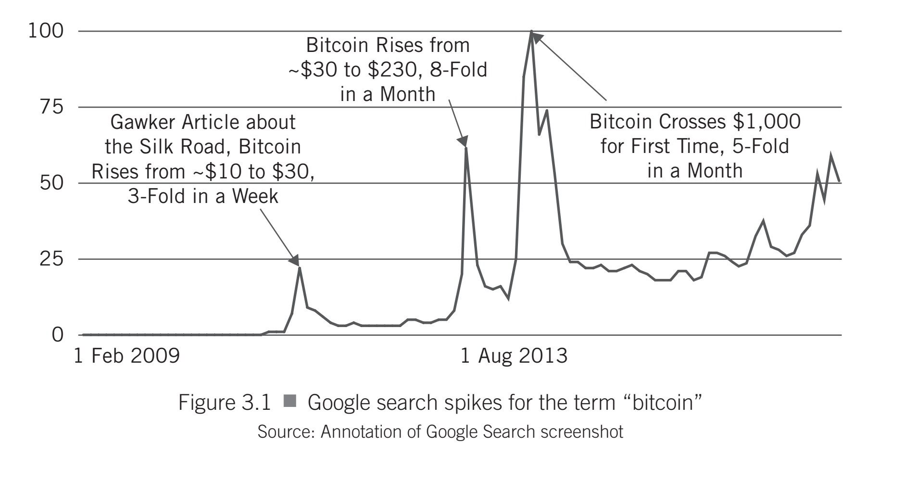

 tHE drawing a line between public and private blockchains, we have entered contentious territory that the innovative investor should understand. The difference between these two types of blockchains and the groups that sup-port them is full of tension, because the two camps have different goals for the technology. At the risk of overgeneralizing, private blockchains are backed by incumbents in their respective industries, while public blockchains are backed by the disruptors.

To round out the context within which the innovative investor approaches cryptoassets, it's important to understand how the world evolved beyond a single blockchain-Bitcoin's blockchain-to include public and private block-chains. Otherwise, investors may be confused when they hear someone claim that Bitcoin is no longer relevant or that it's been displaced. Neither of these claims is true, but it's nonetheless helpful to understand the motivations and rationale behind those that say they are

###            Bitcoin's Early Years: From Quiet Beginnings to Global Attention

After its birth and a quiet, nerdy start, Bitcoin quickly gained notoriety beginning in February 2011 with the launch of the Silk Road, a decentralized online marketplace that used bitcoin as its sole means of payment. This association with the sale of illicit goods, which was first widely publicized by a Gawker article in June 2011, gave Bitcoin its initial "dark reputation." The Gawker article caused the first significant spike in Google searches for Bitcoin and briefly drove its price from about $10 to $30. A much larger surge in interest and price occurred in the spring of 2013, when the price jumped from roughly $30 to $230. This demand is often linked to the financial crisis and bank bailout in Cyprus, which highlighted Bitcoin's appeal as a digital asset outside of government control and led to it being touted as a potential "Global Economy's Last Safe Haven" by Bloomberg. This period in 2013 served as a prelude to Bitcoin's true grand opening to global attention, which was set to happen six months later in November.

## THE UTILITY OF GOOGLE SEARCH TRENDS

Google search trends are a useful indicator of what is grabbing mainstream attention. The innovative investor can go to https://trends.google.com/ and explore the patterns of how people are searching for different topics. Google even provides the option to explore search trends by geographical location, giving charts of where interest is spiking, as well as showing what related top-ics are on the rise. For example, after typing in "bitcoin," investors can look at Google search trends for the last year, or five years, or a custom range, and investigate how Nigeria differs from India. We recommend orienting with this tool even beyond cryptoassets, as it's a fascinating window into the global mesh of minds.

## Blockchain as a General Purpose Technology 

Blockchain is increasingly recognized as a General-Purpose Technology (GPT) due to its broad applicability, transformative potential, and ability to drive innovation across multiple sectors. 

Wide Applicability: Blockchain technology is being applied in finance (e.g., cryptocurrencies, DeFi), supply chain management, healthcare, identity verification, energy, voting systems, and sustainable development (e.g., carbon credit trading), demonstrating its versatility across industries.

Innovation Spawning: It enables new business models by decentralizing control, enabling smart contracts, and creating token-based economies. This fosters innovation in areas like digital ownership, decentralized autonomous organizations (DAOs), and peer-to-peer marketplaces. 

Complementary Nature: Blockchain integrates with other digital GPTs such as artificial intelligence (AI), Internet of Things (IoT), and cloud computing, amplifying their capabilities and creating synergistic effects. 

Evidence from Research:

A 2024 study using patent data and expert interviews found that blockchain already shows key GPT characteristics such as pervasiveness, spawning of innovations, and potential for improvement, leading researchers to conclude it is a GPT in the making.

Another study (2021) noted that while blockchain has not yet fully met all GPT criteria, it exhibits strong signs of becoming one, especially in countries like the United States and China with high R&D investment. 

Challenges to Full GPT Status: Despite strong indicators, some analyses suggest blockchain has not yet achieved full GPT status due to uneven adoption, scalability issues, and regulatory uncertainty. However, its evolutionary trajectory and economic impact potential align closely with historical GPTs like electricity and the internet. 

In summary, blockchain is widely considered a nascent general-purpose technology with the foundational traits to reshape industries, drive digital transformation, and influence macroeconomic dynamics—though its full realization as a GPT is still unfolding. 

## Where is the Blockchain Technology in the Hype Cycle

 blockchain technology is transitioning from experimentation to practical, real-world adoption, placing it in the early maturity phase of its lifecycle. 

Beyond speculation: Blockchain is moving past its speculative roots and is now being used for real business applications, especially in payments, digital assets, and institutional finance. 

Enterprise adoption: Major companies and financial institutions are integrating blockchain for tokenization of real-world assets (RWAs), stablecoin transactions, and efficient settlement systems. 

Infrastructure focus: The ecosystem is maturing with Layer-2 solutions, cross-chain interoperability, and regulated, scalable platforms becoming standard. 

Global use: Adoption is growing rapidly in emerging markets (Asia-Pacific, Latin America, Africa) for remittances and payments, while developed economies focus on compliance and integration. 