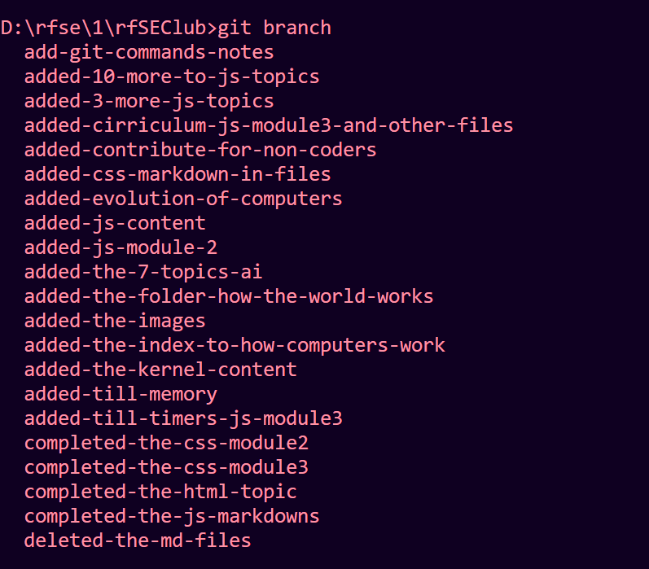
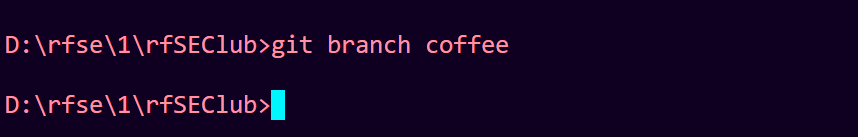
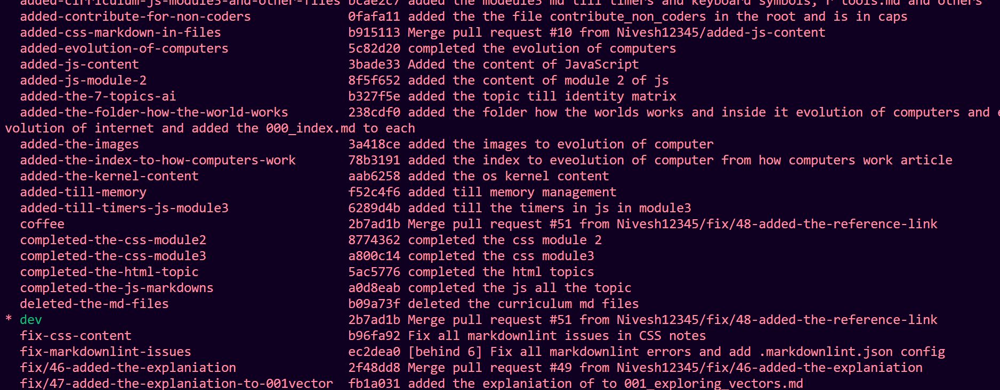

# Git Commands Reference - Notes

## Phase 1: Basic Git Operations

### Configuration

To check your name and email if you have configuration:

```bash
git config user.name
git config user.email
```

To set global configuration:

```bash
git config --global user.name "your name"
git config --global user.email "your email"
```

### Project Initialization

To initialize the project:

```bash
git init
```

### Status and Tracking

To check the status of the project:

```bash
git status
```

### Adding Files to Staging

To add a single file to staging from workspace:

```bash
git add <file name>
```

To add multiple files to staging from workspace:

```bash
git add file1 file2 ...
```

To add all files to staging from workspace:

```bash
git add .
```

### Committing Changes

To commit the changes to the repo:

```bash
git commit -m "message"
```

To commit the changes to the repo in an editor:

```bash
git commit
```

### Viewing Commit History

To check all the commits:

```bash
git log
```

To check all the commits in oneline mode:

```bash
git log --oneline
```

### Unstaging Files

To unstage a file from staging area back to workspace:

```bash
git rm --cached filename
```

### Amending Commits

To amend the last commit:

```bash
git commit --amend
```

### Git Ignore

Create a file named `.gitignore` and add files that you don't want git to track.

---

## Phase 2: Branching

### Check Current Branch

To check the head position:

```bash
git branch
```



### Creating Branches

To create a branch:

```bash
git branch branch-name
```

Example:

```bash
git branch coffee
```



### Switching Branches

Switch branch:

```bash
git switch branch-name
```

To create a branch and switch:

```bash
git switch -c branch-name
git checkout -b branch-name
```


### Branch Information

To view information about each branch:

```bash
git branch -v
```




### Deleting Branches

To delete branch:

> **Note:** You can't delete the branch that you're currently using

```bash
git branch -d branch-name
```

To delete branch forcefully without merging:

> **Note:** You can't delete the branch that you're currently using

```bash
git branch -D branch-name
```

---

## Phase 3: Git Merge

There are 3 kinds of merges:

1. Fast forwarding
2. Merge commit without conflict (with no forward commits in the other branch)
3. Merge commit with conflict (with 1 or more forward commit in the other branch)
git

### How to Merge

Switch to the branch that you want to receive the merge:

```bash
git switch branch-name
```

Now merge the other branch into your branch:

```bash
git merge branch-name
```

---

## Phase 4: Git Diff

### Before Staging

To show the unstaged changes since last commit or to show the changes in our workspace that are not staged yet for the next commit:

```bash
git diff
```

To show all staged and unstaged changes since last commit. To show the changes in your workspace since your last commit. Changes can be anything (before staging/after staging):

```bash
git diff HEAD
```

### After Staging

To show the changes between staging area and last commit:

```bash
git diff --staged
# or
git diff --cached
```

To show the changes between staging area and last commit in a specific file:

```bash
git diff HEAD filename
# or
git diff --staged filename
```

### Comparing Branches and Commits

To show changes between two branches:

```bash
git diff branch1 branch2
```

To show changes between two commits:

```bash
git diff commit1 commit2
```

---

## Phase 5: Git Stash

To switch the branch without committing the current branch:

```bash
git stash
```

To pop the stash:

```bash
git stash pop
```

To copy the stash:

```bash
git stash apply
```

To list the stash list:

```bash
git stash list
```

To delete a specific stash:

```bash
git stash drop stash@{0}
```

To delete all stash:

```bash
git stash clear
```

---

## Phase 6: Detaching & Time Travel

### Detaching HEAD

To detach the head to a specific commit:

```bash
git checkout commit-id  # (first 7 digits)
```

To detach the head to a specific commit using HEAD:

```bash
git checkout HEAD~1
```

Where:

- `HEAD~1` = Last commit
- `HEAD~2` = Last but one commit

### Creating New Commit at Detached HEAD

1. Create a new branch at detached head
2. Do the commit
3. Switch back to master or your branch
4. Merge it

Or:

```bash
git branch branch-name new-commit-id
# Git merge it to master or your branch
```

### Reattaching HEAD

```bash
git switch branch-name
```

### Switching Between Branches

```bash
git switch -
```

### Undoing Changes

To undo the unstaged or working stage changes:

```bash
git checkout -- filename
# or
git checkout HEAD filename
# or
git checkout HEAD~1 filename
# or
git checkout commit-id filename
```

To undo everything:

```bash
git checkout .
```

### Using Git Restore

To undo or discard the unstaged or working stage changes:

```bash
git restore filename
```

To undo or discard the unstaged or working stage changes to a specific commit file:

```bash
git restore --source commit-id filename
# or
git restore --source HEAD~1 filename
```

To undo everything:

```bash
git restore .
```

To undo or discard the staged changes:

```bash
git restore --staged filename
# or
git restore --cached filename
```

### Undoing Commits

Undoing a commit or deleting a commit but not the file changes (e.g., by mistake you have committed in a wrong branch):

```bash
git reset commit-id
```

Permanently deleting a commit along with the file changes:

```bash
git reset --hard commit-id
```

Deleting a commit in a different way - revert. It will create a new commit and there it will delete the file changes:

```bash
git revert commit-id
```

---

## Phase 7: Remote Repositories

### Cloning Repository

Cloning the repo from GitHub:

```bash
git clone <remote repo link>
```

### SSH Keys Configuration

Config SSH keys: <https://docs.github.com/en/authentication/connecting-to-github-with-ssh>

### Two Ways to Link Git Repo to GitHub

1. Push your existing repo (Local machine) to GitHub
2. Start a project on GitHub and clone it to the local machine

### Push Existing Repo to GitHub

1. Create a new repo on GitHub using GUI
2. Connect your local repo to the GitHub repo (also called remote)

> **Note:** Remote is destination link or remote repo URL link or GitHub repo URL link. By convention, it has to be origin.

To check remote details:

```bash
git remote -v
```

### Managing Remotes

Adding remote:

```bash
git remote add <remote-name> <remote repo url>
```

Renaming remote:

```bash
git remote rename <old-remote-name> <new-remote-name>
```

Removing remote:

```bash
git remote remove <remote-name>
```

### Pushing Changes

Now push your changes to GitHub:

```bash
git push <remote-name> <branch name>
```

This will do two things:

1. First it will create a branch on the repo based on your command request
2. Now it will push your last commit to the remote repo

Example: You have a master branch in your local repo. If you push it like `git push origin jyotsna`, this will create a new branch jyotsna on the repo. Now it will push your last commit to the remote repo.

### Set Upstream

Linking local and remote branches:

```bash
git push -u <remote-name> <branch-name>
```

Imagine you are in jyotsna branch in local repo, and you want to commit to Jyotsna repo branch. Now as I am in jyotsna branch in my local machine, if I write `git push -u origin jyotsna`, now as long as I stay in jyotsna local branch, I can simply use `git push` instead of `git push origin branch-name`. Because the link has been established.

### Start Project on GitHub and Clone

1. Create a new repo on GitHub
2. Clone it to your local machine
3. Work locally
4. Now you can push your changes

```bash
git clone <remote-url>
```

> **Note:** The default branch of git is master. But the default branch of GitHub is main.

### Checking Branches

To check local branches:

```bash
git branch
```

To check remote branches:

```bash
git branch -r
```

### Pulling Changes

To pull the remote repo changes to the local machine:

```bash
git pull <origin-name> <branch>
```

### Fetching

You want to check or preview the changes before pulling, so that you can make sure your codebase is not messed up:

```bash
git fetch <origin> <branch-name>
```

This will show you the new remote commits ahead of your local machine code.

### How to Check the Code

Using detached HEAD:

```bash
git checkout <remote-branch name>
```

Example:

```bash
git checkout origin/main
```

Now you can check the code and two cases you have here:

1. You liked it? Then pull the changes
2. You don't like it? Then ignore it

How to come back from detached head:

```bash
git switch <branch-name>
```

### Special Case

Person 1 has pushed a branch to the remote repo and when you pull it, it will show the changes in the remote branch, but not in the local machine. So if you want to see branches, do the following:

```bash
git branch -r
```

This will show you the list of remote branches.

Example:

```bash
origin/main
origin/newbranch
```

```bash
git switch branchname
```

Example:

```bash
git switch newbranch
```

Now this will create the branch newbranch and shows you the code.

### Git Pull vs Git Fetch + Merge

#### Git pull = git fetch + git merge

---

## Collaboration Problems & Solutions

### Problem Example

- Steve made a commit for registration file on master
- Bill is working on login file in his local machine and he needs support from Steve
- Now the only way he can do this is by committing his incomplete code to master
- Now as this master latest commit has bugs, the website that Jack is providing for his customer is stopped
- Now as long as Steve works on the bill bug, the website won't be available for anybody

### Solution: Feature Branches

Treat master as official project history or branch where you push changes only when you are sure that the project has no bugs.

Example: Create a party menu

- Steve - Morning Menu
- Bill - Afternoon Menu
- Jack - Evening Menu

1. Steve will create morning menu branch
2. Bill will create afternoon menu branch
3. Jack will create evening menu branch

Now Steve added tea, coffee. Meanwhile bill push his afternoon branch to remote but, he wants Steve's help in deciding the afternoon menu. Now bill would pull the Steve branch, and help bill with a new commit.

### Pull Request

We should not allow users to push the changes directly. In a real time scenario, we need someone who would scrutinize or verify your pull merge before merging it to master or official branch.

### Contributing to Open Source with Fork and Clone

1. Fork the project
2. Clone the project
3. Set upstream remote to the Open-source project so that you can pull the changes to the local machine
4. Push the changes to the origin
5. Now create a pull request

---

## Rebasing

### Alternative for Merging

> **Note:** Don't use

```bash
git switch newbranch
git rebase master  # or main
```

This would move all the new branch commits to the tip of master branch.

### Interactive Rebase

To change the commit details:

```bash
git rebase -i commit-id  # or HEAD~id
```

---

## Git Tags

Simply pointer that refers to particular phases of your project. Usually we use it to name the version.

### Types of Tags

There are two types:

1. Lightweight tags
2. Annotated tags

### Creating Tags

How to create a tag:

```bash
git tag tagname
```

To list the tags:

```bash
git tag -l  # write version name or common tag name
```

### Semantic Versioning

How to write version names or semantic versioning:

```text
2.3.1
```

Where:

- `2` is major release: major feature released
- `3` is minor release: minor features released
- `1` is patch release: bug fixes

### Checking Tag Status

```bash
git checkout tag
```

### Annotated Tags Creation

```bash
git tag -a <tagname>
```

### Creating Tag for Previous Commits

```bash
git tag <tagname> <commit>
```

### Deleting Tags

```bash
git tag -d <tagname>
```

### Pushing Tags

It has to be separate:

```bash
git push --tags
```

---

## Git Reflogs

```bash
git reflog
```

This will show all the details of project like at what time what you have done.

```bash
git reflog show HEAD
```

```bash
git reflog show main
```

```bash
git reflog head/branch-name@{qualifier}
```

### Time Travel

```bash
git reset --hard <reflog commit id>
```
