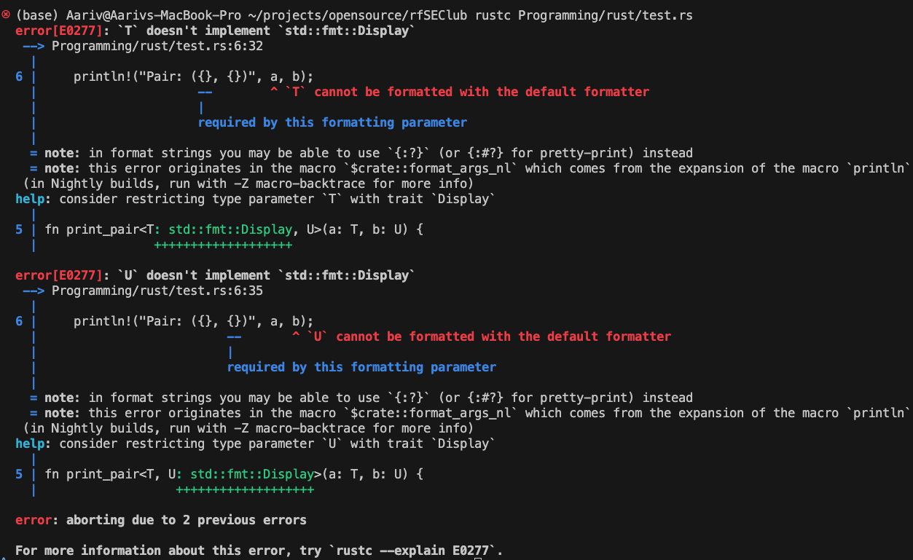

# Variables and Mutability in Rust

## Overview

Variables are a fundamental part of programming that store data values.
In Rust, variables are immutable by default, meaning once a value is assigned, it cannot be changed.

To allow a variable's value to be changed, it must be declared as mutable using the `mut` keyword.

Constants are similar to variables but have important differences:

- They must have a fixed value assigned at compile time.
- They are always immutable.
- They use the `const` keyword.
- They require an explicit type annotation.
- They are accessible throughout the entire program.

---

## Example: Declaring Immutable and Mutable Variables

## Declaring Variables

```rust
let x = 5; // Immutable variable
let mut y = 10; // Mutable variable

println!("The value of x is: {}", x);
println!("The value of y is: {}", y);

y = 15; // Valid because y is mutable

// x = 6; // This would cause a compile-time error because x is immutable
```

You can declare a variable as mutable using `mut`. Attempting to modify an immutable variable will cause a compile-time error.

---

## Constants and Their Declaration

Constants are declared using `const` keyword and must include type annotation.

```rust
const MAX_POINTS: u32 = 100_000;

println!("The maximum points are: {}", MAX_POINTS);
```

Constants are always immutable and are accessible throughout the entire program.

---

Constants are conventionally written in uppercase with underscores. They are handy for fixed values you want available everywhere.

---

## Variable Shadowing

Rust allows you to declare a new variable with the same name as a previous variable. This is called _shadowing_. The new variable shadows the old one.

```rust
let x = 5;
let x = x + 1; // Shadows previous x, now x is 6
let x = x * 2; // Shadows again, x is 12

println!("The value of x is: {}", x); // Prints 12
```

Shadowing is different from mutability because it allows you to re-bind a variable name to a new value and potentially change its type.

---

## Summary

- Variables are immutable by default; use `mut` to allow mutation.
- Constants use `const` and must include a type annotation; they are immutable and globally accessible.
- Shadowing lets you reuse variable names with new values or types.
- Explicit type annotations help control data size and behavior.

This concludes your introduction to variables and mutability. Next, you will explore Rust’s scalar data types in detail.

### Static Variables in Rust

Declared with the static keyword, these are variables that have a fixed location in memory throughout the program's execution.

They exist for the entire lifetime of the program, meaning they are allocated once and remain allocated until the program ends.

#### Immutable by Default, Mutable with static mut

- When you declare a static variable using static in Rust, it is immutable by default. This means its value cannot change after initialization. For example:

```rust
static MAX_USERS: u32 = 100;
// This variable lives for the entire program duration and its value cannot be changed.
```

#### Mutable statics (static mut)

- You can declare a mutable static variable with static mut if you need to change its value:

```rust
static mut COUNTER: u32 = 0;
```

- However, accessing or mutating a static mut variable is unsafe because Rust’s safety guarantees cannot prevent data races in concurrent environments automatically. You must use an unsafe block to read or write:

Because they have a fixed memory address, static variables are most often used for global state, configuration, or interfacing with C code.

```rust
unsafe {
    COUNTER += 1;
}

```

### Synchronization Primitives in Rust

```text
1. Mutex (Mutual Exclusion)
     Think of it as a lock on a resource.

Critical section: A specific region of code where a process or thread accesses a shared resource, like a variable or file.

Locking: A process must acquire a lock before entering the critical section, which prevents other processes from entering at the same time.

Waiting: Any process that tries to access the resource while it is locked must wait until the lock is released.

Unlocking: The process that holds the lock releases it after it has finished executing its critical section, allowing another waiting process to acquire the lock.

When a thread wants to access data, it must “lock” the mutex. No one else can mutate the data until the lock is released.

Only one thread at a time can change the data inside the mutex.

A mutex declared as a local variable lives on the stack.

A mutex inside a Box or other heap-allocated structure lives on the heap.

A mutex declared with static (or through lazy initialization) lives in the static memory region for the program's lifetime.
```

```text
2. Arc Independently
Arc alone is useful for sharing read-only data across threads. It lets multiple threads own the same data without worrying about deallocation.
```

```rust
let data = Arc::new(vec![1, 2, 3]);
for i in 0..3 {
    let data_clone = Arc::clone(&data);
    thread::spawn(move || {
        println!("Thread {} sees: {:?}", i, data_clone);
    });
}

```

### Mutex Independently

Mutex alone protects data from concurrent mutation within a single thread context. But it cannot share ownership across threads on its own.

```rust
use std::sync::Mutex;

fn main() {
    let data = Mutex::new(vec![1, 2, 3]); // Local protected data

    let mut result = data.lock().unwrap();
    result.push(4);
    // Only this thread can access it
}

```

### Arc + Mutex: The Power Combination

When you combine them, you get safely shared, mutable data across threads:

```rust
use std::sync::{Arc, Mutex};
use std::thread;

fn main() {
    let counter = Arc::new(Mutex::new(0)); // Shared mutable data

    let mut handles = vec![];

    for i in 0..3 {
        let counter_clone = Arc::clone(&counter); // Each thread gets its own Arc reference

        handles.push(thread::spawn(move || {
            let mut num = counter_clone.lock().unwrap(); // Lock before accessing
            *num += 1; // Safely mutate
            println!("Thread {} incremented counter to {}", i, *num);
        }));
    }

    for handle in handles {
        handle.join().unwrap();
    }

    println!("Final counter: {}", *counter.lock().unwrap());
}

```

```text
3. RwLock: Multiple-reader, single-writer lock (many threads can read at once, only one can write).
```

```rust
static GLOBAL_NUMBER: i32 = 10;
static mut COUNTER: i32 = 0; // mutable static, requires unsafe usage to access
```

## String in rust

For numbers, the default type for an integer literal like 1 is i32 (signed 32-bit integer).

For string literals like "AlpKid", the default type is &'static str — a string slice with static lifetime because the string data is baked into the binary and lives for the entire program duration.

```text
Literal   |  Default Rust Type
----------+-------------------
1         |  i32
"AlpKid"  |  &'static str
```

So:

1. String Literal (&'static str) — Immutable, stored in read-only data segment

- What is 'static?
- Rust references have lifetimes, specifying how long data is valid.
- 'static lifetime means "lives for the entire program duration."

### Static Memory

- Fixed size determined at compile time, exists for lifetime of program.
- Accessible globally.

```rust
let name: &'static str = "AlpKid";
// same as
let name = "AlpKid";
//same as
let name: &str = "AlpKid"; // type is &'static str (inferred)

// So, even though you write &str explicitly, the actual type here is still &'static str because the data is a string literal with a static lifetime.

// name is an immutable binding to a string slice referring to data in read-only data segment.

```

Diagram:

```text
Memory:

name (stack)  -->  "AlpKid" (read-only data segment)
Diagram:

stack:    | name pointer |
          --------------
name
stack:
| pointer -----> read-only data segment: "AlpKid"
| length
| capacity
```

## Note How stack holds the pointer name

Stack holds the pointer, length, and capacity of the String.

Memory visualization:

```text


text
stack:    | name struct (pointer, len, capacity) |
          ------------------------------------

heap:     | "AlpKid"                      |
Diagram:

text
stack:
| pointer -----> readonly data segment data: "AlpKid"
| length
| capacity
```

## Note:

The variable name of type String is a struct stored on the stack containing these fields:

```rust
struct String {
    ptr: *const u8,  // pointer to heap data
    len: usize,      // current length of string
    capacity: usize, // allocated space in heap
}
So name's stack frame holds this 3-field struct (pointer, length, capacity). The actual string data ("AlpKid Rocks") lives on the heap.
```

2. Mutable Binding to String Literal Slice

```rust
let mut name = "AlpKid";
name = "OtherName";  // rebind allowed
name is a mutable variable on the stack.

Each string literal referenced is immutable and lives in read-only data segment.

mut allows you to point name to a different string slice, but cannot modify the string content.
```

```text
stack:    | name pointer |
          --------------

read-only data segment:
          "AlpKid"
          "OtherName"

```

## Note:

- string literals like "AlpKid" and "OtherName" both live permanently in the read-only data segment. Changing name to point elsewhere doesn't remove or move those literals—they remain in memory as static data.

3. Owned, Mutable String (Heap allocated)

```rust
let mut name = String::from("AlpKid");
name.push_str(" Rocks");

```

name owns its data.

String data stored on the heap (because it can grow/modify).

Stack holds the pointer, length, and capacity of the String.

Memory visualization:

```text


text
stack:    | name struct (pointer, len, capacity) |
          ------------------------------------

heap:     | "AlpKid Rocks"                      |
Diagram:

text
stack:
| pointer -----> heap data: "AlpKid Rocks"
| length
| capacity
```

## Note:

The variable name of type String is a struct stored on the stack containing these fields:

```rust
struct String {
    ptr: *const u8,  // pointer to heap data
    len: usize,      // current length of string
    capacity: usize, // allocated space in heap
}
So name's stack frame holds this 3-field struct (pointer, length, capacity). The actual string data ("AlpKid Rocks") lives on the heap.
```

4. ## changing static lifetime

- To have a &str with a shorter or different lifetime than 'static, the data you borrow from must itself not live for the whole program, but only a part of it.

```rust
// Incorrect example: will NOT compile due to dangling reference
fn get_slice() -> &str {
    let s = String::from("Hello world");  // s is created locally
    &s[0..5]                               // returning reference to local s
}  // s is dropped here, reference would be invalid

fn main() {
    let slice = get_slice();  // ERROR: cannot return reference to local data
    println!("{}", slice);
}

```

```text
get_slice stack frame:
| s: String struct (ptr, len, cap) |
------------------------------------
      |
      V
heap: "Hello world"

Function returns:
&str pointing to heap data owned by s

BUT after function ends:

stack frame removed, s dropped
heap memory freed

Returned &str points to freed memory (dangling pointer)

```

## Problem: Dangling Reference

- Here, s is created inside the function get_slice and owned by it.

- When the function ends, s is dropped (freed).

- Returning &s[0..5] tries to return a reference to data that no longer exists — a dangling reference.

- Rust prevents this by refusing to compile such code.

## The Fix

## Understanding Lifetimes in Rust

- Lifetimes in Rust describe how long references are valid during program execution.

- Every reference has a lifetime specifying the scope in which the data it points to is guaranteed to be valid.

- Rust enforces lifetimes to prevent dangling references, which occur if a reference outlives the data it points to as have just seen in the above example

```rust
fn get_slice<'a>(s: &'a String) -> &'a str {
    &s[0..5]
}

fn main() {
    let my_string = String::from("Hello world");
    let slice = get_slice(&my_string);
    println!("{}", slice);  // prints "Hello"
}

```

## Explanation

### What is <'a>

- We declare a generic lifetime parameter 'a that:
  - Ties the input reference s to the same lifetime 'a.
  - Ensures the returned &str slice lives at least as long as 'a.

This guarantees safety because the slice cannot outlive the data it references.

## What is a generic?

```rust
// generics in rust

// lets your write a function or a struct that can work with different data types
// print pair function with generics
fn print_pair<T, U>(a: T, b: U) {
    println!("Pair: ({}, {})", a, b);
}

fn main() {
    // calling print_pair with different types
    print_pair(1, "hello");
    print_pair(3.14, true);
    print_pair("rust", 'R');
}
// output:
// Error
```

if you run this program, you see the following output:


## Explantion

- The error happens because you use {} in println!, which requires the types T and U to implement the Display trait, but your generic parameters T and U have no such trait bound.

  - Either you implement Display trait
  - or add Debug trait

- The Display trait defines how to present a type to end-users as readable text.

- It is used by Rust's {} formatting marker in println! and string-related macros.

- Many standard types like integers, strings, and floats implement Display so they can print nicely.

```rust
fn main() {
    let num = 42;        // integer implements Display
    let text = "hello"; // string slice implements Display
    println!("Number: {}", num);     // works
    println!("Text: {}", text);      // works
}

```

So
Compiling with {} on a type without Display implementation triggers a compiler error.
Rust suggests implementing

- Display or
- using {:?} and implementing Debug.

## lets understand Trait for this

- For this, lets understand struct

  - A struct is a custom data type that groups related values together under a single name.
  - It lets you organize complex data by bundling into one type.

## Example

```rust
struct Person {
    name: String,
    age: u32,
}

//Person has two fields: name (a string) and age (an unsigned 32-bit integer).

```

## Creating and Using Instances

```rust
fn main() {
    let person = Person {
        name: String::from("Alice"),
        age: 30,
    };
    println!("{} is {} years old.", person.name, person.age);
}

```

## Final code:

```rust
struct Person {
    name: String,
    age: u32,
}

fn main() {
    let person = Person {
        name: String::from("Sony"),
        age: 30,
    };
}

```

## How does it store in the memory?

```rust
int a = 10;

// a is stored on the stack.
// The address of a points to a memory location holding the value 10.
// The value is stored directly at that address.

```

```text
a is like a label to Address (e.g., 0x7ffe_fffc20): holds value 10


Stack Memory

a (int) - > 0x7ffe_fffc20:
+--------------+
| 10           |
+--------------+

```

When you write in Rust:

```rust
let name = String::from("Koel");

```

- String is a struct with three components:

  - A pointer (ptr) to the heap where actual string bytes live.

  - A length (len) describing how many bytes of string are currently used.

  - A capacity (capacity) describing how much space is allocated on the heap for the string.

- These three fields together determine the size of the String struct on the stack.

- Typically, on a 64-bit system, each pointer or integer is 8 bytes, so:

  - Pointer: 8 bytes
  - Length: 8 bytes (usize)
  - Capacity: 8 bytes (usize)
  - Total size on stack: about 8 + 8 + 8 = 24 bytes

- This is independent of string length; the heap holds the actual characters, but String struct size on the stack stays fixed.

```text
Stack Memory                        Heap Memory
┌────────────────────────┐       ┌─────────────────────────┐
│ 0x7ffe_abc130: name    │       │ 0x6000_4000: 'K' 0x4B  │
│ ┌────────────────────┐ │       │ 0x6000_4001: 'o' 0x6F  │
│ │ ptr: 0x60004000    │ ├──────▶│ 0x6000_4002: 'e' 0x65  │
│ │ len: 4             │ │       │ 0x6000_4003: 'l' 0x6C  │
│ │ capacity: 8        │ │       │ (no null terminator)    │
│ └────────────────────┘ │       └─────────────────────────┘
└────────────────────────┘

```

```text
Stack Memory (24 bytes total)                   Heap Memory (4 bytes for "Koel")
┌────────────────────────────┐                 ┌────────────────────────────┐
│ 0x7ffe_abc130: name String  │                 │ 0x6000_4000: 'K' (0x4B)     │
│ ┌────────┬────────┬───────┐│                 │ 0x6000_4001: 'o' (0x6F)     │
│ │ ptr    │ len    │ cap   ││                 │ 0x6000_4002: 'e' (0x65)     │
│ │ (8 B)  │ (8 B)  │ (8 B) ││                 │ 0x6000_4003: 'l' (0x6C)     │
│ └────────┴────────┴───────┘│                 │ (no null terminator)         │
│ 0x7ffe_abc130             0x7ffe_abc137      └────────────────────────────┘
└────────────────────────────┘

```

- On the heap, the characters "Koel" occupy 4 bytes.

```rust
struct Person {
    name: String,
    age: u32,
}

```

- name occupies 24 bytes on stack.
- age is 4 bytes.
- To align the whole struct to an 8-byte boundary (max of fields), Rust inserts 4 bytes padding after age.
  Why Is Padding Needed?
  CPUs like aligned memory because:

  - Misaligned accesses require multiple reads/writes.
  - Aligned data accesses are faster and safer.
    What is a Trait?

```text
Memory Layout (Stack)

+----------------------------+  0x7ffe_abc130
| name: String (24 bytes)    |
|   - ptr (8 B)              |
|   - len (8 B)              |
|   - capacity (8 B)         |
+----------------------------+
| age: u32 (4 bytes)         |  0x7ffe_abc148
+----------------------------+
| padding (4 bytes)          |  0x7ffe_abc14c
+----------------------------+
Total size: 32 bytes

```

```rust
struct Person {
    name: String,
    age: u32,
}

fn main() {
    let person = Person {
        name: String::from("Sony"),
        age: 30,
    };
}


```

```text
Stack Memory (Person struct)               Heap Memory (String data "Sony")
┌───────────────────────────────┐         ┌─────────────────────────┐
│ 0x7ffe_abc200: person (32 B)  │         │ 0x6000_5000: 'S' (0x53) │
│ ┌─────────────────────────┐   │         │ 0x6000_5001: 'o' (0x6F) │
│ │ 0x7ffe_abc200: name     │   │────────▶│ 0x6000_5002: 'n' (0x6E) │
│ │ ┌──────┬──────┬────────┐│   │         │ 0x6000_5003: 'y' (0x79) │
│ │ │ ptr  │ len  │capacity││   │         │ (no null terminator)    │
│ │ │(8 B) │(8 B) │ (8 B)  ││   │         └─────────────────────────┘
│ │ │0x6000_5000           ││   │
│ │ └──────┴──────┴────────┘│   │
│ ├─────────────────────────┤   │
│ │ 0x7ffe_abc218: age (4 B)│   │
│ ├─────────────────────────┤   │
│ │ 0x7ffe_abc21c: padding  │   │
│ │ (4 B)                   │   │
│ └─────────────────────────┘   │
└───────────────────────────────┘


```

- person starts at 0x7ffe_abc200 on stack, size 32 bytes total.
- name occupies bytes 0x7ffe_abc200 to 0x7ffe_abc217 (24 bytes for the String struct).
- Inside name, ptr holds address 0x6000_5000 pointing to heap.
- age stored at 0x7ffe_abc218 (4 bytes).
- Padding (4 bytes) follows at 0x7ffe_abc21c to keep alignment.
- The next free stack address after person is 0x7ffe_abc220 (32 bytes after start).

## Methods on Structs

What is a Method?

- A method is a function associated with a struct (or enum).
- Defines behavior or operations specific to that type.
- Methods have an implicit self parameter representing the instance.

```rust
struct Person {
    name: String,
    age: u32,
}

impl Person {
    // Associated function (like a constructor)
    fn new(name: String, age: u32) -> Person {
        Person { name, age }
    }

    // A method that borrows self immutably
    fn greet(&self) {
        println!("Hello, my name is {} and I am {} years old.", self.name, self.age);
    }

    // A method that borrows self mutably to update state
    fn have_birthday(&mut self) {
        self.age += 1;
        println!("Happy birthday! Now I am {} years old.", self.age);
    }
}

fn main() {
    let mut p = Person::new(String::from("Koel"), 29);
    p.greet();
    p.have_birthday();
    p.greet();
}

```

```text
impl Person { ... } defines method implementations for Person.
new is an associated function (no self), used like a constructor.
Methods have &self or &mut self as first parameter (reference to instance).
Can mutate fields with &mut self, read-only with &self.
```

## Memory Layout

```rust
struct Person {
    name: String,  // 24 bytes (on stack)
    age: u32,     // 4 bytes (on stack)
    // padding:    // 4 bytes (for alignment)
}

```

```text
A Person struct will require 32 bytes on the stack:

name: String is 24 bytes (pointer, length, capacity).

age: u32 is 4 bytes.

4 bytes of padding for alignment.
```

## 2. Implementation Block (impl Person { ... })

This does not allocate memory itself—a method is just code logic stored in the binary.

```text
             Methods for Person
┌────────────────────────────────────────┐
│ Person::new(name, age)     // code only│
│ Person::greet(&self)       // code only│
│ Person::have_birthday(&mut self)// code│
└────────────────────────────────────────┘

```

## The methods exist as compiled code

- When called, they create their own tiny stack frames for arguments.
- They operate on a Person instance in memory (see below).

## Memory layout for new Function Call Frame with Return Space and Heap String

```rust
  fn new(name: String, age: u32) -> Person {
        Person { name, age }
    }
   // when you call let mut p = Person::new(String::from("Koel"), 29);

```

```text
Stack Memory (new() call frame)                              Heap Memory (String data "Koel")
┌─────────────────────────────┐                            ┌─────────────────────────┐
│ 0x7ffe_abd000: new() frame  │                            │ 0x6000_5300: 'K' (0x4B) │
│ ┌─────────────────────────┐ │                            │ 0x6000_5301: 'o' (0x6F) │
│ │ 0x7ffe_abd000 + 0 B: name │───────────────────────────▶│ 0x6000_5302: 'e' (0x65) │
│ │ ┌──────┬──────┬────────┐│ │                            │ 0x6000_5303: 'l' (0x6C) │
│ │ │ ptr  │ len  │capacity││ │                            │ (no null terminator)    │
│ │ │(8 B) │(8 B) │ (8 B)  ││ │
│ │ │0x6000_5300           ││ │
│ │ └──────┴──────┴────────┘│ │
│ ├─────────────────────────┤ │
│ │ 0x7ffe_abd000 + 24 B: age (4bytes) │
│ ├─────────────────────────┤ │
│ │ 0x7ffe_abd028 +4B:padding (4bytes) │
│ ├─────────────────────────┤ │
│ │ 0x7ffe_abd032 +32 B:return│
│ │  (space for Person struct)│
│ └─────────────────────────┘ │
└─────────────────────────────┘


```

```rust
fn main() {
    let mut p = Person::new(String::from("Koel"), 29);
    p.greet();
    p.have_birthday();
    p.greet();
}
```

## After creating p object

```text
Stack Memory (Person variable "p")                  Heap Memory (String data "Koel")
┌─────────────────────────────┐                    ┌─────────────────────────┐
│ 0x7ffe_abc300: p (32 B)     │                    │ 0x6000_5300: 'K' (0x4B) │
│ ┌─────────────────────────┐ │                    │ 0x6000_5301: 'o' (0x6F) │
│ │ 0x7ffe_abc300 + 0 B: name │───────────────────▶│ 0x6000_5302: 'e' (0x65) │
│ │ ┌──────┬──────┬────────┐│ │                    │ 0x6000_5303: 'l' (0x6C) │
│ │ │ ptr  │ len  │capacity││ │                    │ (no null terminator)    │
│ │ │(8 B) │(8 B) │ (8 B)  ││ │
│ │ │0x6000_5300           ││ │
│ │ └──────┴──────┴────────┘│ │
│ ├─────────────────────────┤ │
│ │ 0x7ffe_abc300 + 24B:age (4bytes) │ │
│ ├─────────────────────────┤ │
│ │ 0x7ffe_abc328 +4B:padding (4bytes) │
│ ├─────────────────────────┤ │
│ └─────────────────────────┘ │
└─────────────────────────────┘


```

## During p.greet() call

```rust
   // A method that borrows self immutably
    fn greet(&self) {
        println!("Hello, my name is {} and I am {} years old.", self.name, self.age);
    }
```

```text
Stack Memory (greet() call frame)                   Heap Memory (String data "Koel")
┌───────────────────────────────┐                   ┌─────────────────────────┐
│ 0x7ffe_abd100: greet frame    │                   │ 0x6000_5300: 'K' (0x4B) │
│ ┌─────────────────────────┐   │                   │ 0x6000_5301: 'o' (0x6F) │
│ │ 0x7ffe_abd100 + 0 B: self   │──────────────────▶│ 0x6000_5302: 'e' (0x65) │
│ │ &Person (8 bytes)           │                   │ 0x6000_5303: 'l' (0x6C) │
│ │ points to 0x7ffe_abc300     │                   │ (no null terminator)    │
│ └─────────────────────────┘   │
└───────────────────────────────┘

(And the `p` struct on stack, as before.)

```

## NOTE:

- The variable p is the full Person struct occupying 32 bytes on the stack.
- The method greet takes &self, a reference to Person.
- This reference is a pointer (address) to the stack location of p.
- Hence, self in the method stack frame is 8 bytes (size of a pointer), not the entire 32 bytes.
- So, when you see in the method call stack frame:

  ```text
  0x7ffe_abd100 + 0 B: self &Person (8 bytes)
  ```

## During p.have_birthday() Call

```text
Stack Memory (have_birthday() call frame)           Heap Memory (String data "Koel")
┌───────────────────────────────┐                  ┌─────────────────────────┐
│ 0x7ffe_abd120: have_birthday  │                  │ 0x6000_5300: 'K' (0x4B) │
│ ┌─────────────────────────┐   │                  │ 0x6000_5301: 'o' (0x6F) │
│ │ 0x7ffe_abd120 + 0 B: self  │──────────────────▶│ 0x6000_5302: 'e' (0x65) │
│ │ &mut Person (8 bytes)        │                  │ 0x6000_5303: 'l' (0x6C) │
│ │ points to 0x7ffe_abc300     │                  │ (no null terminator)    │
│ └─────────────────────────┘   │
└───────────────────────────────┘

Stack Memory (`p`) before and after age increment:

Before:
┌───────────────────────────────┐
│ 0x7ffe_abc300 + 24 B: age (4 bytes)      29 (0x0000001D) │
└───────────────────────────────┘

After:
┌───────────────────────────────┐
│ 0x7ffe_abc300 + 24 B: age (4 bytes)      30 (0x0000001E) │
└───────────────────────────────┘

```

## Traits

- Traits in Rust define shared behavior: they specify a set of method signatures that types can implement.

```rust
trait TraitName {
    fn method_name(&self);  // method signature
}

struct MyStruct;

impl TraitName for MyStruct {
    fn method_name(&self) {
        // implementation
    }
}

```

Example

```rust
//traits example


struct Person {
    name:String,
    age:u8,
}

struct Dog {
    name:String,
}

trait Greet {
    fn greet(&self);
}

impl Greet for Person {
    fn greet(&self) {
        println!("Hello, my name is {} and I am {} years old.", self.name, self.age);
    }
}

impl Greet for Dog {
    fn greet(&self) {
        println!("Woof! My name is {}.", self.name);
    }
}

fn main() {
    let person = Person {
        name: String::from("Steve"),
        age: 12,
    };
    let dog = Dog {
        name: String::from("Buddy"),
    };
    person.greet();
    dog.greet();
}
//Output:
// Hello, my name is Steve and I am 12 years old.
// Woof! My name is Buddy.

```

## What is a type?

- A type defines what kind of data a value represents and what operations can be performed on it.

- Types give structure and meaning to data, helping the compiler catch errors and organize memory.

### Examples of Types

- Primitive types:

  - Integers (i32, u64)
  - Floating-point numbers (f32, f64)
  - Boolean (bool)
  - Character (char)

- Compound types:
  - Structs (custom data types grouping multiple values)
  - Enums (types with variants)
  - Arrays and tuples (fixed collections of values)

## Generics

- lets see a program first.

```rust
fn print_number(x: i32) {
    println!("Number: {}", x);
}

fn print_text(text: &str) {
    println!("Text: {}", text);
}

fn main() {
    print_number(42);
    print_text("hello");
}
```

- The problem with the above program is that you have to write same function twice just to satisfy the type.

## Solution - Generics

- Generics let you write code that works with many types instead of one specific type. Think of generics as placeholders for types that get filled in later.

## refer to [012_traits_and_generics.md](/Programming/rust/content/012_traits_and_generics.md)

## Revision

```rust
// generics in rust

// generics allow you to write flexible and reusable code
// that can work with different data types
use std::fmt::Display;
// lets your write a function or a struct that can work with different data types
// print pair function with generics
fn print_pair<T:Display, U:Display>(a: T, b: U) {
    // Display trait is used to format the output
    println!("Pair: ({}, {})", a, b);
}

fn main() {
    // calling print_pair with different types
    print_pair(1, "hello");
    print_pair(3.14, true);
    print_pair("rust", 'R');
}
// output:
// Pair: (1, hello)
// Pair: (3.14, true)
// Pair: (rust, R)
// here T and U are type parameters that can be any type
// this makes the function flexible and reusable with different data types

```

Or, if you want to print any type, use Debug:

```rust
use std::fmt::Debug;
// lets your write a function or a struct that can work with different data types
// print pair function with generics
fn print_pair<T: Debug, U: Debug>(a: T, b: U) {
    //Debug trait bound to ensure that the types can be printed using {:?}
    println!("Pair: ({:?}, {:?})", a, b);
}

fn main() {
    // calling print_pair with different types
    print_pair(1, "hello");
    print_pair(3.14, true);
    print_pair("rust", 'R');
}
// output:
// Pair: (1, hello)
// Pair: (3.14, true)
// Pair: (rust, R)
// here T and U are type parameters that can be any type
// this makes the function flexible and reusable with different data types
```

```text
Formatter  |  Required Trait  |  Usage
-----------+------------------+------------------------------
{}         |  Display         |  Pretty, user-facing output
{:?}       |  Debug           |  Debugging, programmer output
```

## What Does the use std::fmt::Display; Mean?

- std is the Rust Standard Library root.
- fmt is a module inside std that handles formatting.
- Display is a trait defined inside std::fmt.
- The :: notation accesses items inside modules or paths.
- use std::fmt::Display; brings the Display trait into scope so you can use it directly.

Example

```rust
//FILE 1:  print hello from a library - rfselib.rs

pub fn print_hello() {
    println!("Hello from rfselib!");
}
```

```rust
//FILE 2:  print hello from a library rfselib.rs

mod rfselib; // include the library
use rfselib::print_hello; // use the function from the library
fn main() {
    print_hello();
}

//output:
// Hello from rfselib!
```

```text
main stack:
| my_string: String struct (ptr, len, cap) |
---------------------------------------------
        |
        V
heap: "Hello world"

get_slice stack frame:
| s: &my_string (reference with lifetime 'a) |
----------------------------------------------

Returns &str slice with same lifetime 'a:
points into my_string's heap data

Back in main stack:
| my_string | slice (&str) |
--------------------------------
      |          |
      V          V
   heap: "Hello world"

slice valid so long as my_string is alive → safe

```

## note

- ASCII — Simple Character Encoding
  ASCII encodes 128 characters (letters, digits, symbols) using 7 bits.
- Each character mapped to one byte (8 bits, with most significant bit unused).

Example: Letter 'A' is represented as 65 in decimal or 01000001 in binary.

```text
Char  |  Decimal  |  Binary
------+-----------+----------
A     |  65       |  01000001
B     |  66       |  01000010
```

Limit: ASCII cannot represent symbols or letters beyond English.

2. UTF-8 — Modern Universal Encoding
   UTF-8 encodes all Unicode characters (think: every language and symbol).

Uses 1 to 4 bytes per character:

ASCII characters use 1 byte (compatible with ASCII).

More complex characters use multiple bytes.

```text
Example:
'A' = 1 byte: same as ASCII

'€' (Euro sign) = 3 bytes: 11100010 10000010 10101100
```
