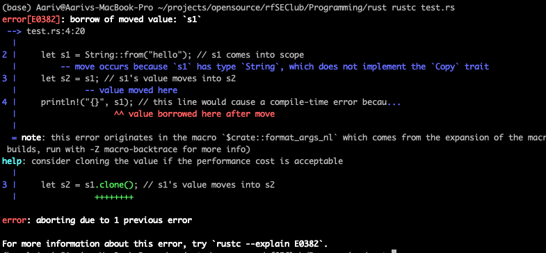

## Rust Ownership

Rust’s ownership system ensures memory safety without garbage collection.
Each value in Rust has a single owner; when the owner goes out of scope, Rust frees the memory automatically.
When you assign a variable, its “ownership” moves.
If you try to use the originfn main1() {
let s1 = String::from("hello"); // s1 comes into scope
let s2 = s1; // s1's value moves into s2
// println!("{}", s1); // this line would cause a compile-time error because s1 is no longer valid
println!("{}", s2); // this works fine
} // s2 goes out of scope and is dropped here

al after move, you’ll get an error

```rust
fn main1() {
let s1 = String::from("hello"); // s1 comes into scope
let s2 = s1; // s1's value moves into s2
// println!("{}", s1); // this line would cause a compile-time error because s1 is no longer valid
println!("{}", s2); // this works fine
} // s2 goes out of scope and is dropped here
```



## References
