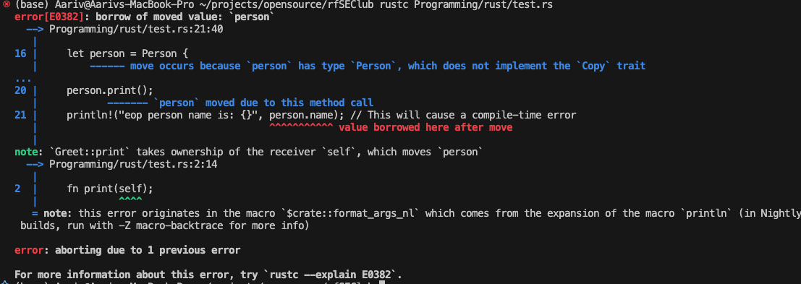

### Traits basics

- impl for traits
- Traits with functions
- The next topics to deepen your understanding of traits and their ecosystem are:

## Trait Bounds

- How to use traits as constraints on generic parameters
- Inline bounds vs where clauses

## Trait Objects (dyn Trait)

- Dynamic dispatch with trait objects
- When and why to use them

## Default Implementations in Traits

- Providing default method bodies
- Overriding defaults in implementations

## Trait Inheritance (Supertraits)

- Traits requiring other traits

## Generic Traits

- Traits parameterized by generic types

## Associated Types in Traits

- Placeholder types inside traits tied to implementing types

## Advanced Trait Patterns

- Blanket implementations
- Combination with generics and lifetimes

## Traits

## lets understand Trait for this

- For this, lets understand structs first
  [Click here](/Programming/rust/content/010_structs.md)

- They define shared behavior that types can implement. Think of them as a way to specify what a type can do, without saying how it does it.

```rust
trait Printable {
    fn print(&self);
}

```

- This trait says: any type that implements Printable must have a print() method.
- and type can be a struct, enum, or even a primitive type such as i32 or f64.

## 2. Implementing Traits

- Once a trait is defined, you implement it for specific types using the impl keyword.

```rust
trait Printable{
    fn print(&self);
}

struct Person{
    name:String,
}

impl Printable for Person {
    fn print(&self){
        println!("person:{}",self.name);
    }
}

fn main(){
    Person{name:"koel".to_string(),}.print();
}

```

- Here, Person now has a print() method as per the Printable trait.

## Generics

- What is a generic function?
  - A generic function is a function that can accept arguments of any type.
  - Instead of writing a different function for each type, you write one generic function that works for all.
  - The generic type parameter is usually written as `<T>`, but it can be any valid name.

```rust
fn print_value<T>(value: T) {
    println!("Got a value!");
}

fn main() {
    print_value(42);
    print_value("hello");
    print_value(3.14);
}

// but to add print feature , we need add Display trait and we will discuss this in detail later.


fn print_value<T: std::fmt::Debug>(value: T) {
    println!("Got a value! {:?}",value);
}

fn main() {
    print_value(42);
    print_value("hello");
    print_value(3.14);
}
//OUTPUT:
// Got a value! 42
// Got a value! "hello"
// Got a value! 3.14


```

## Revision

```rust
// generics in rust

// generics allow you to write flexible and reusable code
// that can work with different data types
use std::fmt::Display;
// lets your write a function or a struct that can work with different data types
// print pair function with generics
fn print_pair<T:Display, U:Display>(a: T, b: U) {
    // Display trait is used to format the output
    println!("Pair: ({}, {})", a, b);
}

fn main() {
    // calling print_pair with different types
    print_pair(1, "hello");
    print_pair(3.14, true);
    print_pair("rust", 'R');
}
// output:
// Pair: (1, hello)
// Pair: (3.14, true)
// Pair: (rust, R)
// here T and U are type parameters that can be any type
// this makes the function flexible and reusable with different data types

```

Or, if you want to print any type, use Debug:

```rust
use std::fmt::Debug;
// lets your write a function or a struct that can work with different data types
// print pair function with generics
fn print_pair<T: Debug, U: Debug>(a: T, b: U) {
    //Debug trait bound to ensure that the types can be printed using {:?}
    println!("Pair: ({:?}, {:?})", a, b);
}

fn main() {
    // calling print_pair with different types
    print_pair(1, "hello");
    print_pair(3.14, true);
    print_pair("rust", 'R');
}
// output:
// Pair: (1, hello)
// Pair: (3.14, true)
// Pair: (rust, R)
// here T and U are type parameters that can be any type
// this makes the function flexible and reusable with different data types
```

```text
Formatter  |  Required Trait  |  Usage
-----------+------------------+------------------------------
{}         |  Display         |  Pretty, user-facing output
{:?}       |  Debug           |  Debugging, programmer output
```

## What Does the use std::fmt::Display; Mean?

- std is the Rust Standard Library root.
- fmt is a module inside std that handles formatting.
- Display is a trait defined inside std::fmt.
- The :: notation accesses items inside modules or paths.
- use std::fmt::Display; brings the Display trait into scope so you can use it directly.

Example

```rust
//FILE 1:  print hello from a library - rfselib.rs

pub fn print_hello() {
    println!("Hello from rfselib!");
}
```

```rust
//FILE 2:  print hello from a library rfselib.rs

mod rfselib; // include the library
use rfselib::print_hello; // use the function from the library
fn main() {
    print_hello();
}

//output:
// Hello from rfselib!
```

```text
main stack:
| my_string: String struct (ptr, len, cap) |
---------------------------------------------
        |
        V
heap: "Hello world"

get_slice stack frame:
| s: &my_string (reference with lifetime 'a) |
----------------------------------------------

Returns &str slice with same lifetime 'a:
points into my_string's heap data

Back in main stack:
| my_string | slice (&str) |
--------------------------------
      |          |
      V          V
   heap: "Hello world"

slice valid so long as my_string is alive → safe

```

## What happens here?

- print_value is generic over type T.
- When you call print_value(42), T becomes i32.
- When you call print_value("hello"), T becomes &str.
- No need to write separate functions for each type.

## Trait Bound

- To enhance the generic function to be able to perform specific operations with the value/T/Trait.
- If you want to actually do something with value, like print its contents, you need to add a trait bound to T:

```rust
use std::fmt::Display;

fn print_value<T: Display>(value: T) {
    println!("{:?}", value);
}

fn main() {
    print_value(42);
    print_value("hello");
    print_value(3.14);
}

```

```rust
trait Greet {
    fn print(self);
}

struct Person {
    name: String,
}

impl Greet for Person {
    fn print(self) {
        println!("Hello, my name is {}", self.name);
    }
}

fn main() {
    let person = Person {
        name: String::from("Alice"),
    };
    println!("person name is: {}", person.name);
    person.print();
    println!("eop person name is: {}", person.name); // This will cause a compile-time error
}
```

## Output



```rust
trait Greet {
    fn print(self);
}

struct Person {
    name: String,
}

impl Greet for Person {
    fn print(self) {
        println!("Hello, my name is {}", self.name);
    }
}

fn main() {
    let person = Person {
        name: String::from("Alice"),
    };
    println!("person name is: {}", person.name);
    person.print();
    println!("eop person name is: {}", person.name); // This will cause a compile-time error
}

```

```rust
trait Greet {
    fn print(&self);
}

struct Person {
    name: String,
}

impl Greet for Person {
    fn print(&self) {
        println!("Hello, my name is {}", self.name);
    }
}

fn main() {
    let person = Person {
        name: String::from("Alice"),
    };
    println!("person name is: {}", person.name);
    person.print();
    println!("eop person name is: {}", person.name);
}

// OUTPUT:
// person name is: Alice
// Hello, my name is Alice
```

```rust
trait Printable {
    fn print(&self);
}

struct Circle {
    radius: f64,
}
impl Printable for Circle {
    fn print(&self){
        println!("Circle with radius: {}", self.radius);
    }
}

fn print_item<T:Printable>(item:T){
    item.print();
}

// the type T must implement the Printable trait

struct Square {
    side: f64,
}

fn main() {
    let circle = Circle { radius: 5.0 };
    print_item(circle);
    // Output: Circle with radius: 5.0
    let square = Square { side: 3.0 };
    // print_item(square); // This will cause a compile-time error
}


```

## Types of Generics

### Generic Functions

- A generic function lets you write one function that works for any type.
- Instead of separate functions for numbers and text, write one generic function.
- Generics allow you to write code with placeholder types like `<T>`.
- They enable code reuse without losing type safety.

```rust
You specify generics with

fn print_anything<T> (variable:T){}
fn print_anything<A> (variable:T){}
```

## `<T>` after the function name

- This declares T as a generic type parameter for the function.
- It tells Rust: "This function is generic and uses the placeholder type T."

## value: T inside the parentheses

- This means the function takes an argument named value whose type is T (the generic type parameter declared earlier).
- It connects the parameter value to the generic type placeholder T.

### Generic Functions That Return a Value (No Display Needed)

```rust
    fn identity<T>(value: T) -> T {
        value
    }

    fn main() {
        let x = identity(42);        // Works, T = i32
        let y = identity("hello"); // Works, T = &str
        println!("x and y are {} and {}",x,y);
    }
// x and y are 42 and hello

```

### Generic Functions Using println! or Formatting Inside (Require Traits like Display)

```rust
    fn print_anything<T: Display> (variable:T){
        println!("{}",variable);
    }
```

## Why Rust Requires Display Trait to Print Generic Values

- When you write a generic function in Rust that prints or formats a generic parameter value, Rust must be sure that the type of value supports printing.

- What does T: Display mean?

- It means "type T must implement the trait Display".
- So when you use T in your function, Rust knows it can call methods defined in the Display trait on values of that type.

## Understanding Display Trait with Examples

What is the Display Trait?

- The Display trait defines how to present a type to end-users as readable text.

- It is used by Rust's {} formatting marker in println! and string-related macros.

- Many standard types like integers, strings, and floats implement Display behind so they can print nicely.

```rust
use std::fmt::Display;

fn print_anything<T: Display>(value: T) {
    println!("Value: {}", value);
}

fn main() {
    print_anything(10);
    print_anything("world");
}

```

## 2. Generic Structs

- Define structs with generic types to hold any type of data.
- Example

```rust
struct Pair<T>{
    first:T,
    second:T,
}
fn main(){
    let p1 = Pair{first:1,second:2}; // T is i32
    let p2 = Pair{first:'a',second:'b'}; // T is &str
    println!("p1:({},{}), p2:({}, {})",p1.first,p1.second,p2.first,p2.second);
}
//Output: p1:(1,2), p2:(a, b)
```

## 3. Using Trait Bounds on Generic Functions

- You can define your own traits that describe behaviors you want generic types to have.
- Define the trait with required methods.
- Implement the trait for custom or existing types.
- Use trait bounds to restrict generic parameters to those types.
  - What Are Trait Bounds in Rust?
    - Simple Explanation:
    - Trait bounds are rules Rust uses to limit what types can be used in generic functions or structs. They say: "The type you use must implement certain traits (behaviors) for the code to work."

```rust
trait Printable {
    fn print(&self);
}

struct Circle {
    radius: f64,
}
impl Printable for Circle {
    fn print(&self){
        println!("Circle with radius: {}", self.radius);
    }
}

fn print_item<T:Printable>(item:T){
    item.print();
}

// the type T must implement the Printable trait

struct Square {
    side: f64,
}

fn main() {
    let circle = Circle { radius: 5.0 };
    print_item(circle);
    // Output: Circle with radius: 5.0
    let square = Square { side: 3.0 };
    // print_item(square); // This will cause a compile-time error
}


```

## 4. Where Clause in Rust

- where clause is a way to specify trait bounds for generic types in a clear and readable way, especially when the bounds get complicated or there are multiple.
- Instead of writing trait bounds directly in the generic parameters, you can write them separately after the function signature with where.
- Suppose we extend the example to compare two items that both implement Printable. Instead of putting the trait bounds inline, we use a where clause:

```rust
trait Printable {
    fn print(&self);
}

trait Describable {
    fn describe(&self) -> String;
}

struct Square {
    side: f64,
}

impl Printable for Square {
    fn print(&self) {
        println!("Square with side: {}", self.side);
    }
}
impl Describable for Square {
    fn describe(&self) -> String {
        format!("A square with side length {}", self.side)
    }
}

fn show_item<T: Printable + Describable>(item: T) {
    item.print();
    println!("Description: {}", item.describe());
}

fn main() {
    let square = Square { side: 4.0 };
    show_item(square);
    // Output:
    // Square with side: 4
    // Description: A square with side length 4
}
```

## How where can fix this:

```rust
trait Printable {
    fn print(&self);
}

trait Describable {
    fn describe(&self) -> String;
}

struct Square {
    side: f64,
}

impl Printable for Square {
    fn print(&self) {
        println!("Square with side: {}", self.side);
    }
}
impl Describable for Square {
    fn describe(&self) -> String {
        format!("A square with side length {}", self.side)
    }
}

// a generic function with where clause
fn show_item<T>(item: T)
where
    T: Printable + Describable,
{
    item.print();
    println!("Description: {}", item.describe());
}


fn main() {
    let square = Square { side: 4.0 };
    show_item(square);
    // Output:
    // Square with side: 4
    // Description: A square with side length 4
}
```

## REVISION: Using Traits with functions

- You can write functions that accept any type that implements a certain trait, making your code flexible:

```rust
trait Printable {
    fn print(&self);
}
// This trait says: any type that implements Printable must have a print() method.
// and type can be a struct, enum, or even a primitive type such as i32 or f64.

struct Person {
    name: String,
    age: u32,
}
impl Printable for Person {
    fn print(&self) {
        println!("Person: {}, Age: {}", self.name, self.age);
    }
}

// using traits with function display- its saying any type must implement Printable
fn display<T: Printable>(item: T) {
    item.print();
}

fn main() {
    let person = Person {
        name: "Alice".to_string(),
        age: 30,
    };
    person.print(); // Output: Person: Alice, Age: 30
    let person2 = Person {
        name: "Bob".to_string(),
        age: 25,
    };
    display(person2); // Output: Person: Bob, Age: 25
}
```

## Why both can produce the same output but serve different roles:

- Trait implementations (impl) provide abilities to types:
  - They attach behavior to a type.
  - Once you impl Printable for Person, any Person value can be printed anywhere.
- Generic functions using trait bounds describe what kinds of types they accept:
  - They allow writing code once that works for any printable type.
  - You can reuse display with Person, String, or any other type that implements Printable.

### dyn Trait - Trait Objects

#### Without Trait Objects (No dyn Trait)

- Suppose you want to write a function to make animals talk. Without trait objects, you must write separate functions for each animal type:

```rust
struct Dog;
struct Cat;

trait Animal{
    fn talk(&self);
}

impl Animal for Dog{
    fn talk(&self){
        println!("dog says bow bow");
    }
}

impl Animal for Cat{
    fn talk(&self){
        println!("Cat says meow meow");
    }
}

fn main(){
    let cat = Cat;
    let dog = Dog;
    cat.talk();
    dog.talk();
}
```

- It uses static dispatch, meaning the compiler knows the exact types (Cat and Dog) at compile time, and it generates specific, optimized code for each call to talk() depending on the concrete type. The cat.talk() directly calls Cat's implementation, and similarly for dog.talk().

### What is a Concrete Type?

- The concrete type is the actual, exact type of a value in your program, known at compile time. For example:

```rust
struct Dog;
struct Cat;

let dog = Dog; // Dog is a concrete type
let cat = Cat; // Cat is a concrete type
```

Here, Dog and Cat are concrete types — you know exactly what they are.

### What is a Trait Object (dyn Trait)?

- A trait object like &dyn Animal is a pointer to some value that implements the Animal trait, but you don't know exactly which concrete type it is at compile time. It could be a Dog, Cat, or anything else that implements Animal.

### For example:

```rust
let animal: &dyn Animal = &dog; // type erased to trait object
```

- The concrete type is still Dog, but this info is hidden behind dyn Animal.

- animal is a trait object pointer to something implementing Animal, but Rust treats it uniformly without needing to know it’s a Dog.

- Rust stores internally a pointer to the data (dog) and a vtable with method addresses for Dog.

### Why Does This Matter?

- When you call animal.talk(), Rust uses the vtable to look up and call the correct method dynamically based on the concrete type (Dog here).
- This is dynamic dispatch: method selection at runtime.
- You lose compile-time knowledge of the type but gain flexibility to write code that works with any type implementing the trait.

### Dyn Trait

```rust
struct Dog;
struct Cat;

trait Animal {
    fn talk(&self);
}

impl Animal for Dog {
    fn talk(&self) {
        println!("dog says bow bow");
    }
}

impl Animal for Cat {
    fn talk(&self) {
        println!("Cat says meow meow");
    }
}

fn main() {
    let cat = Cat;
    let dog = Dog;

    // Trait object references: a pointer to a value of some type implementing Animal
    let animal1: &dyn Animal = &cat;
    let animal2: &dyn Animal = &dog;

    // When calling talk(), Rust uses dynamic dispatch:
    // it looks up the correct method for the actual type to call at runtime.
    animal1.talk();  // Output: Cat says meow meow
    animal2.talk();  // Output: dog says bow bow
}

    // Using dyn Trait: references to any type implementing Animal
    let animals: Vec<&dyn Animal> = vec![&dog, &cat];

    // Call talk() polymorphically on different animals
    for animal in animals {
        animal.talk();
    }

```

### Traits with Default Implementations and Inheritance

- You define methods with bodies inside the trait. Any type implementing the trait automatically gets that default method unless it provides its own.

```rust
// Traits can provide default method implementations:
trait Animal {
    fn talk(&self) {
        println!("Some generic animal noise");
    }
}
```

### Overriding defaults in implementations

- When you implement the trait for a particular type, you can override the default method with a specific version.

```rust
trait Animal {
    fn talk(&self) {
        println!("Some generic animal noise");  // Default implementation
    }
}

struct Dog;
struct Cat;

impl Animal for Dog {
    fn talk(&self) {
        println!("Dog says bow bow");   // Overrides default
    }
}

impl Animal for Cat {
    // Uses default talk()
}

fn main() {
    let dog = Dog;
    let cat = Cat;

    dog.talk();  // Dog says bow bow
    cat.talk();  // Some generic animal noise (default)
}

```

### Why use default implementations?

- Reduce boilerplate by writing shared logic in one place (the trait).
- Allow implementors to override behavior when needed.
- Makes traits more powerful and flexible.

## 5.Associated Types in Traits

### Without Generic Type Parameter

- You define a trait with a specific return type directly (no `<T>`):

```rust
trait FoodProvider {
    fn food(&self) -> String;  // fixed output type String
}

```

- The trait method always returns a String.
- You can’t change the return type per implementation.

### With Generic Type Parameter `<T>`

- You define the trait as generic over type T:

```rust
trait FoodProvider<T> {
    fn food(&self) -> T;
}

```

- The trait is parameterized by type T.
- Implementors choose what T is (e.g., String or some other type).
- This means every use of the trait must state which T it means.

```rust
struct Dog;
impl FoodProvider<String> for Dog {
    fn food(&self) -> String {
        "Bones".to_string()
    }
}
// You specify T as String for this impl.
// If another impl uses i32 instead, you'd write impl FoodProvider<i32>
```

- Why Specifying `<T>` Everywhere is Verbose:
- Everywhere you use or bound the trait, you write:

```rust
fn feed_animal<P: FoodProvider<String>>(p: &P) {
let meal = p.food();
println!("Food: {}", meal);
}
```

- The generic type String is repeated in the trait bound.

```rust
trait FoodProvider<T> {
    fn food(&self) -> T;
}

struct Dog;
struct Cat;

impl FoodProvider<String> for Dog {
    fn food(&self) -> String {
        "Bones".to_string()
    }
}

impl FoodProvider<String> for Cat {
    fn food(&self) -> String {
        "Fish".to_string()
    }
}

fn print_food<P: FoodProvider<String>>(provider: &P) {
    println!("Food: {}", provider.food());
}

fn main() {
    let dog = Dog;
    let cat = Cat;

    print_food(&dog);
    print_food(&cat);
}

```

## With Associated Types (No type parameter `<T>`)

- You declare the type inside the trait and implement it per type:

```rust
trait FoodProvider{
    type Food;
    fn food(&self) ->Self::Food;
}

struct Dog;

impl FoodProvider for Dog {
    type Food = String;
    fn food(&self)->Self::Food {
        "Fish".to_string()
    }
}

fn print_food<P>(p:&P)
where
P:FoodProvider,
P::Food:std::fmt::Display,
{
    println!("Food : {} ", p.food());
}


fn main(){
    let dog = Dog;
    print_food(&dog);
}

```

- Use : to say a type implements a trait.
- Use :: to access an item inside a type or trait, like an associated type, constant, or method

### Advanced Trait Patterns

#### Blanket Implementations

What is it?
It means "implementing a trait for all types (or all types meeting certain conditions) at once."

Instead of writing the same trait implementation repeatedly for many types, you write a generic one rule that applies broadly.

### Simple analogy

- Imagine a "Speak" rule that says "everyone who knows a language can say hello." Instead of teaching each person individually how to say hello, you teach the rule generally.

```rust
// Trait that defines greeting behavior
trait HasName {
    fn name(&self) -> &str;
}

trait CanGreet {
    fn greet(&self);
}

// Blanket implementation of CanGreet for any type that implements HasName
impl<T> CanGreet for T
where
    T: HasName,
{
    fn greet(&self) {
        println!("Hello, {}!", self.name());
    }
}

// Specific type implementing HasName
struct Person {
    name: String,
}

impl HasName for Person {
    fn name(&self) -> &str {
        &self.name
    }
}

fn main() {
    let p = Person { name: "Alice".to_string() };
    p.greet();  // CanGreet implemented automatically!
}

```

### 2. Combination with Generics and Lifetimes

#### What is it?

Traits often use generic types and lifetimes to be flexible and safe.

Generics allow traits to work with any data type.

Lifetimes ensure references don’t become invalid (no dangling refs).

### Simple analogy

- Think of "LanguageSpeaker" as a trait generic over the language they speak, and we track how long that "language proficiency" lasts (lifetime).

```rust
trait Greeter<'a, T> {
    fn greet(&self, name: &'a str) -> T;
}

struct Dog;

impl<'a> Greeter<'a, String> for Dog {
    fn greet(&self, name: &'a str) -> String {
        format!("{} the dog says woof!", name)
    }
}

fn greet_any<'a, T, G>(greeter: &G, name: &'a str) -> T
where
    G: Greeter<'a, T>,
{
    greeter.greet(name)
}

fn main() {
    let dog = Dog;
    let greeting = greet_any(&dog, "Rex");
    println!("{}", greeting);
}
```
