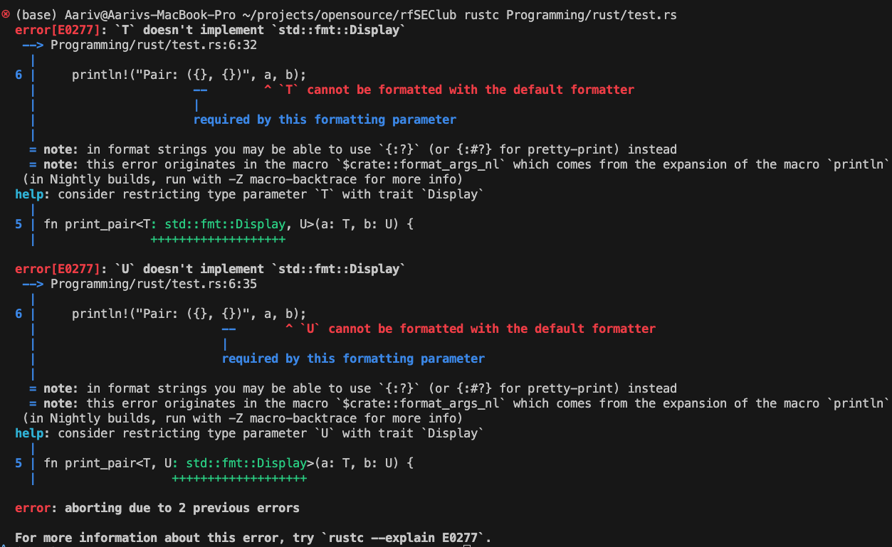

## What is a generic?

```rust
// generics in rust

// lets your write a function or a struct that can work with different data types
// print pair function with generics
fn print_pair<T, U>(a: T, b: U) {
    println!("Pair: ({}, {})", a, b);
}

fn main() {
    // calling print_pair with different types
    print_pair(1, "hello");
    print_pair(3.14, true);
    print_pair("rust", 'R');
}
// output:
// Error
```

if you run this program, you see the following output:


## Explantion

- The error happens because you use {} in println!, which requires the types T and U to implement the Display trait, but your generic parameters T and U have no such trait bound.

  - Either you implement Display trait
  - or add Debug trait

- The Display trait defines how to present a type to end-users as readable text.

- It is used by Rust's {} formatting marker in println! and string-related macros.

- Many standard types like integers, strings, and floats implement Display so they can print nicely.

```rust
fn main() {
    let num = 42;        // integer implements Display
    let text = "hello"; // string slice implements Display
    println!("Number: {}", num);     // works
    println!("Text: {}", text);      // works
}

```

So
Compiling with {} on a type without Display implementation triggers a compiler error.
Rust suggests implementing

- Display or
- using {:?} and implementing Debug.

To understand traits:
[Click here](/Programming/rust/content/012_traits_and_generics.md)
