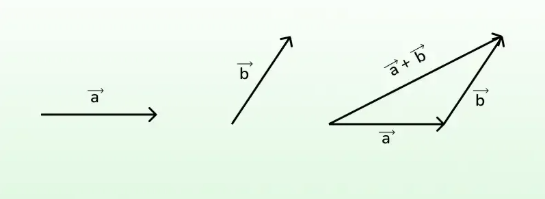

# Performing Vector Addition

## What is Vector Addition?

**Vector addition** means combining two vectors to form a new one. It’s like merging two moves into a single move.

> Imagine walking 3 steps east, then 4 steps north. Your total movement is the sum of those two directions.

### Example

Let’s add two vectors:

* **A** = (2, 3)
* **B** = (1, 4)

Add corresponding components:

* A + B = (2+1, 3+4) = (3, 7)

This new vector (3, 7) shows the combined movement.

## Why Is Vector Addition Important in AI?

In artificial intelligence, vector addition is used to:

* Combine feature vectors from multiple sources
* Aggregate data from different layers in a neural network
* Merge transformations or effects in sequence

### Example in AI

If a data sample has two sources of input:

* Input A = (0.2, 0.4)
* Input B = (0.6, 0.1)
* Combined Input = A + B = (0.8, 0.5)

---

Think of adding vectors like combining two deliveries:

* One goes 2 blocks north and 1 east
* Another goes 3 blocks north and 2 east
* Add the paths: 5 blocks north and 3 east

You now know your full route!

## Properties of Vector Addition

* **Commutative**: A + B = B + A
* **Associative**: (A + B) + C = A + (B + C)
* **Zero Vector**: A + (0,0) = A

## Summary

* **Vector addition** merges two movements or states.
* Add vectors by adding their components.
* Used in AI to combine data or model outputs.
* It’s commutative, associative
