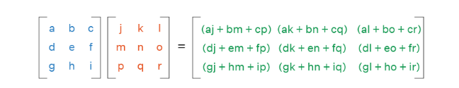
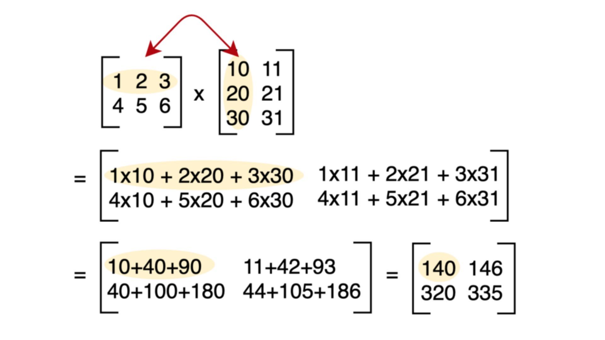

# 006 - Multiplying Matrices

## What is Matrix Multiplication?

**Matrix multiplication** combines two matrices to create a new matrix by taking **dot products of rows and columns**.

> It’s like feeding input data through a layer of neurons in AI.

### Key Rule

Matrix **A (m×n)** can be multiplied by matrix **B (n×p)**

* The **inner dimensions must match**
* Result is a new matrix of size **m×p**

### Example

## Why Is Matrix Multiplication Important in AI?

* Fundamental to **neural network computation**
* Connects **inputs to outputs** through weights
* Performs **transformations** of data
* Drives **forward pass** in deep learning

### AI Example

Input vector: \[x₁, x₂]
Weight matrix: W = \[\[w₁₁, w₁₂], \[w₂₁, w₂₂]]
Output = W × Input

## Properties of Matrix Multiplication

* **Not Commutative**: A × B ≠ B × A
* **Associative**: (A × B) × C = A × (B × C)
* **Distributive**: A × (B + C) = A×B + A×C

## Summary

* **Matrix multiplication** takes dot products of rows and columns.
* The **inner dimensions must match**.
* It’s essential for passing data through AI models.
* Not commutative, but associative and distributive.
