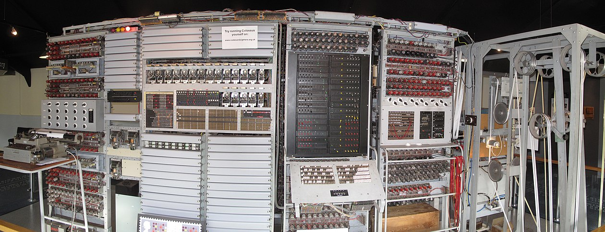
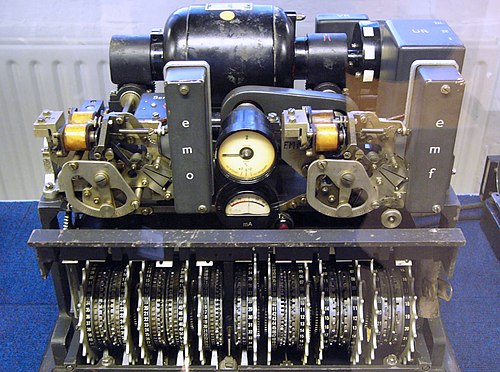

# Colossus and WWII Cryptography

The **Colossus** computer, developed during World War II, was the world’s **first programmable electronic digital computer** used in operation. It played a critical role in **decoding enemy communications**, changing the course of the war and laying the foundation for modern cryptography and computing.

## What Was Colossus?

Designed by **Tommy Flowers**, Colossus was developed at **Bletchley Park**, Britain’s secret wartime codebreaking center.

Key characteristics:

* Used **2,400 vacuum tubes** for logic operations
* Operated at unprecedented speeds: **5,000 characters per second**
* Programmed by **plugboards and switches**, not tape-based instructions
* Designed specifically to break the German **Lorenz cipher**, more complex than Enigma

---

## Breaking the Lorenz Cipher

While the Enigma machine is more famous, the **Lorenz cipher** was used for **high-level Nazi communications**—and far more difficult to crack.

Colossus enabled the Allies to:

* Process large volumes of intercepted radio traffic
* Reduce deciphering time from **weeks to hours**
* Provide **critical intelligence** during D-Day and other key operations

Colossus read ciphertext from **paper tape at lightning speed** using optical sensors, matching it against pre-set patterns to determine encryption settings.

---

## Secrecy and Legacy

Colossus remained **top secret** until the 1970s. Because of this, its contributions were **overlooked in early computing histories**.

Legacy:

* Demonstrated the feasibility of **electronic computation for real-time problems**
* Influenced post-war computing efforts in the UK and beyond
* Validated the use of **programmable logic machines** for practical applications

Even though Colossus wasn’t a general-purpose machine, its **speed, reliability, and programmable design** made it a pivotal step toward modern computing.
