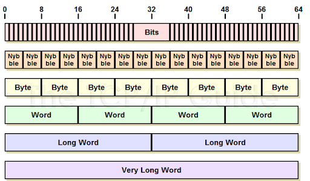
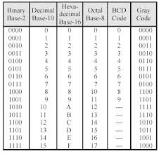

# Digital Storage Units

All digital information is stored as **bits**—binary digits that represent either a 0 or a 1. But since we handle vast amounts of data daily, we use larger **storage units** to quantify it. Understanding these units is essential for grasping file sizes, memory capacities, and internet bandwidth.

---

## Base Unit: Bit and Byte

* **Bit (b)**: The smallest unit of digital data; can be 0 or 1
* **Byte (B)**: Group of 8 bits; represents a single character like ‘A’

---

## Standard Storage Units (Base-10)

In everyday consumer devices and storage advertising, decimal prefixes (SI units) are often used:

* **1 Kilobyte (KB)** = 1,000 Bytes
* **1 Megabyte (MB)** = 1,000 KB = 1 million Bytes
* **1 Gigabyte (GB)** = 1,000 MB = 1 billion Bytes
* **1 Terabyte (TB)** = 1,000 GB = 1 trillion Bytes
* **1 Petabyte (PB)** = 1,000 TB

---

## Binary Storage Units (Base-2)

Computers operate using binary (base-2) systems. Therefore, memory and operating systems often use binary-based prefixes:

* **1 Kibibyte (KiB)** = 1,024 Bytes
* **1 Mebibyte (MiB)** = 1,024 KiB
* **1 Gibibyte (GiB)** = 1,024 MiB
* **1 Tebibyte (TiB)** = 1,024 GiB

This difference is why a 500 GB drive may show as around 465 GiB in a computer’s OS.

---

## Why the Confusion?

Storage manufacturers use **base-10 (decimal)** because it shows higher numbers, making the drive seem larger.
Operating systems use **base-2 (binary)** because it's how data is actually processed internally.

This results in:

* **1 TB (decimal)** ≠ **1 TiB (binary)**
* 1 TB = 1,000,000,000,000 Bytes → about 931 GiB

---

## File Size Examples

To make sense of these units, here are some real-world comparisons:

* **Text file (1 page)** ≈ 4 KB
* **MP3 song** ≈ 3–5 MB
* **HD Movie (2 hrs)** ≈ 1.5–4 GB
* **4K Movie** ≈ 20–60 GB
* **1 TB** can hold about 250,000 songs or 500 hours of HD video

---

## Summary

* All digital data is built from **bits**, grouped into **bytes**
* Data is measured in units like KB, MB, GB, TB, and their binary equivalents (KiB, MiB, etc.)
* Manufacturers use decimal units; OSs often use binary—hence the size differences
* Knowing units helps you manage files, buy storage, and understand bandwidth

## RAM vs Permanent Storage

In computing, two major types of memory are essential: **RAM (Random Access Memory)** and **Permanent Storage** (like SSDs or HDDs). Though they both store data, they serve entirely different purposes.

---

## What is RAM?

RAM is the computer's **temporary workspace**. It's used to store data that the CPU needs **right now** or in the **near future**.

* Volatile: Data is lost when power is off.
* Extremely fast access speed.
* Used for running programs, open files, and system processes.

**Example:** If you're editing a photo, it's stored in RAM while open in the editing software.

---

## What is Permanent Storage?

Permanent storage refers to devices like **SSDs (Solid State Drives)** and **HDDs (Hard Disk Drives)** where data is saved **long-term**.

* Non-volatile: Data stays even when the power is off.
* Slower than RAM but much higher capacity.
* Stores the operating system, documents, applications, media files, etc.

**Example:** When you save your photo edits, the final image is stored on your SSD or hard drive.

---

## Key Differences

| Feature          | RAM                   | Permanent Storage        |
| ---------------- | --------------------- | ------------------------ |
| Data Persistence | Temporary (volatile)  | Permanent (non-volatile) |
| Speed            | Much faster           | Slower                   |
| Capacity         | Limited (usually GBs) | Larger (GBs to TBs)      |
| Purpose          | Temporary processing  | Long-term storage        |
| Cost per GB      | Higher                | Lower                    |

---

## Modern Systems Use Both

Modern computers balance RAM and permanent storage:

* Operating system loads into RAM during boot.
* Apps launch into RAM from SSD/HDD.
* Unsaved work lives in RAM — crash or power loss = data loss.
* Virtual memory: If RAM runs out, the OS temporarily uses the SSD to simulate RAM (called swap space or paging).

---

## Why This Matters

* **More RAM = faster multitasking**, smoother gaming, better performance under load.
* **Larger storage = more files/apps/media** stored permanently.
* **Balance is critical**: Too little RAM makes even fast SSDs slow due to excessive swapping.

---

## Summary

* RAM is fast but temporary; permanent storage is slower but lasting.
* They work together to ensure performance and data persistence.
* Upgrading RAM and SSD can significantly improve system speed.
