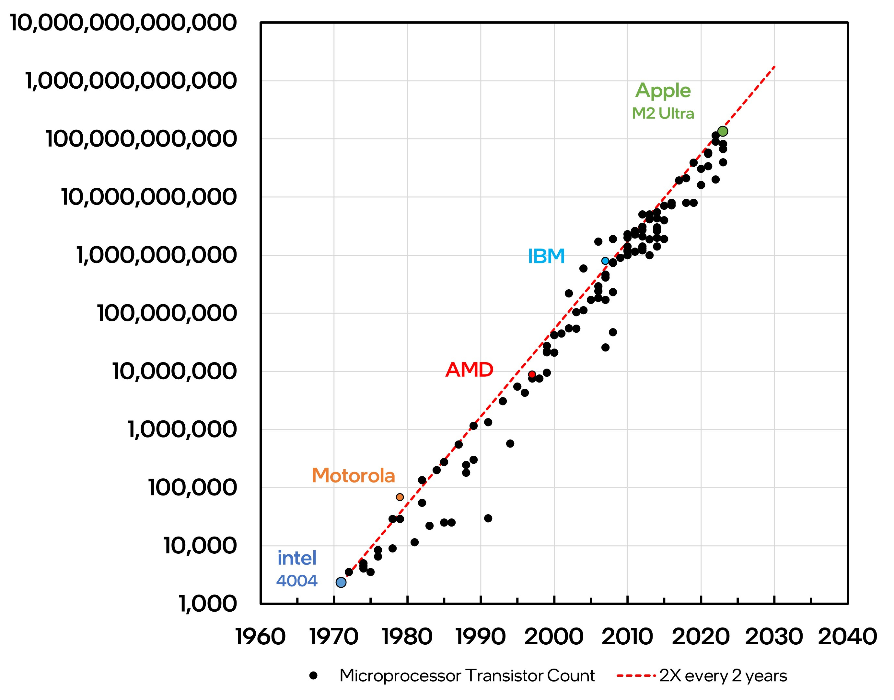
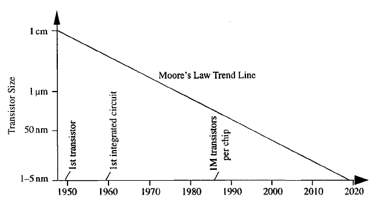

# Moore's Law and Scaling Trends

**Moore’s Law** describes how the power of computers has increased over time. It’s not a physical law but an observation that has held true for decades: the number of transistors on a microchip doubles approximately every **18 to 24 months**, while the cost per transistor halves.

---

## What is Moore's Law?

Coined by **Gordon Moore**, co-founder of Intel, in 1965:

> "The number of transistors on a chip will double every year, while the cost stays the same."

It was later revised to every **two years**, but the core idea remained—**exponential growth** in computing power.

---

## Why It Mattered

Moore’s Law became a **self-fulfilling prophecy**—companies pushed innovation to meet the prediction. This led to:

* Faster processors
* Smaller, more efficient chips
* Affordable computing for everyone
* Rise of smartphones, AI, and cloud computing

It also guided the **semiconductor industry roadmap** for over 50 years.

---

## Transistor Shrinking and Node Sizes

Each new chip generation is measured in **nanometers (nm)**:

* Intel’s 4004 (1971) – 10,000 nm
* Pentium III (1999) – 180 nm
* Apple M1 (2020) – 5 nm
* Modern chips (2023–2025) – heading toward 3 nm and below

Smaller transistors = more per chip = faster + less power = better devices.

---

## The Physical Limits

As chips approach **atomic scale**, challenges arise:

* **Heat**: Smaller transistors = more heat per area
* **Quantum tunneling**: Electrons may jump barriers unintentionally
* **Cost**: Advanced fabrication is incredibly expensive

We’re now reaching the **end of Moore’s Law** in traditional silicon.

---

## Beyond Moore: What’s Next?

New technologies aim to keep performance growing:

* **3D chip stacking** (like Intel’s Foveros)
* **Chiplets** (modular CPU design)
* **Quantum computing**
* **Neuromorphic chips** (brain-like computing)
* **Optical computing** (using light instead of electrons)

---

## Real-World Impact

* Your smartphone today is more powerful than the computers used in the Apollo 11 mission.
* AI models that used to require supercomputers now run on personal devices.
* Without Moore’s Law, innovations like video calling, streaming, or GPT would not be possible.

---

## Summary

* Moore’s Law predicted exponential transistor growth and shaped the tech industry.
* We’ve hit physical limits, but new paradigms are emerging.
* The future may lie in **quantum**, **neuromorphic**, or **3D computing**.
