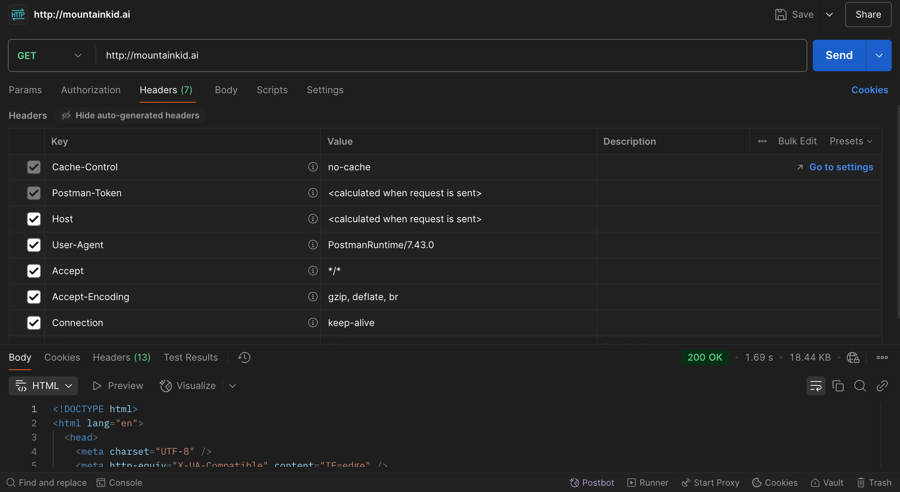
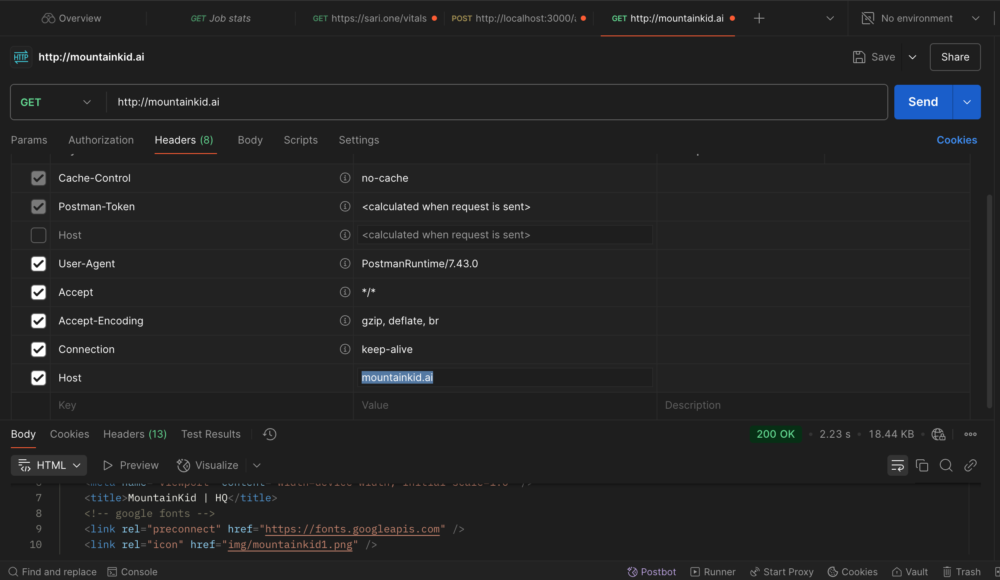
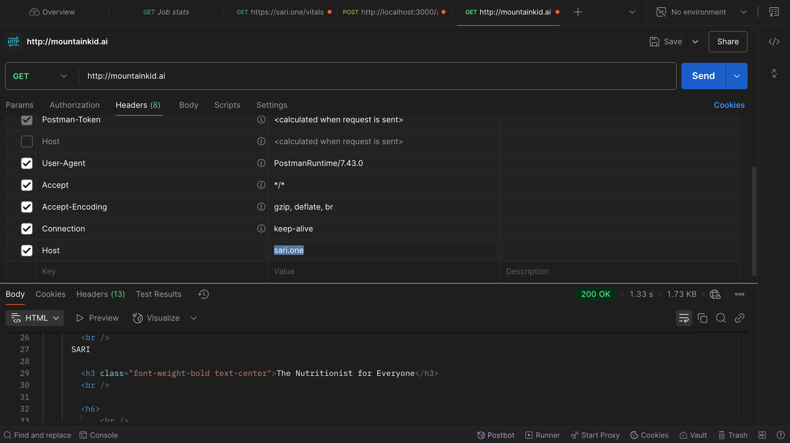

# Level 2.5 - HOW INTERNET WORKS

Series: 002
Internet Explained
How the Internet Works?

Canva Link

When you type a domain name (e.g., `mountainkid.ai`) in the browser, the client follows these steps:

## **1️⃣ User Enters the Domain Name**

* You type `https://mountainkid.ai` in the browser.
* The browser **extracts the domain name** (`mountainkid.ai`).

## **2️⃣ DNS Lookup: Finding the Server's IP Address**

* The browser asks a **DNS server** for the **IP address** of `mountainkid.ai`.
* Example response:
  
  ```txt
  mountainkid.ai → 75.2.60.5 
  ```

## **3️⃣ The Client Opens a Connection to the Server**

The browser opens a **TCP connection** to `75.2.60.5` on **port 80 (HTTP) or 443 (HTTPS)**.

### **TCP Connection: Knocking on the Server's Door**

Now that your browser knows `mountainkid.ai` is at **75.2.60.5**, it needs to **connect** to that IP.

* The browser **starts a TCP connection** to **75.2.60.5**.
* It connects on **port 80** (for HTTP) or **port 443** (for HTTPS).

This process is known as the **TCP Three-Way Handshake**, which works like this:

#### **🔹 Step 1: Client → SYN (Synchronize)**

* Your browser sends a **SYN** (synchronize) request to the server:
  
  ```txt
  SYN → Hey server, I want to start a connection with you! 
  ```

#### **🔹 Step 2: Server → SYN-ACK (Synchronize-Acknowledge)**

* The server responds:
  
  ```txt
  SYN-ACK → Got it! I'm ready to talk. 
  ```

#### **🔹 Step 3: Client → ACK (Acknowledge)**

* Your browser confirms:
  
  ```txt
  ACK → Great! Let's start sending data. 
  ```

Now, the **TCP connection is established**. 🟢

## **4️⃣ The Client Sends a HTTP Request with the `Host` Header**

* The browser **automatically includes the domain name** in the request:
  
  ```txt
  GET / HTTP/1.1 
  Host: mountainkid.ai 
  User-Agent: Mozilla/5.0 
  Accept: text/html 
  ```

* The `Host` header is **required** in HTTP/1.1 and later.

---

## **🔥 Why Does the Client Include the `Host` Header?**

* Many servers **host multiple websites** on the same IP.
* The `Host` header tells the server **which website** the client is requesting.

### **Example: Shared Hosting**

Imagine a server **(IP: 75.2.60.5)** hosts **two websites**:

* `mountainkid.ai`
* `rfse.club`

When you visit:

1. **`mountainkid.ai`** → Server serves **MountainKid AI's website**.
  
   ```txt
   GET / HTTP/1.1 
   Host: mountainkid.ai 
   ```

2. **`rfse.club`** → Server serves **RFSE Club's website**.

   ```txt
   GET / HTTP/1.1 
   Host: rfse.club 
   ```

Without the `Host` header, the server **wouldn't know which website** to serve.

---

## **🔹 Does This Apply to HTTPS (SSL) Requests?**

Yes! But since **HTTPS encrypts everything**, the `Host` header is hidden inside the encrypted request.

👉 **Solution:** **SNI (Server Name Indication)**

* Before encryption starts, the browser sends the **domain name** in plain text using SNI.
* This allows the server to pick the **correct SSL certificate** before decrypting the request.

---

## **🔹 Summary**

1. The browser **extracts the domain** (e.g., `mountainkid.ai`).
2. It performs a **DNS lookup** to get the **IP address**.
3. It **connects to the server's IP**.
4. It sends an **HTTP request with the `Host` header** (automatically included).
5. The server **uses the `Host` header** to serve the correct website.

## Demonstration using Postman

### **🔹 Step 1: Open Postman**

If you haven't already, download and install Postman from here.
Open Postman.

### **🔹 Step 2: Make a Basic HTTP Request**

Set the request type to GET.
Enter the URL → [http://mountainkid.ai](http://mountainkid.ai)
Click "Send".

### **Expected Response**

If the website is correctly hosted, you should get a 200 OK response with the HTML page.
If there's no response, it may be due to DNS or hosting issues.



### **Header Purpose:**

A **request header** is **metadata** sent by the client (browser, Postman, or API) to the server, providing additional information about the request. It helps the server understand **who is making the request, what data is accepted, how to handle the response, and connection details**.

| Header | Purpose |
|--------|---------|
| Cache-Control: no-cache | Prevents using cached data, forces fresh request |
| Postman-Token | Prevents duplicate request caching (Postman-specific) |
| Host: mountainkid.ai | Identifies the website (important for shared hosting) |
| User-Agent: PostmanRuntime | Identifies the client making the request (Postman tool) |
| Accept: */* | Tells the server the client can accept any response type |
| Accept-Encoding: gzip, deflate, br | Allows the server to compress responses to reduce data size |
| Connection: keep-alive | Keeps the TCP connection open for efficiency |

### **🔹 Step 3: Check the Host Header**

Now, let's manually set a Host header and see what happens.

Go to the "Headers" tab in Postman.
Add a new header:

* Key: Host
* Value: mountainkid.ai

Click "Send" again.

### **What Happens?**

The request now explicitly tells the server that it's meant for mountainkid.ai, even if the IP hosts multiple websites.



### **🔹 Step 4: Simulate a Wrong Hostname**

To see how the server handles incorrect Host headers:

* Change the Host header to something else (e.g., rfse.club).
* Click "Send".

### **Expected Outcome**

If the server is properly configured, it will either return an error or serve the wrong website.
In this case, it served the wrong site.



### **🔹 Step 5: Test HTTPS ([https://mountainkid.ai](https://mountainkid.ai))**

Change the URL to: [https://mountainkid.ai](https://mountainkid.ai)
Click Send.

### **Key Difference**

Since this is HTTPS, the request is encrypted.
However, SNI (Server Name Indication) still ensures the server knows which website to serve.

### **🔥 Summary of Tests**

| Test | Expected Result |
|------|-----------------|
| GET [http://mountainkid.ai](http://mountainkid.ai) | Server responds with website content (if hosted) |
| Adding Host: mountainkid.ai | Should work the same as the default request |
| Changing Host to a wrong domain | May return an error or another website |
| GET [https://mountainkid.ai](https://mountainkid.ai) | Uses SNI to serve the right SSL certificate |

---

## **🔹 What Does "Visible to Intermediaries?" Mean?**

When you visit a website (`mountainkid.ai`), your request **travels through multiple points** before reaching the website's server.

Here's the journey of your request:

🛜 **Your device → Wi-Fi router → ISP (Internet Provider) → Data Centers → Website Server**

At each step, **intermediaries** (like your ISP, network admins, or attackers) **can see some parts of your request**.

---

## **1️⃣ HTTP (Unencrypted) – Everything is Visible**

🔴 **Problem:** If you visit `http://mountainkid.ai` (without HTTPS), everything is **sent as plain text**, meaning:

* Your **ISP, network admin, or hackers** can see **everything** (website, page content, passwords, etc.).
* Anyone **can read or modify your data** (like change your login credentials).

### **Example: You Send a Request Over HTTP**

```txt
GET /login HTTP/1.1 
Host: mountainkid.ai 
User-Agent: Chrome 
Username: test 
Password: 12345 
```

📌 **What Intermediaries See:** EVERYTHING! 🚨

* They can see the **website** you're visiting.
* They can see the **data you send (like passwords, search queries, messages).**
* Hackers **can modify** your request and redirect you to a fake site.

🛑 **This is why HTTP is insecure!**

---

## **2️⃣ HTTPS (Encrypted) – Almost Everything is Hidden**

✅ **Solution:** HTTPS **encrypts your data** before sending it.

* This **hides** your passwords, messages, and website content.
* But before encryption starts, your browser must tell the server **which website it wants to visit**.
* This is done using **SNI (Server Name Indication)**.

### **Example: You Send a Request Over HTTPS**

### **Step 1: Your Browser Starts a Secure Connection (TLS Handshake)**

```txt
Client Hello 
SNI: mountainkid.ai 
```

### **Step 2: Server Responds and Encryption Starts**

```txt
Server Hello 
SSL Certificate → Encryption Begins 
```

### **Step 3: Encrypted Request is Sent**

```txt
🔒 GET /login HTTP/1.1 (Encrypted) 
🔒 Username: test (Encrypted) 
🔒 Password: 12345 (Encrypted) 
```

📌 **What Intermediaries See Now:**

* ✅ **The website name (SNI: mountainkid.ai)**
* ❌ **But everything else is hidden!** (passwords, content, search queries, etc.)

👉 **This means your ISP can see that you are visiting** `mountainkid.ai`, **but not what you're doing there**.

---

## **3️⃣ Why is This Important?**

Since **SNI is visible**, some governments and companies **block websites** using SNI filtering.
For example:

* **China's Great Firewall** blocks websites by **checking the SNI field**.
* Some **corporate offices** block YouTube, Facebook, etc., using SNI.
* Your **ISP may log which websites you visit** (even if they can't see what you do).

---

## **4️⃣ Difference Between HTTP, SNI, and Full HTTPS Encryption**

| Type | What Intermediaries See | Can Data Be Modified? |
|------|------------------------|----------------------|
| 🔴 **HTTP (No Encryption)** | Everything (URL, passwords, content) | Yes, data can be modified |
| 🟡 **HTTPS with SNI** | Only website name (SNI:) | No, but ISP knows which site you visit |
| 🟢 **Fully Encrypted HTTPS (After Handshake)** | Nothing (Fully secured) | No, everything is hidden |

📌 **In simple terms:**

* With **HTTP**, everything is open.
* With **HTTPS**, your **passwords and content are hidden**, but the **website name is still visible**.
* After **encryption starts, everything is 100% private**.

---

## **🔥 How to Hide SNI? (Advanced)**

To stop ISPs or governments from seeing the website you visit, there are new technologies:

1. **Encrypted SNI (ESNI)** → Encrypts the SNI field (but not widely supported yet).
2. **TLS 1.3 Encrypted Client Hello (ECH)** → Fully hides SNI (future of HTTPS).
3. **VPNs/Tor** → Hide everything, including SNI, by routing traffic through another server.

---

## **🔹 Summary**

1. **HTTP = Everything is visible.**
2. **HTTPS = Only the website name (SNI) is visible, but content is hidden.**
3. **Once encryption starts, everything is hidden.**
4. **SNI filtering is used to block websites in some countries or offices.**
5. **Future tech (ESNI, ECH) will fix this issue.**
